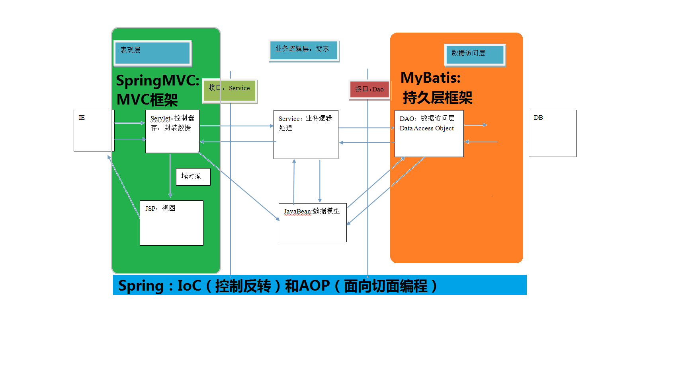
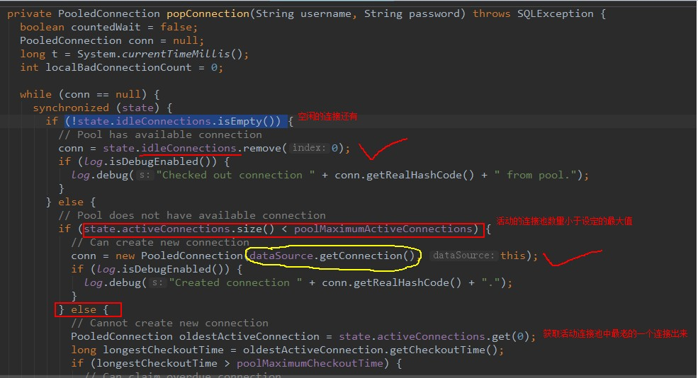

###  框架概述  

#### 什么是框架 

框架（Framework）是整个或部分系统的可重用设计，表现为一组抽象构件及构件实例间交互的方法;另一种 定义认为，框架是可被应用开发者定制的应用骨架。前者是从应用方面而后者是从目的方面给出的定义。  简而言之，框架其实就是某种应用的半成品，就是一组组件，供你选用完成你自己的系统。简单说就是使用别 人搭好的舞台，你来做表演。而且，框架一般是成熟的，不断升级的软件。 

#### 框架要解决的问题 

框架要解决的最重要的一个问题是技术整合的问题，在 J2EE 的 框架中，有着各种各样的技术，不同的 软件企业需要从 J2EE 中选择不同的技术，这就使得软件企业最终的应用依赖于这些技术，技术自身的复杂性和技 术的风险性将会直接对应用造成冲击。而应用是软件企业的核心，是竞争力的关键所在，因此应该将应用自身的设
计和具体的实现技术解耦。这样，软件企业的研发将集中在应用的设计上，而不是具体的技术实现，技术实现是应 用的底层支撑，它不应该直接对应用产生影响。 

**框架一般处在低层应用平台（如 J2EE）和高层业务逻辑之间的中间层。** 

#### 软件开发的分层重要性 

框架的重要性在于它实现了部分功能，并且能够很好的将低层应用平台和高层业务逻辑进行了缓和。为了实现
软件工程中的“高内聚、低耦合”。把问题划分开来各个解决，易于控制，易于延展，易于分配资源。我们常见的 **MVC 软件设计思想就是很好的分层思想。** 


#### 分层开发下的常见框架  常见的 JavaEE 开发框架

##### 1、解决数据的持久化问题的框架 

**MyBatis** 本是[apache](https://baike.baidu.com/item/apache/6265)的一个开源项目[iBatis](https://baike.baidu.com/item/iBatis), 2010年这个项目由apache software foundation 迁移到了google code，并且改名为MyBatis 。2013年11月迁移到Github。

iBATIS一词来源于“internet”和“abatis”的组合，是一个基于Java的[持久层](https://baike.baidu.com/item/持久层/3584971)框架。iBATIS提供的持久层框架包括SQL Maps和Data Access Objects（DAOs）

当前，最新版本是MyBatis 3.5.4 ，其发布时间是2020年2月4日。

##### 2、解决 WEB 层问题的 MVC 框架 

**SprintMvc**

##### 3、解决技术整合问题的框架 

**Spring框架**


##### 三层架构



**spring 不属于任何一层**，包含了ioc, aop..

**springmvc 是一个表现层框架**

**mybatis 是持久层框架**


####  jdbc 程序的回顾 

```java
public static void main(String[] args) {
    Connection connection = null;    
	PreparedStatement preparedStatement = null;    
	ResultSet resultSet = null;    
	try {     
		//加载数据库驱动    
		Class.forName("com.mysql.jdbc.Driver");     
		//通过驱动管理类获取数据库链接     
		connection =  DriverManager.getConnection("jdbc:mysql://localhost:3306/mybatis?characterEncoding=utf-8","ro ot", "root"); 
		//定义 sql 语句 ?表示占位符    
		String sql = "select * from user where username = ?";
		//获取预处理 
		statement     preparedStatement = connection.prepareStatement(sql); 
		//设置参数，第一个参数为 sql 语句中参数的序号（从 1 开始），第二个参数为设置的 参数值     
		preparedStatement.setString(1, "王五");     //向数据库发出 sql 执行查询，查询出结果集     
		resultSet =  preparedStatement.executeQuery(); 
		//遍历查询结果集    
		while(resultSet.next()){ 
			System.out.println(resultSet.getString("id")+"   "+resultSet.getString("username"));   
		}    
		
	} catch (Exception e) {
		e.printStackTrace(); 
	}finally{    
		//释放资源     
		if(resultSet!=null){ 
			try {
				resultSet.close(); 
		} catch (SQLException e) {
			e.printStackTrace();
		}  
	}     
	if(preparedStatement!=null){
		try {  
			preparedStatement.close();      
		} catch (SQLException e) {  
			e.printStackTrace();    
		}    
	}    

	if(connection!=null){ 
		try {
				connection.close();      
			} catch (SQLException e) {
				// TODO Auto-generated catch block       
				e.printStackTrace();     				
			}     
		}    
	}   
} 
上边使用 jdbc 的原始方法（未经封装）实现了查询数据库表记录的操作。 
```

 **jdbc 问题分析** 

1、**数据库链接创建、释放频繁造成系统资源浪费从而影响系统性能**，如果使用数据**库链接池可解决**此问题。

2、Sql 语句在代码中硬编码，**造成代码不易维护**，实际应用 sql 变化的可能较大**，sql 变动需要改变 java 代码**。 

3、使用 preparedStatement 向占有位符号传参数存在硬编码，因为 sql 语句的 where 条件不一定，可能 多也可能少，**修改 sql 还要修改代码，系统不易维护**。 

4、对结果集解析存在硬编码（查询列名），sql 变化导致解析代码变化，系统不易维护，如果能将数据库记 录封装成 **pojo 对象解析比较方便**

####  MyBatis 框架概述 

mybatis是一个优秀的基于 **java 的持久层框架**，它内部**封装了 jdbc**，**使开发者只需要关注 sql语句本**身， 而不需要花费精力去处理加载驱动、创建连接、创建 statement 等繁杂的过程。

 mybatis通过xml 或注解的方式将要执行的各种statement配置起来**，并通过java对象和statement 中 sql 的动态参数进行映射生成最终执行的 sql 语句**，最后由 mybatis 框架执行 sql 并将结果映射为 java 对象并 返回。 采用 **ORM 思想解决了实体和数据库映射**的问题，对 jdbc进行了封装，屏蔽了 jdbc api 底层访问细节，使我 们不用与 jdbc api 打交道，就可以完成对数据库的持久化操作。 为了我们能够更好掌握框架运行的内部过程，并且有更好的体验，下面我们将从自定义 Mybatis 框架开始来 学习框架。此时我们将会体验框架从无到有的过程体验，也能够很好的综合前面阶段所学的基础。

###  Mybatis 框架快速入门 

创建maven 工程并导入坐标

```xml
 <dependencies>
        <dependency>
            <groupId>org.mybatis</groupId>
            <artifactId>mybatis</artifactId>
            <version>3.4.5</version>
        </dependency>
        <dependency>
            <groupId>mysql</groupId>
            <artifactId>mysql-connector-java</artifactId>
            <version>5.1.32</version>
        </dependency>

        <dependency>
            <groupId>log4j</groupId>
            <artifactId>log4j</artifactId>
            <version>1.2.17</version>
        </dependency>
        <dependency>
            <groupId>junit</groupId>
            <artifactId>junit</artifactId>
            <version>4.12</version>
        </dependency>
    </dependencies>
```

创建实体类和dao的接口。

```java
public interface IUserDao {

    /**
     * 查询所有操作
     * @return
     */
    List<User> findAll();
}

```

创建mybatis 的主配置文件sqlMapConfig.xml (注意 约束)

```xml
<?xml version="1.0" encoding="UTF-8"?>
<!DOCTYPE configuration
        PUBLIC "-//mybatis.org//DTD Config 3.0//EN"
        "http://mybatis.org/dtd/mybatis-3-config.dtd">
<!-- mybatis的主配置文件 -->
<configuration>
    <!-- 配置环境 mysql 随意起名-->
    <environments default="mysql">
        <!-- 配置mysql的环境-->
        <environment id="mysql">
            <!-- 配置事务的类型-->
            <transactionManager type="JDBC"></transactionManager>
            <!-- 配置数据源（连接池） -->
            <dataSource type="POOLED">
                <!-- 配置连接数据库的4个基本信息 -->
                <property name="driver" value="com.mysql.jdbc.Driver"/>
                <property name="url" value="jdbc:mysql://localhost:3306/eesy_mybatis"/>
                <property name="username" value="root"/>
                <property name="password" value="1234"/>
            </dataSource>
        </environment>
    </environments>

    <!-- 指定映射配置文件的位置，映射配置文件指的是每个dao独立的配置文件 -->
    <mappers>
        <mapper resource="com/itheima/dao/IUserDao.xml"/>
    </mappers>
</configuration>
```

创建映射配置文件 IUserDao.xml （注意 约束)

```xml
<?xml version="1.0" encoding="UTF-8"?>
<!DOCTYPE mapper
        PUBLIC "-//mybatis.org//DTD Mapper 3.0//EN"
        "http://mybatis.org/dtd/mybatis-3-mapper.dtd">
<mapper namespace="com.itheima.dao.IUserDao">
    <!--配置查询所有 resultType 表示要往哪个类封装-->
    <select id="findAll" resultType="com.itheima.domain.User">
        select * from user
    </select>
</mapper>
```

mybatis的环境搭建 

1. 创建maven 工程并导入坐标
2. 创建实体类和dao的接口。
3. 创建mybatis 的主配置文件sqlMapConfig.xml
4. 创建映射配置文件 IUserDao.xml

**环境搭建注意事项：**

1. 创建IUserDao.xml 和 IUserDao.java时，名称为了和我们之前的知识保持一致，在mybatis 中，它把持久层的操作接口名称和映射文件也叫做Mapper. 所以，IUserDao 和 IUserMapper 是一样的。

2. 在idea 中创建目录的时候，它和包是不一样的。

3. mybatis 的映射配置文件位置必须和dao接口包结构相同。

4. 映射配置文件的mapper 标签namespace 属性的取值必须是dao接口的全限定类名。

5. 映射配置文件的操作配置，id属性的取值必须是dao 接口的方法名。

   当我们遵从了第三，四，五 后，**我们在开发中就无须写dao 的实现类**。

   

   

   **测试用例**

   ```java
         //1.读取配置文件
           InputStream in = Resources.getResourceAsStream("SqlMapConfig.xml");
           //2.创建 SqlSessionFactory 的构建者对象
            SqlSessionFactoryBuilder builder = new SqlSessionFactoryBuilder();
            //3.使用构建者创建工厂对象 SqlSessionFactory
            SqlSessionFactory factory = builder.build(in);
           //4.使用 SqlSessionFactory 生产 SqlSession 对象
           SqlSession session = factory.openSession();
           //5.使用 SqlSession 创建 dao 接口的代理对象
           IUserDao userDao = session.getMapper(IUserDao.class);
           //6.使用代理对象执行查询所有方法
           List<User> users = userDao.findAll();
           for(User user : users) {
               System.out.println(user);
           }
   
           //7.释放资源
           session.close();
           in.close();
   ```

   

##### 在持久层接口中添加注解 

```java
public interface IUserDao {

    /**
     * 查询所有操作
     * @return
     */
    @Select("select * from user")
    List<User> findAll();
}

```

在使用基于注解的 Mybatis 配置时，请移除 xml 的映射配置（IUserDao.xml）。 

```xml
  <?xml version="1.0" encoding="UTF-8"?>
<!DOCTYPE configuration
        PUBLIC "-//mybatis.org//DTD Config 3.0//EN"
        "http://mybatis.org/dtd/mybatis-3-config.dtd">
<!-- mybatis的主配置文件 -->
<configuration>
    <!-- 配置环境 -->
    <environments default="mysql">
        <!-- 配置mysql的环境-->
        <environment id="mysql">
            <!-- 配置事务的类型-->
            <transactionManager type="JDBC"></transactionManager>
            <!-- 配置数据源（连接池） -->
            <dataSource type="POOLED">
                <!-- 配置连接数据库的4个基本信息 -->
                <property name="driver" value="com.mysql.jdbc.Driver"/>
                <property name="url" value="jdbc:mysql://localhost:3306/eesy_mybatis"/>
                <property name="username" value="root"/>
                <property name="password" value="1234"/>
            </dataSource>
        </environment>
    </environments>

    <!-- 指定映射配置文件的位置，映射配置文件指的是每个dao独立的配置文件
        如果是用注解来配置的话，此处应该使用class属性指定被注解的dao全限定类名
    -->
    <mappers>
        <mapper class="com.itheima.dao.IUserDao"/>
    </mappers>
</configuration>
```

明确： 我们在实际开发中，都是越简单越好，所以都是采用不写dao 实现类的方式，

不管是xml,还是注解。但是mybatis 它是支持写dao 实现类的. 虽然支持，但是不建议。

```java
 */
public class UserDaoImpl implements IUserDao {

    private SqlSessionFactory factory;

    public UserDaoImpl(SqlSessionFactory  factory){
        this.factory = factory;
    }


    public List<User> findAll(){
        //1.使用工厂创建SqlSession对象
        SqlSession session = factory.openSession();
        //2.使用session执行查询所有方法
        List<User> users = session.selectList("com.itheima.dao.IUserDao.findAll");
        session.close();
        //3.返回查询结果
        return users;
    }
}

```

```java
 		//1.读取配置文件
        InputStream in = Resources.getResourceAsStream("SqlMapConfig.xml");
        //2.创建SqlSessionFactory工厂
        SqlSessionFactoryBuilder builder = new SqlSessionFactoryBuilder();
        SqlSessionFactory factory = builder.build(in);
        //3.使用工厂创建dao对象
        IUserDao userDao = new UserDaoImpl(factory);
        //4.使用代理对象执行方法
        List<User> users = userDao.findAll();
        for(User user : users){
            System.out.println(user);
        }
        //5.释放资源
        in.close();
```


### 基于代理 Dao  实现 CRUD 


使用要求：
1、持久层接口和持久层接口的映射配置必须在相同的包下
2、持久层映射配置中 mapper 标签的 namespace 属性取值必须是持久层接口的全限定类名
3、SQL 语句的配置标签<select>,<insert>,<delete>,<update>的 id 属性必须和持久层接口的
方法名相同

#### 据根据ID 查询

1. **在 在 持久层接口加 中添加 findById  方法、**

   ```java
   /**
   * 根据 id 查询
   * @param userId
   * @return
   */
   User findById(Integer userId);
   ```

   

2. **在用户的映射配置文件中配置**

   ```xml
   <!-- 根据 id 查询 -->
   <select id="findById" resultType="com.itheima.domain.User" parameterType="int">
   select * from user where id = #{uid}
   </select>
   ```

   **细节：**
   **resultType  属性：**
   	用于指定结果集的类型。
   **parameterTyp**e 

   ​	于指定传入参数的类型。
   **sql  语句中使用#{} 字符 ：**
   ​	它代表占位符，相当于原来 jdbc 部分所学的?，都是用于执行语句时替换实际的数据。
   ​	具体的数据是由#{}里面的内容决定的。
   **#{} 中内容的写法：**
   由于数据类型是基本类型，并且只有一个，所以此处可以随意写。

3. 

#### 保存操作

1. **在持久层接口中添加新增方法**

   ```java
   /**
   * 保存用户
   * @param user
   * @return 影响数据库记录的行数
   */
   int saveUser(User user);
   ```

   

2. 在 在 用户的映射配置文件中 配置

   ```xml
   <!-- 保存用户-->
   <insert id="saveUser" parameterType="com.itheima.domain.User">
   insert into user(username,birthday,sex,address)
   values(#{username},#{birthday},#{sex},#{address})
   </insert>
   ```

   

   **细节：**
   **parameterType 属性：**
   		代表参数的类型，因为我们要传入的是一个类的对象，所以类型就写类的全名称。
   **sql 语句中使用#{}字符：**
   	它代表占位符，相当于原来 jdbc 部分所学的?，都是用于执行语句时替换实际的数据。
   	具体的数据是由#{}里面的内容决定的。
   **#{}中内容的写法：**
   由于我们保存方法的参数是 一个 User 对象，此处要写 User 对象中的属性名称。
   它用的是 ognl 表达式。
   **ognl 表达式：**
   它是 apache 提供的一种表达式语言，全称是：
   Object Graphic Navigation Language 对象图导航语言
   它是按照一定的语法格式来获取数据的。
   语法格式就是使用 #{对象.对象}的方式

   #{user.username}它会先去找 user 对象，然后在 user 对象中找到 username 属性，并调用
   getUsername()方法把值取出来。但是我们在 parameterType 属性上指定了实体类名称，所以可以省略 user.
   而直接写 username。


打开 Mysql 数据库发现并没有添加任何记录，原因是什么？
这一点和 jdbc 是一样的，我们在实现增删改时一定**要去控制事务的提交**，那么在 mybatis 中如何控制事务
提交呢？
可以使用:session.commit();来实现事务提交。加入事务提交后的代码如下:

```java

@After//在测试方法执行完成之后执行
public void destroy() throws Exception{
session.commit();
//7.释放资源
session.close();
in.close();
}
```


####   问题扩展：新增用户 id 

新增用户后，同时还要返回当前新增用户的 id 值，因为 id 是由数据库的自动增长来实现的，所以就相
当于我们要在新增后将自动增长 auto_increment 的值返回。

```xml

<insert id="saveUser" parameterType="USER">
<!--  配置保存时获取插入的 id -->
<selectKey keyColumn="id" keyProperty="id" resultType="int">
select last_insert_id();
</selectKey>
insert into user(username,birthday,sex,address)
values(#{username},#{birthday},#{sex},#{address})
</insert>
```


#### 用户 更新

1.  在 持久层接口 中添加更新方法

   ```java
   /**
   * 更新用户
   * @param user
   * @return 影响数据库记录的行数
   */
   int updateUser(User user);
   ```

2. 在 在 用户的映射配置

   ```xml
   <!-- 更新用户 -->
   <update id="updateUser" parameterType="com.itheima.domain.User">
   update user set username=#{username},birthday=#{birthday},sex=#{sex},
   address=#{address} where id=#{id}
   </update>
   ```

   

#### 用户模糊查询

```java
/**
* 根据名称模糊查询
* @param username
* @return
*/
List<User> findByName(String username);


<!-- 根据名称模糊查询 -->
<select id="findByName" resultType="com.itheima.domain.User" parameterType="String">
select * from user where username like #{username}
</select>

@Test
public void testFindByName(){

//5.执行查询一个方法
List<User> users = userDao.findByName("%王%");
for(User user : users){
System.out.println(user);
}
}

们在配置文件中没有加入%来作为模糊查询的条件，所以在传入字符串实参时，就需要给定模糊查询的标
识%。配置文件中的#{username}也只是一个占位符，所以 SQL 语句显示为“？”
    
    
    
```

#### 模糊查询的另一种配置方式

```java
第一步：修改 SQL 语句的配置，配置如下：
<!-- 根据名称模糊查询 -->
<select id="findByName" parameterType="string" resultType="com.itheima.domain.User">
select * from user where username like '%${value}%'
</select>
我们在上面将原来的#{}占位符，改成了${value}。注意如果用模糊查询的这种写法，那么${value}的写
法就是固定的，不能写成其它名字。
第二步：测试，如下：
/**
* 测试模糊查询操作
*/
@Test
public void testFindByName(){
//5.执行查询一个方法
List<User> users = userDao.findByName("王");
for(User user : users){
System.out.println(user);
}
}
```


可以发现，我们在程序代码中就不需要加入模糊查询的匹配符%了，这两种方式的实现效果是一样的，但执行
的语句是不一样的..


#### #{} 与${}

**#{} 表示一个占位符号**
通过#{}可以实现 preparedStatement 向占位符中设置值，自动进行 java 类型和 jdbc 类型转换，
**#{}可以有效防止 sql 注入**。 #{}可以接收简单类型值或 pojo 属性值。 如果 parameterType 传输单个简单类
型值，#{}括号中可以是 value 或其它名称。
**${} 表示拼接 sql  串**
通过${}可以将 parameterType 传入的内容拼接在 sql中且不进行 jdbc 类型转换， ${}可以接收简
单类型值或 pojo 属性值，如果 parameterType 传输单个简单类型值，${}括号中只能是 value。


#### 查询使用聚合函数

```java
/**
* 查询总记录条数
* @return
*/
int findTotal();

<!-- 查询总记录条数 -->
<select id="findTotal" resultType="int">
select count(*) from user;
</select>
    
    @Test
public void testFindTotal() throws Exception {
//6.执行操作
int res = userDao.findTotal();
System.out.println(res);
}
```

#### Mybatis 与 与 JDBC  编程的比较


1.数据库链接创建、释放频繁造成系统资源浪费从而影响系统性能，如果使用数据库链接池可解决此问题。
解决：
**在 SqlMapConfig.xml 中配置数据链接池，使用连接池管理数据库链接**。
2.Sql 语句写在代码中造成代码不易维护，实际应用 sql 变化的可能较大，sql 变动需要改变 java 代码。
解决：
**将 Sql 语句配置在 XXXXmapper.xml 文件中与 java 代码分离。**
3.向sql语句传参数麻烦，因为sql语句的where 条件不一定，可能多也可能少，占位符需要和参数对应。
解决：
**Mybatis自动将 java 对象映射至 sql 语句，通过 statement 中的 parameterType 定义输入参数的**
**类型。**
4.对结果集解析麻烦，sql 变化导致解析代码变化，且解析前需要遍历，如果能将数据库记录封装成 pojo 对
象解析比较方便。
解决：
**Mybatis自动将 sql执行结果映射至 java 对象，通过 statement 中的 resultType 定义输出结果的**
**类型**

### Mybatis  的参数深入


#### 传递 pojo 

开发中通过 pojo 传递查询条件 ，查询条件是综合的查询条件，不仅包括用户查询条件还包括其它的查
询条件（比如将用户购买商品信息也作为查询条件），这时可以使用包装对象传递输入参数。
Pojo 类中包含 pojo。
需求：根据用户名查询用户信息，查询条件放到 QueryVo 的 user 属性中。


```java
/**
*
* <p>Title: QueryVo</p>
* <p>Description: 查询条件对象</p>
* 
*/
public class QueryVo implements Serializable {
private User user;
public User getUser() {
return user;
}
public void setUser(User user) {
this.user = user;
} 
}
```

#### 3.2.2  编写持久层

```java
public interface IUserDao {
/**
* 根据 QueryVo 中的条件查询用户
* @param vo
* @return
*/
List<User> findByVo(QueryVo vo);
}


<!-- 根据用户名称模糊查询，参数变成一个 QueryVo 对象了 -->
<select id="findByVo" resultType="com.itheima.domain.User"
parameterType="com.itheima.domain.QueryVo">
select * from user where username like #{user.username};
</select>
    
 @Test
public void testFindByQueryVo() {
QueryVo vo = new QueryVo();
User user = new User();
user.setUserName("%王%");
vo.setUser(user);
List<User> users = userDao.findByVo(vo);
for(User u : users) {
System.out.println(u);
}
}   
```

####   定义 resultMap

resultMap 标签可以建立查询的列名和实体类的属性名称不一致时建立对应关系。从而实现封装。
在 select 标签中使用 resultMap 属性指定引用即可。同时 resultMap 可以实现将查询结果映射为复杂类
型的 pojo，比如在查询结果映射对象中包括 pojo 和 list 实现一对一查询和一对多查询

```xml
<!-- 建立 User 实体和数据库表的对应关系
type 属性：指定实体类的全限定类名
id 属性：给定一个唯一标识，是给查询 select 标签引用用的。
-->
<resultMap type="com.itheima.domain.User" id="userMap">
<id column="id" property="userId"/>
<result column="username" property="userName"/>
<result column="sex" property="userSex"/>
<result column="address" property="userAddress"/>
<result column="birthday" property="userBirthday"/>
</resultMap>
id 标签：用于指定主键字段
result 标签：用于指定非主键字段
column 属性：用于指定数据库列名
property 属性：用于指定实体类属性名称
```

#### 映射配置

```xml
<!-- 配置查询所有操作 -->
<select id="findAll" resultMap="userMap">
select * from user
</select>

@Test
public void testFindAll() {
List<User> users = userDao.findAll();
for(User user : users) {
System.out.println(user);
}
}
```


SqlMapConfig.xml


```java
<?xml version="1.0" encoding="UTF-8"?>
<!DOCTYPE configuration
        PUBLIC "-//mybatis.org//DTD Config 3.0//EN"
        "http://mybatis.org/dtd/mybatis-3-config.dtd">
<configuration>
    <!-- 配置properties
        可以在标签内部配置连接数据库的信息。也可以通过属性引用外部配置文件信息
        resource属性： 常用的
            用于指定配置文件的位置，是按照类路径的写法来写，并且必须存在于类路径下。
        url属性：
            是要求按照Url的写法来写地址
            URL：Uniform Resource Locator 统一资源定位符。它是可以唯一标识一个资源的位置。
            它的写法：
                http://localhost:8080/mybatisserver/demo1Servlet
                协议      主机     端口       URI

            URI:Uniform Resource Identifier 统一资源标识符。它是在应用中可以唯一定位一个资源的。
    -->
    <properties url="file:///D:/IdeaProjects/day02_eesy_01mybatisCRUD/src/main/resources/jdbcConfig.properties">
       <!-- <property name="driver" value="com.mysql.jdbc.Driver"></property>
        <property name="url" value="jdbc:mysql://localhost:3306/eesy_mybatis"></property>
        <property name="username" value="root"></property>
        <property name="password" value="1234"></property>-->
    </properties>

    <!--使用typeAliases配置别名，它只能配置domain中类的别名 -->
    <typeAliases>
        <!--typeAlias用于配置别名。type属性指定的是实体类全限定类名。alias属性指定别名，当指定了别名就再区分大小写 
        <typeAlias type="com.itheima.domain.User" alias="user"></typeAlias>-->

        <!-- 用于指定要配置别名的包，当指定之后，该包下的实体类都会注册别名，并且类名就是别名，不再区分大小写-->
        <package name="com.itheima.domain"></package>
    </typeAliases>

    <!--配置环境-->
    <environments default="mysql">
        <!-- 配置mysql的环境-->
        <environment id="mysql">
            <!-- 配置事务 -->
            <transactionManager type="JDBC"></transactionManager>

            <!--配置连接池-->
            <dataSource type="POOLED">
                <property name="driver" value="${jdbc.driver}"></property>
                <property name="url" value="${jdbc.url}"></property>
                <property name="username" value="${jdbc.username}"></property>
                <property name="password" value="${jdbc.password}"></property>
            </dataSource>
        </environment>
    </environments>
    <!-- 配置映射文件的位置 -->
    <mappers>
        <!--<mapper resource="com/itheima/dao/IUserDao.xml"></mapper>-->
        <!-- package标签是用于指定dao接口所在的包,当指定了之后就不需要在写mapper以及resource或者class了 -->
        <package name="com.itheima.dao"></package>
    </mappers>
</configuration>
```

log4j.properties

```properties
# Set root category priority to INFO and its only appender to CONSOLE.
#log4j.rootCategory=INFO, CONSOLE            debug   info   warn error fatal
log4j.rootCategory=debug, CONSOLE, LOGFILE

# Set the enterprise logger category to FATAL and its only appender to CONSOLE.
log4j.logger.org.apache.axis.enterprise=FATAL, CONSOLE

# CONSOLE is set to be a ConsoleAppender using a PatternLayout.
log4j.appender.CONSOLE=org.apache.log4j.ConsoleAppender
log4j.appender.CONSOLE.layout=org.apache.log4j.PatternLayout
log4j.appender.CONSOLE.layout.ConversionPattern=%d{ISO8601} %-6r [%15.15t] %-5p %30.30c %x - %m\n

# LOGFILE is set to be a File appender using a PatternLayout.
log4j.appender.LOGFILE=org.apache.log4j.FileAppender
log4j.appender.LOGFILE.File=d:\axis.log
log4j.appender.LOGFILE.Append=true
log4j.appender.LOGFILE.layout=org.apache.log4j.PatternLayout
log4j.appender.LOGFILE.layout.ConversionPattern=%d{ISO8601} %-6r [%15.15t] %-5p %30.30c %x - %m\n


```


jdbcConfig.properties

```properties
jdbc.driver=com.mysql.jdbc.Driver
jdbc.url=jdbc:mysql://localhost:3306/eesy_mybatis
jdbc.username=root
jdbc.password=1234
```

IUserDao.xml

```xml
<?xml version="1.0" encoding="UTF-8"?>
<!DOCTYPE mapper
        PUBLIC "-//mybatis.org//DTD Mapper 3.0//EN"
        "http://mybatis.org/dtd/mybatis-3-mapper.dtd">
<mapper namespace="com.itheima.dao.IUserDao">

    <!-- 配置 查询结果的列名和实体类的属性名的对应关系 -->
    <resultMap id="userMap" type="uSeR">
        <!-- 主键字段的对应 -->
        <id property="userId" column="id"></id>
        <!--非主键字段的对应-->
        <result property="userName" column="username"></result>
        <result property="userAddress" column="address"></result>
        <result property="userSex" column="sex"></result>
        <result property="userBirthday" column="birthday"></result>
    </resultMap>


    <!-- 查询所有 -->
    <select id="findAll" resultMap="userMap">
        <!--select id as userId,username as userName,address as userAddress,sex as userSex,birthday as userBirthday from user;-->
        select * from user;
    </select>

    <!-- 保存用户 -->
    <insert id="saveUser" parameterType="user">
        <!-- 配置插入操作后，获取插入数据的id -->
        <selectKey keyProperty="userId" keyColumn="id" resultType="int" order="AFTER">
            select last_insert_id();
        </selectKey>
        insert into user(username,address,sex,birthday)values(#{userName},#{userAddress},#{userSex},#{userBirthday});
    </insert>

    <!-- 更新用户 -->
    <update id="updateUser" parameterType="USER">
        update user set username=#{userName},address=#{userAddress},sex=#{userAex},birthday=#{userBirthday} where id=#{userId}
    </update>

    <!-- 删除用户-->
    <delete id="deleteUser" parameterType="java.lang.Integer">
        delete from user where id = #{uid}
    </delete>
    
    <!-- 根据id查询用户 -->
    <select id="findById" parameterType="INT" resultMap="userMap">
        select * from user where id = #{uid}
    </select>

    <!-- 根据名称模糊查询 -->
    <select id="findByName" parameterType="string" resultMap="userMap">
          select * from user where username like #{name}
        <!-- select * from user where username like '%${value}%'-->
   </select>

    <!-- 获取用户的总记录条数 -->
    <select id="findTotal" resultType="int">
        select count(id) from user;
    </select>

    <!-- 根据queryVo的条件查询用户 -->
    <select id="findUserByVo" parameterType="com.itheima.domain.QueryVo" resultMap="userMap">
        select * from user where username like #{user.username}
    </select>
</mapper>
```


####  Mybatis  传统 O DAO  层开发[ [ 了解] ]

使用 Mybatis 开发 Dao，通常有两个方法，即原始 Dao开发方式和 Mapper 接口代理开发方式。而现在主流
的开发方式是接口代理开发方式，这种方式总体上更加简便。我们的课程讲解也主要以接口代理开发方式为主。在
第二章节已经给大家介绍了基于代理方式的 dao 开发，现在给大家介绍一下基于传统编写 Dao 实现类的开发方式


 **typeAliases （类型别名）**


```xml
在 SqlMapConfig.xml 中配置：
<typeAliases>
<!-- 单个别名定义 -->
<typeAlias alias="user" type="com.itheima.domain.User"/>
<!-- 批量别名定义，扫描整个包下的类，别名为类名（首字母大写或小写都可以） -->
<package name="com.itheima.domain"/>
<package name=" 其它包 "/>
</typeAliases>
```


```xml
<?xml version="1.0" encoding="UTF-8"?>
<!DOCTYPE configuration
        PUBLIC "-//mybatis.org//DTD Config 3.0//EN"
        "http://mybatis.org/dtd/mybatis-3-config.dtd">
<configuration>
    <!-- 配置properties-->
    <properties resource="jdbcConfig.properties"></properties>

    <!--使用typeAliases配置别名，它只能配置domain中类的别名 -->
    <typeAliases>
	<!--typeAliases 用于配置别名，type 属性指定的是实体类全限定类名。
	alias属性指定别名，当指定了就区分大小写。
	-->
	<!--用于指定要配置别名的包，当指定之后，该包下的实体类都会注册别名，并且类名就是别名，不再区分大小写-->
        <package name="com.itheima.domain"></package>
    </typeAliases>

    <!--配置环境-->
    <environments default="mysql">
        <!-- 配置mysql的环境-->
        <environment id="mysql">
            <!-- 配置事务 -->
            <transactionManager type="JDBC"></transactionManager>

            <!--配置连接池-->
            <dataSource type="POOLED">
                <property name="driver" value="${jdbc.driver}"></property>
                <property name="url" value="${jdbc.url}"></property>
                <property name="username" value="${jdbc.username}"></property>
                <property name="password" value="${jdbc.password}"></property>
            </dataSource>
        </environment>
    </environments>
    <!-- 配置映射文件的位置 -->
	<!-- package 标签指定dao 接口所在的包，当指定之后就不需要再写mapper以及resource或者class-->
    <mappers>
        <package name="com.itheima.dao"></package>
    </mappers>
</configuration>
```


###  Mybatis  连接池与事务 深入


连接池：

​	因为在实际的开发中都会使用连接池，因为它减少我们链接所消耗的时间。

mybatis中的连接池。

​	mybatis 连接池体用了3种方式的配置。

​	

​	

配置的位置：

​			主配置文件SqlMapConfig.xml 的dataSource标签，type属性就是表示采用何种连接池方式。

type属性的取值：

​	 	**POOLED** : 采用传统的javax.sql.DataSource 规范的连接池，mybatis 有针对的实现。

​	      **UNPOOLED** 采用传统的链接方式，虽然也实现了javax.sql.DataSource接口，但是并没有使用池的思想。

​		**JNDI** 采用服务器提供的JNDI技术实现，不同服务器所拿到的DataSource是不一样的，如果不是web或者maven 的war 工程，是不能使用的。

课程中使用的是tomcat 服务器，采用连接池技术就是dbcp 连接池。


mybatis 配置

```xml
我们的数据源配置就是在 SqlMapConfig.xml 文件中，具体配置如下：
<!-- 配置数据源（连接池）信息 -->
<dataSource type="POOLED">
<property name="driver" value="${jdbc.driver}"/>
<property name="url" value="${jdbc.url}"/>
<property name="username" value="${jdbc.username}"/>
<property name="password" value="${jdbc.password}"/>
</dataSource>
MyBatis 在初始化时，根据<dataSource>的 type 属性来创建相应类型的的数据源 DataSource，即：
type=”POOLED”：MyBatis 会创建 PooledDataSource 实例
type=”UNPOOLED” ： MyBatis 会创建 UnpooledDataSource 实例
type=”JNDI”：MyBatis 会从 JNDI 服务上查找 DataSource 实例，然后返回使用
```





```java
现在我们一起思考，为什么 CUD 过程中必须使用 sqlSession.commit()提交事
务？主要原因就是在连接池中取出的连接，都会将调用 connection.setAutoCommit(false)方法，这样我们
就必须使用 sqlSession.commit()方法，相当于使用了 JDBC 中的 connection.commit()方法实现事务提
交。
明白这一点后，我们现在一起尝试不进行手动提交，一样实现 CUD 操作。
@Before//在测试方法执行之前执行
public void init()throws Exception {
//1.读取配置文件
in = Resources.getResourceAsStream("SqlMapConfig.xml");
//2.创建构建者对象
SqlSessionFactoryBuilder builder = new SqlSessionFactoryBuilder();
//3.创建 SqlSession 工厂对象
factory = builder.build(in);
//4.创建 SqlSession 对象 设置事务。
session = factory.openSession(true);
//5.创建 Dao 的代理对象
userDao = session.getMapper(IUserDao.class);
}
@After//在测试方法执行完成之后执行
public void destroy() throws Exception{
    session.close();
in.close();
}

```


我们发现，此时事务就设置为自动提交了，同样可以实现CUD操作时记录的保存。虽然这也是一种方式，但就
编程而言，设置为自动提交方式为 false再根据情况决定是否进行提交，这种方式更常用。因为我们可以根据业务
情况来决定提交是否进行提交


### 动态 SQL 

```java
/**
* 根据用户信息，查询用户列表
* @param user
* @return
*/
List<User> findByUser(User user);

<select id="findByUser" resultType="user" parameterType="user">
select * from user where 1=1
<if test="username!=null and username != '' ">
and username like #{username}
</if>
<if test="address != null">
and address like #{address}
</if>
</select>
注意：<if>标签的 test 属性中写的是对象的属性名，如果是包装类的对象要使用 OGNL 表达式的写法。
另外要注意 where 1=1 的作用~！
    
    @Test
public void testFindByUser() {
User u = new User();
u.setUsername("%王%");
u.setAddress("%顺义%");
//6.执行操作
List<User> users = userDao.findByUser(u);
for(User user : users) {
System.out.println(user);
} 
}
```


#### 动态 SQL  之 标签


为了简化上面 where 1=1 的条件拼装，我们可以采用<where>标签来简化开发。

```xml
<!-- 根据用户信息查询 -->
<select id="findByUser" resultType="user" parameterType="user">
<include refid="defaultSql"></include>
<where>
<if test="username!=null and username != '' ">
and username like #{username}
</if>
<if test="address != null">
and address like #{address}
</if>
</where>
</select>
```

#### 动态标签之foreach 标签

需求：传入多个 id 查询用户信息，用下边两个 sql 实现：
SELECT * FROM USERS WHERE username LIKE '%张%' AND (id =10 OR id =89 OR id=16)
SELECT * FROM USERS WHERE username LIKE '%张%' AND id IN (10,89,16)
这样我们在进行范围查询时，就要将一个集合中的值，作为参数动态添加进来。
这样我们将如何进行参数的传递？

   在 QueryVo  中加入一个 List  集合用于封装参数


```java
public class QueryVo implements Serializable {
private List<Integer> ids;
public List<Integer> getIds() {
return ids;
}
public void setIds(List<Integer> ids) {
this.ids = ids;
}
}


/**
* 根据 id 集合查询用户
* @param vo
* @return
*/
List<User> findInIds(QueryVo vo);
```


```xml
 <!-- 根据queryvo中的Id集合实现查询用户列表 -->
    <select id="findUserInIds" resultMap="userMap" parameterType="queryvo">
        <include refid="defaultUser"></include>
        <where>
            <if test="ids != null and ids.size()>0">
                <foreach collection="ids" open="and id in (" close=")" item="uid" separator=",">
                    #{uid}
                </foreach>
            </if>
        </where>
    </select>
```


```java
@Test
public void testFindInIds() {
QueryVo vo = new QueryVo();
List<Integer> ids = new ArrayList<Integer>();
ids.add(41);
ids.add(42);
ids.add(43);
ids.add(46);
ids.add(57);
vo.setIds(ids);
//6.执行操作
List<User> users = userDao.findInIds(vo);
for(User user : users) {
System.out.println(user);
} 
}
```

#### Mybatis  中简化编写的 SQL  片段

```xml
<!-- 抽取重复的语句代码片段 -->
<sql id="defaultSql">
select * from user
</sql>


<!-- 配置查询所有操作 -->
<select id="findAll" resultType="user">
<include refid="defaultSql"></include>
</select>
<!-- 根据 id 查询 -->
<select id="findById" resultType="UsEr" parameterType="int">
    
<include refid="defaultSql"></include>
where id = #{uid}
</select>
```

```xml
<?xml version="1.0" encoding="UTF-8"?>
<!DOCTYPE mapper
        PUBLIC "-//mybatis.org//DTD Mapper 3.0//EN"
        "http://mybatis.org/dtd/mybatis-3-mapper.dtd">
<mapper namespace="com.itheima.dao.IUserDao">

    <!-- 配置 查询结果的列名和实体类的属性名的对应关系 -->
    <resultMap id="userMap" type="uSeR">
        <!-- 主键字段的对应 -->
        <id property="userId" column="id"></id>
        <!--非主键字段的对应-->
        <result property="userName" column="username"></result>
        <result property="userAddress" column="address"></result>
        <result property="userSex" column="sex"></result>
        <result property="userBirthday" column="birthday"></result>
    </resultMap>

    <!-- 了解的内容：抽取重复的sql语句-->
    <sql id="defaultUser">
        select * from user
    </sql>

    <!-- 查询所有 -->
    <select id="findAll" resultMap="userMap">
        <include refid="defaultUser"></include>
    </select>

    <!-- 根据id查询用户 -->
    <select id="findById" parameterType="INT" resultMap="userMap">
        select * from user where id = #{uid}
    </select>

    <!-- 根据名称模糊查询 -->
    <select id="findByName" parameterType="string" resultMap="userMap">
          select * from user where username like #{name}
   </select>

    <!-- 根据queryVo的条件查询用户 -->
    <select id="findUserByVo" parameterType="com.itheima.domain.QueryVo" resultMap="userMap">
        select * from user where username like #{user.userName}
    </select>

    <!-- 根据条件查询
    <select id="findUserByCondition" resultMap="userMap" parameterType="user">
        select * from user where 1=1
        <if test="userName != null">
          and username = #{userName}
        </if>
        <if test="userSex != null">
            and sex = #{userSex}
        </if>
    </select>-->

    <select id="findUserByCondition" resultMap="userMap" parameterType="user">
        select * from user
        <where>
            <if test="userName != null">
                and username = #{userName}
            </if>
            <if test="userSex != null">
                and sex = #{userSex}
            </if>
        </where>
    </select>

    <!-- 根据queryvo中的Id集合实现查询用户列表 -->
    <select id="findUserInIds" resultMap="userMap" parameterType="queryvo">
        <include refid="defaultUser"></include>
        <where>
            <if test="ids != null and ids.size()>0">
                <foreach collection="ids" open="and id in (" close=")" item="uid" separator=",">
                    #{uid}
                </foreach>
            </if>
        </where>
    </select>
</mapper>
```


### mybatis 多表查询

表之间的关系：

一对多，一对一，多对多。

举例：

用户和钉钉就是一对多

订单和用户就是多对一

​			一个用户可以下多个订单

​			多个订单属于同一用户


人和身份证号就是一对一

​	一个人只能有衣蛾身份证号

​	一个身份证号只能属于一个人

老师和学生之间就是多对多

​	一个学生可以被多个老师教过

   一个老师可以教多个学生


特例：

​     如果拿出每一个订单，他都只能输入一个用户。

​	**所以Mybatis 就把多对一看成了一对一。**


#### mybatis 一对一   一对多查询

```java
public class AccountUser extends Account {

    private String username;
    private String address;

    public String getUsername() {
        return username;
    }

    public void setUsername(String username) {
        this.username = username;
    }

    public String getAddress() {
        return address;
    }

    public void setAddress(String address) {
        this.address = address;
    }

    @Override
    public String toString() {
        return super.toString()+"        AccountUser{" +
                "username='" + username + '\'' +
                ", address='" + address + '\'' +
                '}';
    }
}

```

```java
public class Account implements Serializable {

    private Integer id;
    private Integer uid;
    private Double money;

    //从表实体应该包含一个主表实体的对象引用
    private User user;

    public User getUser() {
        return user;
    }

    public void setUser(User user) {
        this.user = user;
    }

    public Integer getId() {
        return id;
    }

    public void setId(Integer id) {
        this.id = id;
    }

    public Integer getUid() {
        return uid;
    }

    public void setUid(Integer uid) {
        this.uid = uid;
    }

    public Double getMoney() {
        return money;
    }

    public void setMoney(Double money) {
        this.money = money;
    }

    @Override
    public String toString() {
        return "Account{" +
                "id=" + id +
                ", uid=" + uid +
                ", money=" + money +
                '}';
    }
}
```

IAccountDao.xml

```xml
<?xml version="1.0" encoding="UTF-8"?>
<!DOCTYPE mapper
        PUBLIC "-//mybatis.org//DTD Mapper 3.0//EN"
        "http://mybatis.org/dtd/mybatis-3-mapper.dtd">
<mapper namespace="com.itheima.dao.IAccountDao">

    <!-- 定义封装account和user的resultMap -->
    <resultMap id="accountUserMap" type="account">
        <id property="id" column="aid"></id>
        <result property="uid" column="uid"></result>
        <result property="money" column="money"></result>
        <!-- 一对一的关系映射：配置封装user的内容-->
        <association property="user" column="uid" javaType="user">
            <id property="id" column="id"></id>
            <result column="username" property="username"></result>
            <result column="address" property="address"></result>
            <result column="sex" property="sex"></result>
            <result column="birthday" property="birthday"></result>
        </association>
    </resultMap>

    <!-- 查询所有 -->
    <select id="findAll" resultMap="accountUserMap">
        select u.*,a.id as aid,a.uid,a.money from account a , user u where u.id = a.uid;
    </select>

    <!--查询所有账户同时包含用户名和地址信息-->
    <select id="findAllAccount" resultType="accountuser">
        select a.*,u.username,u.address from account a , user u where u.id = a.uid;
    </select>

</mapper>
```

IUserDao.xml

```xml
<?xml version="1.0" encoding="UTF-8"?>
<!DOCTYPE mapper
        PUBLIC "-//mybatis.org//DTD Mapper 3.0//EN"
        "http://mybatis.org/dtd/mybatis-3-mapper.dtd">
<mapper namespace="com.itheima.dao.IUserDao">

    <!-- 定义User的resultMap-->
    <resultMap id="userAccountMap" type="user">
        <id property="id" column="id"></id>
        <result property="username" column="username"></result>
        <result property="address" column="address"></result>
        <result property="sex" column="sex"></result>
        <result property="birthday" column="birthday"></result>
        <!-- 配置user对象中accounts集合的映射 -->
        <collection property="accounts" ofType="account">
            <id column="aid" property="id"></id>
            <result column="uid" property="uid"></result>
            <result column="money" property="money"></result>
        </collection>
    </resultMap>

    <!-- 查询所有 -->
    <select id="findAll" resultMap="userAccountMap">
        select * from user u left outer join account a on u.id = a.uid
    </select>

    <!-- 根据id查询用户 -->
    <select id="findById" parameterType="INT" resultType="user">
        select * from user where id = #{uid}
    </select>

</mapper>
```

####  

### mybatis多对多


需求：
实现查询所有对象并且加载它所分配的用户信息。
分析：
查询角色我们需要用到Role表，但角色分配的用户的信息我们并不能直接找到用户信息，而是要通过中
间表(USER_ROLE 表)才能关联到用户信息。
下面是实现的 SQL 语句：

```sql
SELECT
r.*,u.id uid,
u.username username,
u.birthday birthday,
u.sex sex,
u.address address
FROM
ROLE r
INNER JOIN
USER_ROLE ur
ON ( r.id = ur.rid)
INNER JOIN
USER u
ON (ur.uid = u.id);


```


IRoleDao.xml

```xml
<?xml version="1.0" encoding="UTF-8"?>
<!DOCTYPE mapper
        PUBLIC "-//mybatis.org//DTD Mapper 3.0//EN"
        "http://mybatis.org/dtd/mybatis-3-mapper.dtd">
<mapper namespace="com.itheima.dao.IRoleDao">

    <!--定义role表的ResultMap-->
    <resultMap id="roleMap" type="role">
        <id property="roleId" column="rid"></id>
        <result property="roleName" column="role_name"></result>
        <result property="roleDesc" column="role_desc"></result>
        <collection property="users" ofType="user">
            <id column="id" property="id"></id>
            <result column="username" property="username"></result>
            <result column="address" property="address"></result>
            <result column="sex" property="sex"></result>
            <result column="birthday" property="birthday"></result>
        </collection>
    </resultMap>

    <!--查询所有-->
    <select id="findAll" resultMap="roleMap">
       select u.*,r.id as rid,r.role_name,r.role_desc from role r
        left outer join user_role ur  on r.id = ur.rid
        left outer join user u on u.id = ur.uid
    </select>
</mapper>
```

IUserDao.xml

```xml
<?xml version="1.0" encoding="UTF-8"?>
<!DOCTYPE mapper
        PUBLIC "-//mybatis.org//DTD Mapper 3.0//EN"
        "http://mybatis.org/dtd/mybatis-3-mapper.dtd">
<mapper namespace="com.itheima.dao.IUserDao">

    <!-- 定义User的resultMap-->
    <resultMap id="userMap" type="user">
        <id property="id" column="id"></id>
        <result property="username" column="username"></result>
        <result property="address" column="address"></result>
        <result property="sex" column="sex"></result>
        <result property="birthday" column="birthday"></result>
        <!-- 配置角色集合的映射 -->
        <collection property="roles" ofType="role">
            <id property="roleId" column="rid"></id>
            <result property="roleName" column="role_name"></result>
            <result property="roleDesc" column="role_desc"></result>
        </collection>
    </resultMap>

    <!-- 查询所有 -->
    <select id="findAll" resultMap="userMap">
        select u.*,r.id as rid,r.role_name,r.role_desc from user u
         left outer join user_role ur  on u.id = ur.uid
         left outer join role r on r.id = ur.rid
    </select>

    <!-- 根据id查询用户 -->
    <select id="findById" parameterType="INT" resultType="user">
        select * from user where id = #{uid}
    </select>

</mapper>
```


```java
public class Role implements Serializable {

    private Integer roleId;
    private String roleName;
    private String roleDesc;

    //多对多的关系映射：一个角色可以赋予多个用户
    private List<User> users;

    public List<User> getUsers() {
        return users;
    }
    
    public void setUsers(List<User> users) {
        this.users = users;
    }
}
```


```java
public class User implements Serializable {

    private Integer id;
    private String username;
    private String address;
    private String sex;
    private Date birthday;

    //多对多的关系映射：一个用户可以具备多个角色
    private List<Role> roles;

    public List<Role> getRoles() {
        return roles;
    }

    public void setRoles(List<Role> roles) {
        this.roles = roles;
    }
}
```

**jndi**

必须

webapp/META-INF下创建context.xml

```xml
<?xml version="1.0" encoding="UTF-8"?>
<Context>
<!-- 
<Resource 
name="jdbc/eesy_mybatis"						数据源的名称
type="javax.sql.DataSource"						数据源类型
auth="Container"								数据源提供者
maxActive="20"									最大活动数
maxWait="10000"									最大等待时间
maxIdle="5"										最大空闲数
username="root"									用户名
password="1234"									密码
driverClassName="com.mysql.jdbc.Driver"			驱动类
url="jdbc:mysql://localhost:3306/eesy_mybatis"	连接url字符串
/>
 -->
<Resource 
name="jdbc/eesy_mybatis"
type="javax.sql.DataSource"
auth="Container"
maxActive="20"
maxWait="10000"
maxIdle="5"
username="root"
password="1234"
driverClassName="com.mysql.jdbc.Driver"
url="jdbc:mysql://localhost:3306/eesy_mybatis"
/>
</Context>
```


sqlMapConfig 


```java
<?xml version="1.0" encoding="UTF-8"?>
<!-- 导入约束 -->
<!DOCTYPE configuration
        PUBLIC "-//mybatis.org//DTD Config 3.0//EN"
        "http://mybatis.org/dtd/mybatis-3-config.dtd">
<configuration>
    <typeAliases>
        <package name="com.itheima.domain"></package>
    </typeAliases>
    <!-- 配置mybatis的环境 -->
    <environments default="mysql">
        <!-- 配置mysql的环境 -->
        <environment id="mysql">
            <!-- 配置事务控制的方式 -->
            <transactionManager type="JDBC"></transactionManager>
            <!-- 配置连接数据库的必备信息  type属性表示是否使用数据源（连接池）-->
            <dataSource type="JNDI">
                <property name="data_source" value="java:comp/env/jdbc/eesy_mybatis"/>
            </dataSource>
        </environment>
    </environments>

    <!-- 指定mapper配置文件的位置 -->
    <mappers>
        <mapper resource="com/itheima/dao/IUserDao.xml"/>
    </mappers>
</configuration>
```


 **Mybatis  延迟加载策略**


通过前面的学习，我们已经掌握了 Mybatis 中一对一，一对多，多对多关系的配置及实现，可以实现对象的
关联查询。实际开发过程中很多时候我们**并不需要总是在加载用户信息时就一定要加载他的账户信息**。此时**就是我**
**们所说的延迟加载**


**延迟加载：**
就是在需要用到数据时才进行加载，不需要用到数据时就不加载数据。延迟加载也称懒加载.
好处：先从单表查询，需要时再从关联表去关联查询，大大提高数据库性能，因为查询单表要比关联查询多张表速
度要快。
**坏处 ：**
因为只有当需要用到数据时，才会进行数据库查询，这样在大批量数据查询时，因为查询工作也要消耗
时间，所以可能造成用户等待时间变长，造成用户体验下降

```java
  <!--配置参数-->
    <settings>
        <!--开启Mybatis支持延迟加载-->
        <setting name="lazyLoadingEnabled" value="true"/>
        <setting name="aggressiveLazyLoading" value="false"></setting>
    </settings>
```

```java
<?xml version="1.0" encoding="UTF-8"?>
<!DOCTYPE mapper
        PUBLIC "-//mybatis.org//DTD Mapper 3.0//EN"
        "http://mybatis.org/dtd/mybatis-3-mapper.dtd">
<mapper namespace="com.itheima.dao.IAccountDao">

    <!-- 定义封装account和user的resultMap -->
    <resultMap id="accountUserMap" type="account">
        <id property="id" column="id"></id>
        <result property="uid" column="uid"></result>
        <result property="money" column="money"></result>
        <!-- 一对一的关系映射：配置封装user的内容
        select属性指定的内容：查询用户的唯一标识：
        column属性指定的内容：用户根据id查询时，所需要的参数的值
        -->
        <association property="user" column="uid" javaType="user" select="com.itheima.dao.IUserDao.findById"></association>
    </resultMap>

    <!-- 查询所有 -->
    <select id="findAll" resultMap="accountUserMap">
        select * from account
    </select>

    <!-- 根据用户id查询账户列表 -->
    <select id="findAccountByUid" resultType="account">
        select * from account where uid = #{uid}
    </select>

</mapper>
```

IUserdao

```java
<?xml version="1.0" encoding="UTF-8"?>
<!DOCTYPE mapper
        PUBLIC "-//mybatis.org//DTD Mapper 3.0//EN"
        "http://mybatis.org/dtd/mybatis-3-mapper.dtd">
<mapper namespace="com.itheima.dao.IUserDao">

    <!-- 定义User的resultMap-->
    <resultMap id="userAccountMap" type="user">
        <id property="id" column="id"></id>
        <result property="username" column="username"></result>
        <result property="address" column="address"></result>
        <result property="sex" column="sex"></result>
        <result property="birthday" column="birthday"></result>
        <!-- 配置user对象中accounts集合的映射 -->
        <collection property="accounts" ofType="account" select="com.itheima.dao.IAccountDao.findAccountByUid" column="id"></collection>
    </resultMap>

    <!-- 查询所有 -->
    <select id="findAll" resultMap="userAccountMap">
        select * from user
    </select>

    <!-- 根据id查询用户 -->
    <select id="findById" parameterType="INT" resultType="user">
        select * from user where id = #{uid}
    </select>

</mapper>
```


```xml
<?xml version="1.0" encoding="UTF-8"?>
<!DOCTYPE configuration
        PUBLIC "-//mybatis.org//DTD Config 3.0//EN"
        "http://mybatis.org/dtd/mybatis-3-config.dtd">
<configuration>
    <!-- 配置properties-->
    <properties resource="jdbcConfig.properties"></properties>

    <!--配置参数-->
    <settings>
        <!--开启Mybatis支持延迟加载-->
        <setting name="lazyLoadingEnabled" value="true"/>
        <setting name="aggressiveLazyLoading" value="false"></setting>
    </settings>

    <!--使用typeAliases配置别名，它只能配置domain中类的别名 -->
    <typeAliases>
        <package name="com.itheima.domain"></package>
    </typeAliases>

    <!--配置环境-->
    <environments default="mysql">
        <!-- 配置mysql的环境-->
        <environment id="mysql">
            <!-- 配置事务 -->
            <transactionManager type="JDBC"></transactionManager>

            <!--配置连接池-->
            <dataSource type="POOLED">
                <property name="driver" value="${jdbc.driver}"></property>
                <property name="url" value="${jdbc.url}"></property>
                <property name="username" value="${jdbc.username}"></property>
                <property name="password" value="${jdbc.password}"></property>
            </dataSource>
        </environment>
    </environments>
    <!-- 配置映射文件的位置 -->
    <mappers>
        <package name="com.itheima.dao"></package>
    </mappers>
</configuration>
```

需求：
查询账户(Account)信息并且关联查询用户(User)信息。如果先查询账户(Account)信息即可满足要
求，当我们需要查询用户(User)信息时再查询用户(User)信息。把对用户(User)信息的按需去查询就是延迟加
载。
mybatis第三天实现多表操作时，我们使用了resultMap来实现一对一，一对多，多对多关系的操作。**主要**
**是通过 association、collection 实现一对一及一对多映射。association、collection 具备延迟加载功**
**能。**

###  Mybatis  缓存

像大多数的持久化框架一样，Mybatis 也提供了缓存策略，通过缓存策略来减少数据库的查询次数，从而提
高性能。
Mybatis 中缓存分为一级缓存，二级缓存。


什么是缓存？

​	存在于内存的临时数组。

为什么使用缓存？

​	减少和数据库的交互，提高执行效率

什么样的数据能使用缓存？什么样的数据不能？

​	适用于缓存：

​		**经常查询，并且经常改变。**

​		**数据的正确与否，对最终结果影响不大。**

​		

#### Mybatis 一级缓存

​	


一级缓存

​	

是 SqlSession 级别的缓存，只要 SqlSession 没有 flush 或 close，它就存在。

sqlSessin对象的缓存。但我们执行查询后，查询的结果会同时存入SqlSession提供的一块内存区域中。

该区域的结构是一个map,当我们再次查询同样的数据，mybatis 会先去sqlSession 中，查询是否有，有的话，直接拿出来。当sqlsesssion 对象消失时，mybatis 的一级缓存也消失了。


```java

    /**
     * 测试一级缓存
     */
    @Test
    public void testFirstLevelCache(){
        User user1 = userDao.findById(41);
        System.out.println(user1);

//        sqlSession.close();
        //再次获取SqlSession对象
//        sqlSession = factory.openSession();

        sqlSession.clearCache();//此方法也可以清空缓存

   userDao = sqlSession.getMapper(IUserDao.class);

        User user2 = userDao.findById(41);
        System.out.println(user2);

        System.out.println(user1 == user2);
    }
```


二级缓存：

​		它指的时候SqlSessionFactory对象的缓存。由同一个SqlSessionFactory 对象窗机爱你的SqlSession 共享缓存。二级缓存，存放的是数据，而不是对象。


​		二级缓存的使用步骤：

​	         第一步：让Mybatis 框架支持二级缓存，（在SqlMapConfig.xml中配置）

​			第二步: 让当前的映射文件支持二级缓存（在IUserDao.xml中配置）

​			第三步: 让当前的操作支持二级缓存（在select标签中配置）


```xml
<?xml version="1.0" encoding="UTF-8"?>
<!DOCTYPE configuration
        PUBLIC "-//mybatis.org//DTD Config 3.0//EN"
        "http://mybatis.org/dtd/mybatis-3-config.dtd">
<configuration>
    <!-- 配置properties-->
    <properties resource="jdbcConfig.properties"></properties>

    <settings>
        <setting name="cacheEnabled" value="true"/>
    </settings>
    
    <!--使用typeAliases配置别名，它只能配置domain中类的别名 -->
    <typeAliases>
        <package name="com.itheima.domain"></package>
    </typeAliases>

    <!--配置环境-->
    <environments default="mysql">
        <!-- 配置mysql的环境-->
        <environment id="mysql">
            <!-- 配置事务 -->
            <transactionManager type="JDBC"></transactionManager>

            <!--配置连接池-->
            <dataSource type="POOLED">
                <property name="driver" value="${jdbc.driver}"></property>
                <property name="url" value="${jdbc.url}"></property>
                <property name="username" value="${jdbc.username}"></property>
                <property name="password" value="${jdbc.password}"></property>
            </dataSource>
        </environment>
    </environments>
    <!-- 配置映射文件的位置 -->
    <mappers>
        <package name="com.itheima.dao"></package>
    </mappers>
</configuration>
```

```xml
<?xml version="1.0" encoding="UTF-8"?>
<!DOCTYPE mapper
        PUBLIC "-//mybatis.org//DTD Mapper 3.0//EN"
        "http://mybatis.org/dtd/mybatis-3-mapper.dtd">
<mapper namespace="com.itheima.dao.IUserDao">
    <!--开启user支持二级缓存-->
    <cache/>

    <!-- 查询所有 -->
    <select id="findAll" resultType="user">
        select * from user
    </select>

    <!-- 根据id查询用户 -->
    <select id="findById" parameterType="INT" resultType="user" useCache="true">
        select * from user where id = #{uid}
    </select>

    <!-- 更新用户信息-->
    <update id="updateUser" parameterType="user">
        update user set username=#{username},address=#{address} where id=#{id}
    </update>
</mapper>
```

### MyBatis 的注解开发


**mybatis  的常用注解说明**


@Insert:实现新增
@Update:实现更新
@Delete:实现删除
@Select:实现查询
@Result:实现结果集封装
@Results:可以与@Result 一起使用，封装多个结果集
@ResultMap:实现引用@Results 定义的封装
@One:实现一对一结果集封装
@Many:实现一对多结果集封装
@SelectProvider: 实现动态 SQL 映射
@CacheNamespace:实现注解二级缓存的使用

**如果采用注解开发，就不能同一个dao在选择xml开发。**


 crud 查询

```java
public interface IUserDao {

    /**
     * 查询所有用户
     * @return
     */
    @Select("select * from user")
    List<User> findAll();

    /**
     * 保存用户
     * @param user
     */
    @Insert("insert into user(username,address,sex,birthday)values(#{username},#{address},#{sex},#{birthday})")
    void saveUser(User user);

    /**
     * 更新用户
     * @param user
     */
    @Update("update user set username=#{username},sex=#{sex},birthday=#{birthday},address=#{address} where id=#{id}")
    void updateUser(User user);

    /**
     * 删除用户
     * @param userId
     */
    @Delete("delete from user where id=#{id} ")
    void deleteUser(Integer userId);

    /**
     * 根据id查询用户
     * @param userId
     * @return
     */
    @Select("select * from user  where id=#{id} ")
    User findById(Integer userId);

    /**
     * 根据用户名称模糊查询
     * @param username
     * @return
     */
//    @Select("select * from user where username like #{username} ")
    @Select("select * from user where username like '%${value}%' ")
    List<User> findUserByName(String username);

    /**
     * 查询总用户数量
     * @return
     */
    @Select("select count(*) from user ")
    int findTotalUser();
}

```


多表查询

```java
@CacheNamespace(blocking = true)
public interface IUserDao {

    /**
     * 查询所有用户
     * @return
     */
    @Select("select * from user")
    @Results(id="userMap",value={
            @Result(id=true,column = "id",property = "userId"),
            @Result(column = "username",property = "userName"),
            @Result(column = "address",property = "userAddress"),
            @Result(column = "sex",property = "userSex"),
            @Result(column = "birthday",property = "userBirthday"),
            @Result(property = "accounts",column = "id",
                    many = @Many(select = "com.itheima.dao.IAccountDao.findAccountByUid",
                                fetchType = FetchType.LAZY))
    })
    List<User> findAll();

    /**
     * 根据id查询用户
     * @param userId
     * @return
     */
    @Select("select * from user  where id=#{id} ")
    @ResultMap("userMap")
    User findById(Integer userId);

    /**
     * 根据用户名称模糊查询
     * @param username
     * @return
     */
    @Select("select * from user where username like #{username} ")
    @ResultMap("userMap")
    List<User> findUserByName(String username);


}

```


```java
public interface IAccountDao {

    /**
     * 查询所有账户，并且获取每个账户所属的用户信息
     * @return
     */
    @Select("select * from account")
    @Results(id="accountMap",value = {
            @Result(id=true,column = "id",property = "id"),
            @Result(column = "uid",property = "uid"),
            @Result(column = "money",property = "money"),
            @Result(property = "user",column = "uid",one=@One(select="com.itheima.dao.IUserDao.findById",fetchType= FetchType.EAGER))
    })
    List<Account> findAll();

    /**
     * 根据用户id查询账户信息
     * @param userId
     * @return
     */
    @Select("select * from account where uid = #{userId}")
    List<Account> findAccountByUid(Integer userId);
}

```

#### 用注解实现复杂关系映射开发

实现复杂关系映射之前我们可以在映射文件中通过配置<resultMap>来实现，在使用注解开发时我们需要借
助@Results 注解，@Result 注解，@One 注解，@Many 注解

```
@Results  注解
代替的是标签<resultMap>
该注解中可以使用单个@Result 注解，也可以使用@Result 集合
@Results（{@Result（），@Result（）}）或@Results（@Result（））
@Resutl 注解
代替了 <id> 标签和<result> 标签
@Result  中  属性介绍：
id 是否是主键字段
column 数据库的列名
property 需要装配的属性名
one 需要使用的@One 注解（@Result（one=@One）（）））
many 需要使用的@Many 注解（@Result（many=@many）（）））
@One  注解（一对一）
代替了<assocation> 标签，是多表查询的关键，在注解中用来指定子查询返回单一对象。
@One  注解属性介绍：
select 指定用的 来多表查询的 sqlmapper
fetchType 会覆盖全局的配置参数 lazyLoadingEnabled。。
使用格式：
@Result(column=" ",property="",one=@One(select=""))
@Many  注解（多对一）
代替了<Collection> 标签, 是是多表查询的关键，在注解中用来指定子查询返回对象集合。
注意：聚集元素用来处理“一对多”的关系。需要指定映射的 Java 实体类的属性，属性的 javaType
（一般为 ArrayList）但是注解中可以不定义；
使用格式：
@Result(property="",column="",many=@Many(select=""))
```


延迟加载

```java
public interface IAccountDao {
/**
* 查询所有账户，采用延迟加载的方式查询账户的所属用户
* @return
*/
@Select("select * from account")
@Results(id="accountMap",
value= {
@Result(id=true,column="id",property="id"), 
@Result(column="uid",property="uid"),
@Result(column="money",property="money"),
@Result(column="uid",
property="user",
one=@One(select="com.itheima.dao.IUserDao.findById",
fetchType=FetchType.LAZY)
)
})
List<Account> findAll()
```


#### mybatis  基于注解的二级缓存

在 在 SqlMapConfig  中开启二级缓存支持

```xml
<!-- 配置二级缓存 -->
<settings>
<!-- 开启二级缓存的支持 -->
<setting name="cacheEnabled" value="true"/>
</settings>
```

在持久层接口中使用注解配置二级缓存

```java
/**
*
* <p>Title: IUserDao</p>
* <p>Description: 用户的持久层接口</p>
* 
*/
@CacheNamespace(blocking=true)//mybatis 基于注解方式实现配置二级缓存
public interface IUserDao {}
```


