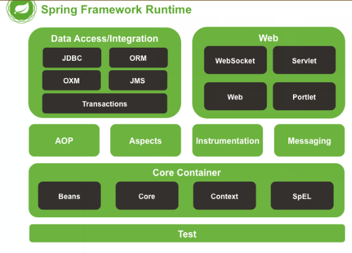
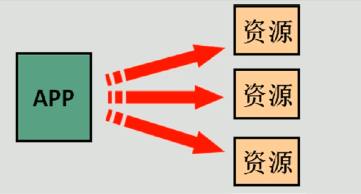
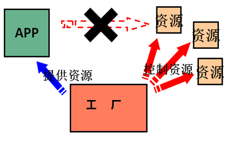
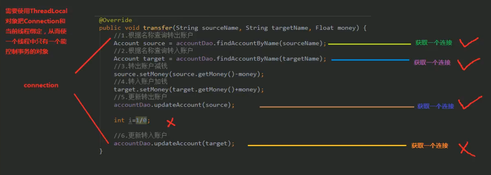
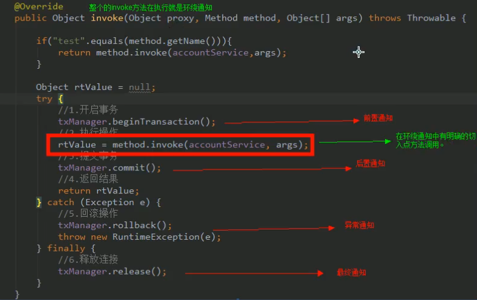
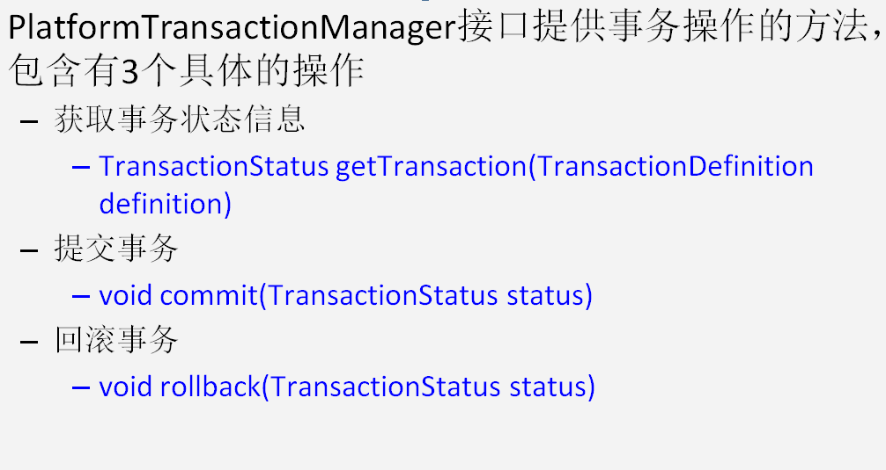
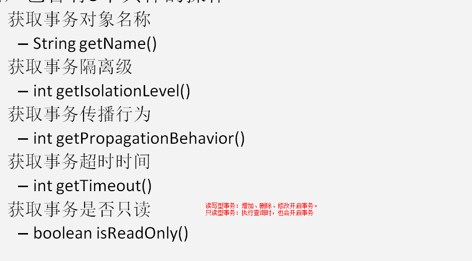
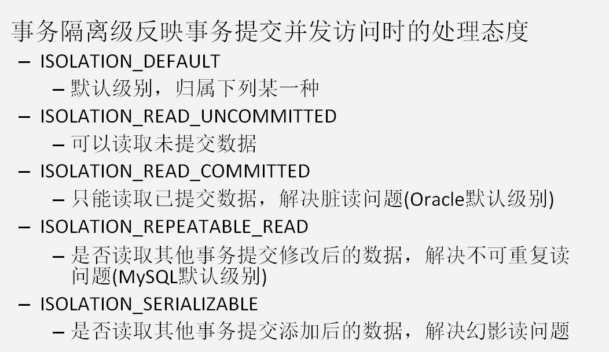
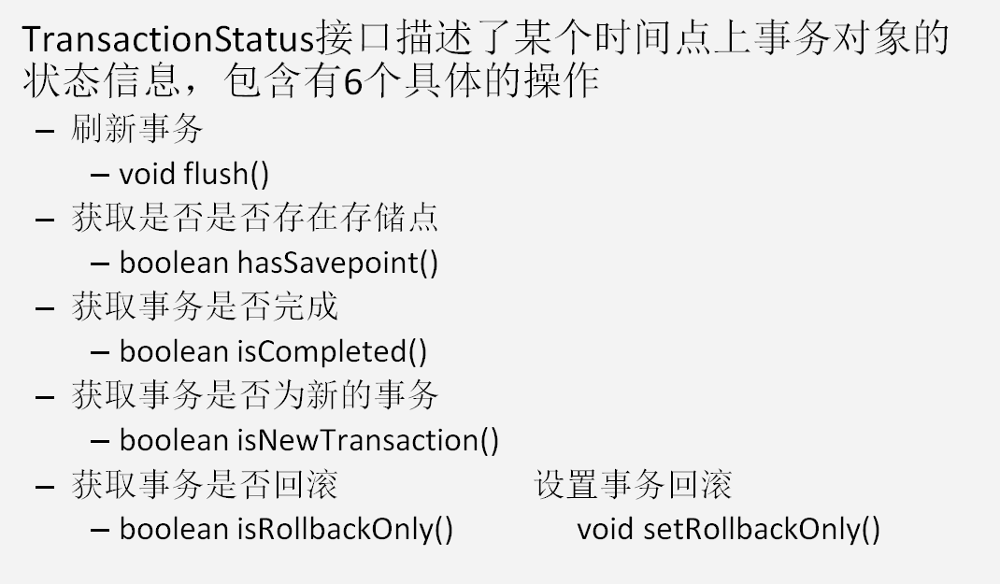

###  Spring 概述

Spring是分层的 Java SE/EE应用 **full-stack** 轻量级开源框架，**以 IoC（Inverse Of Control：**
**反转控制）和 AOP（Aspect Oriented Programming：面向切面编程）为内核**，提供了展现层 Spring
MVC 和持久层 Spring JDBC 以及业务层事务管理等众多的企业级应用技术，还能整合开源世界众多
著名的第三方框架和类库，逐渐成为使用最多的Java EE 企业应用开源框架

#### spring  的优势

**方便解耦，简化开发**
通过 Spring提供的 IoC容器，可以将对象间的依赖关系交由 Spring进行控制，避免硬编码所造
成的过度程序耦合。用户也不必再为单例模式类、属性文件解析等这些很底层的需求编写代码，可
以更专注于上层的应用。
**AOP 编程的支持**
通过 Spring的 AOP 功能，方便进行面向切面的编程，许多不容易用传统OOP 实现的功能可以

通过 AOP 轻松应付。
**声明式事务的支持**
可以将我们从单调烦闷的事务管理代码中解脱出来，通过声明式方式灵活的进行事务的管理，
提高开发效率和质量。
**方便程序的测试**
可以用非容器依赖的编程方式进行几乎所有的测试工作，测试不再是昂贵的操作，而是随手可
做的事情。
**方便集成各种优秀框架**
Spring可以降低各种框架的使用难度，提供了对各种优秀框架（Struts、Hibernate、Hessian、Quartz
等）的直接支持。
**低 降低 JavaEE API 的使用难度**
Spring对 JavaEE API（如 JDBC、JavaMail、远程调用等）进行了薄薄的封装层，使这些 API 的
使用难度大为降低。
**Java 源码是经典学习范例**
Spring的源代码设计精妙、结构清晰、匠心独用，处处体现着大师对Java 设计模式灵活运用以
及对 Java技术的高深造诣。它的源代码无意是 Java 技术的最佳实践的范例





###  IOC的概念和作用


#### 什么是程序的耦合

耦合： 程序间的依赖关系

包括：类之间的依赖，方法之间的依赖


解耦：

​	**降低程序间的依赖关系**。

实际开发中：
	实际做到：**编译期不依赖，运行时依赖**。

**解耦的思路：**

​	第一步：**使用反射来创建对象，而避免使用new关键字**

   第二部： **通过读取配置文件来**获取要创建的对象全限定类名。


#### IOC到底是什么意思？


```java
private IAccountDao accountDao  = new AccountDaoImpl(); 

// 有独立的控制权，想要谁，就要谁，控制权的转移，就叫做控制反转。把控制权交给工厂，帮我们创建对象，带来的好处，就是降低程序之间的依赖关系。也叫削减计算机的耦合。

private IAccountDao accountDao = (IAccountDao)BeanFactory.getBean("accountDao");

```


#### 工厂模式解耦

在实际开发中我们可以把三层的对象都使用配置文件配置起来,当启动服务器应用加载的时候,让一个类中的
方法通过读取配置文件,把这些对象创建出来并存起来。在接下来的使用的时候,直接拿过来用就好了。
那么,这个读取配置文件,创建和获取三层对象的类就是工厂。


#### 控制反转-Inversion Of Control

把创建对象的权利交给框架（工厂），是框架的重要特征，并非面向对象编程的专用术语。

它包含依赖注入（Dependency Injection 简称：DI），和依赖查找(Dependency Look)。

原来：

在获取对象时,都是采用 new 的方式。是主动的。



​	

现在:
我们获取对象时,同时跟工厂要,有工厂为我们查找或者创建对象。是被动的





这种被动接收的方式获取对象的思想就是控制反转,它是 spring 框架的核心之一。

#### **明确 ioc 的作用**

**削减计算机程序的耦合**(解除我们代码中的依赖关系)。


### 使用 spring 的 IOC 解决程序耦合


#### 基于 XML 的配置

spring 核心容器：简单理解，就是个map,封装了要用的对象。

1,依赖配置

```XML

    <dependencies>
        <dependency>
            <groupId>org.springframework</groupId>
            <artifactId>spring-context</artifactId>
            <version>5.0.2.RELEASE</version>
        </dependency>
    </dependencies>
```

2，新建bean.xml 名字随意 ，导入约束

```xml
<beans xmlns="http://www.springframework.org/schema/beans"
       xmlns:xsi="http://www.w3.org/2001/XMLSchema-instance"
       xsi:schemaLocation="http://www.springframework.org/schema/beans
http://www.springframework.org/schema/beans/spring-beans.xsd">
    <bean id="accountDao" class="com.zkk.account.dao.AccountDaoImpl"/>

</beans>
```

3,

```java
   /**
     * 获取ioc容器，并且根据id获取对象
     * @param args
     */
public static void main(String[] args) {
        //1 获取核心容器对象
        ApplicationContext ac = new ClassPathXmlApplicationContext("bean.xml");
        //2 根据id获取bean对象
        AccountDao accountDao1 = (AccountDao) ac.getBean("accountDao");
        AccountDao accountDao2 = ac.getBean("accountDao", AccountDao.class);
        System.out.println(accountDao1);
        System.out.println(accountDao2);
    }
```

### ApplicationContext 接口的实现类


ClassPathXmlApplicationContext:
**它是从类的根路径下加载配置文件** 推荐使用这种

FileSystemXmlApplicationContext:
它是从磁盘路径上加载配置文件,配置文件可以在磁盘的任意位置。
AnnotationConfigApplicationContext:
当我们使用注解配置容器对象时,需要使用此类来创建 spring 容器。它用来读取注解


### BeanFactory 和 ApplicationContext 的区别

BeanFactory 才是 Spring 容器中的顶层接口。
ApplicationContext 是它的子接口。
BeanFactory 和 ApplicationContext 的区别:
创建对象的时间点不一样。
ApplicationContext:只要一读取配置文件,默认情况下就会创建对象。所以，**单利的情况适用**。实际开发中，使用次对象。
BeanFactory:什么使用什么时候创建对象。也就是说，什么时候创建id获取对象了，什么时候才真正的创建对象。所以，**多例情况适用**。


#### IOC 中 bean 标签和管理对象细节 


#### 实例化 Bean 的三种方式

第一种方式:**使用默认无参构造函数**

```xml
 <!--在默认情况下:
        它会根据默认无参构造函数来创建类对象。如果 bean 中没有默认无参构造函数,将会创建失败。
    -->
    <bean id="accountDao" class="com.zkk.account.dao.AccountDaoImpl"/>
```

第二种方式 	使用普通工厂中的方法创建对象（使用某个类中的方法创建对象，并存入spring容器）

​	spring 管理实例工厂-使用实例工厂的方法创建对象

​	实际开发中，有可能使用别人写好的类，有可能是存在于jar包中的，我们是无法修改的，我们如何使用呢？

   

```java
/**
 * 模拟一个工厂类，（该类有可能是存在于jar中，我们无法修改源码来提供默认构造函数）
 */
public class InstanceFactory {
    public AccountDao getAccountDao(){
        return new AccountDaoImpl();
    }
}

```


```xml

    <bean id="instanceFactory" class="com.zkk.factory.InstanceFactory"/>

    <bean id="accountDao" factory-bean="instanceFactory" factory-method="getAccountDao"/>
```

第三种方式 使用工厂中的静态方法创建对象（使用某个类中的静态方法创建对象，并存入spring 容器 ）

```java
/**
 * 模拟一个工厂类，（该类有可能是存在于jar中，我们无法修改源码来提供默认构造函数）
 */
public class StaticInstanceFactory {
    public static AccountDao getAccountDao(){
        return new AccountDaoImpl();
    }
}
```


```xml
 <bean id="accountDao" class="com.zkk.factory.StaticInstanceFactory" factory-method="getAccountDao"/>
```


#### bean 的作用范围和生命周期

bean 标签的scope属性:

​	作用：用于指定bean属性的作用范围

   取值：常用的就是单例和多例。

​	 	singleton: 单利（默认）

​	     prototype: 多例

​		 request: 作用于web应用的请求范围

​	    session:作用于web应用的会话范围，

​		 global-session:作用于集群环境的会话范围，（全局会话范围），当不是集群环境时，它是session.


bean 对象的生命周期：

```xml
 <bean id="accountDao" class="com.zkk.account.dao.AccountDaoImpl" init-method="init" destroy-method="destory"/>
```

单例对象：

​		出生：当容器创建时，对象出生

​	 	活着： 只要容器在，对象一直活着。

​		 死亡：容器销毁，对象消亡。

​		总结：单利对象的生命周期和容器相同

  多例对象：

​		出生：当我们使用对象时候，spring框架为我们创建。

​		活着：对象在使用过程中就一直活着

​		死亡：对象长时间不用，并且没有别的对象引用，由java垃圾回收机制回收。

spring 框架是一个很强大的框架，他可以感知到对象的作用范围，是单利还是多例，从而选择什么时候创建对象，对象创建的时机是立即，还是延迟。


### spring 的依赖注入

依赖注入:Dependency Injection。**它是 spring 框架核心 ioc 的具体实现**。

我们的程序在编写时,通过控制反转,把对象的创建交给了 spring,但是代码中不可能出现没有依赖的情况。
**ioc 解耦只是降低他们的依赖关系,但不会消除**。例如:我们的业务层仍会调用持久层的方法。
那这种业务层和持久层的依赖关系,在使用 spring 之后,就让 spring 来维护了。
简单的说,就是坐等框架把持久层对象传入业务层,而不用我们自己去获取。


spring 中的依赖注入：

​	依赖注入：

​	 	Dependency Injection.

​	IOC的作用：	 

​		降低程序间的耦合

​	依赖关系的管理：

​		以后都交给spring 来维护

​	在当前类需要用到其他类的对象，由spring 为我们提供，我们只需要在配置文件中说明

​    依赖关系的维护：

​			就称为依赖注入。

  依赖注入：

​	  能注入的数据有三类。

​			基本类型和String

​			其他bean类型（在配置文件中活着注释配置过的bean，也可以说，是在spring容器存在的bean）

​            复杂类型/集合类型

   注入的方式：有三种

​         第一种：使用构造函数提供

​				

```java
public class AccountServiceImpl implements IAccountService{
    //如果是经常变化的数据，并不适合注入的方式，
    private Integer age; //包装类
    private String name;//基本类型
    private Date birthday;//其他bean类型

    public AccountServiceImpl(String name,Integer age,Date birthday){
        this.age =age;
        this.name =name;
        this.birthday =birthday;
    }

    public void createAccount() {
        System.out.println("createAccount:"+name+":"+age+":birthdata:"+birthday);
    }
}

```


```java
 <!--
        构造函数的注入：
         使用的标签：constructor-arg
         标签出现的位置：bean标签的内部
         标签中的属性
            type: 用于指定要注入的数据类型，改数据类型也是构造函数中某个或某些参数的类型
            index：用于指定要注入的数据给构造函数中指定索引位置的参数赋值,位置从0开始
            name: 用户给构造函数中，指定名称的参数赋值 （常用的）
            =============以上三个用户指定给构造函数中哪个参数赋值===============
            value : 基本类型和String 类型。
            ref：用于指定其他bean类型。它指定的就是在spring 的ioc容器中，出现过的bean对象。


            优势：在获取对象时，注入数据是必须的操作， 否则对象无法创建成功。
            弊端：改变bean对象实例化方式，使我们在创建对象时，如果用不到这些数据，也必须提供。
    -->
    <bean id="accountService" class="com.zkk.account.service.AccountServiceImpl" scope="prototype">
        <constructor-arg name="name" value="test"></constructor-arg>
        <constructor-arg name="age" value="1"></constructor-arg>
        <constructor-arg name="birthday" ref="now"></constructor-arg>
    </bean>
    <!--配置一个data对象-->
    <bean id="now" class="java.util.Date" scope="prototype"/>
```

​		第二种： 使用set方法提供

```java
public class AccountServiceImpl2 implements IAccountService {
    //如果是经常变化的数据，并不适合注入的方式，
    private Integer age; //包装类
    private String name;//基本类型

    public void setAge(Integer age) {
        this.age = age;
    }

    public void setName(String name) {
        this.name = name;
    }

    public void setBirthday(Date birthday) {
        this.birthday = birthday;
    }

    private Date birthday;//其他bean类型


    public void createAccount() {
        System.out.println("createAccount:" + name + ":" + age + ":birthdata:" + birthday);
    }

```


```xml
 <!--set 方法注入 更常用的是set方式
        涉及的标签： property
         name:  用于指定注入时所调用的set方法名称
         value : 基本类型和String 类型。
         ref:用于指定其他bean类型。它指定的就是在spring 的ioc容器中，出现过的bean对象。
         优势：创建对象时候没有明确的限制，可以直接使用构造函数
         弊端：如果有某个成员必须有值，则获取对象是有可能set方法没有执行。
    -->
    <bean id = "accountService2" class="com.zkk.account.service.AccountServiceImpl2" scope="prototype">
        <property name="age" value="1"/>
        <property name="name" value="zhang3"/>
        <property name="birthday" ref="now" />
     </bean>
```


复杂类型注入：

```java
public class AccountServiceImpl3 implements IAccountService {

    private String[] myStrs;
    private List<String> myList;
    private Set<String> mySet;
    private Map<String,String> myMap;
    private Properties myProps;

    public void setMyStrs(String[] myStrs) {
        this.myStrs = myStrs;
    }

    public void setMyList(List<String> myList) {
        this.myList = myList;
    }

    public void setMySet(Set<String> mySet) {
        this.mySet = mySet;
    }

    public void setMyMap(Map<String, String> myMap) {
        this.myMap = myMap;
    }

    public void setMyProps(Properties myProps) {
        this.myProps = myProps;
    }

    public void  saveAccount(){
        System.out.println(Arrays.toString(myStrs));
        System.out.println(myList);
        System.out.println(mySet);
        System.out.println(myMap);
        System.out.println(myProps);
    }


}
```


```xml
  <!-- 复杂类型的注入/集合类型的注入
        用于给List结构集合注入的标签：
            list array set
        用于个Map结构集合注入的标签:
            map  props
        结构相同，标签可以互换
    -->
    <bean id="accountService3" class="com.itheima.service.impl.AccountServiceImpl3">
        <property name="myStrs">
            <set>
                <value>AAA</value>
                <value>BBB</value>
                <value>CCC</value>
            </set>
        </property>

        <property name="myList">
            <array>
                <value>AAA</value>
                <value>BBB</value>
                <value>CCC</value>
            </array>
        </property>

        <property name="mySet">
            <list>
                <value>AAA</value>
                <value>BBB</value>
                <value>CCC</value>
            </list>
        </property>

        <property name="myMap">
            <props>
                <prop key="testC">ccc</prop>
                <prop key="testD">ddd</prop>
            </props>
        </property>

        <property name="myProps">
            <map>
                <entry key="testA" value="aaa"></entry>
                <entry key="testB">
                    <value>BBB</value>
                </entry>
            </map>
        </property>
    </bean>


```


第三种：使用注解提供。


### 基于注解的 IOC 配置


学习基于注解的 IoC 配置,大家脑海里首先得有一个认知,即注解配置和 xml 配置要实现的功能都是一样
的,都是要降低程序间的耦合。只是配置的形式不一样。
关于实际的开发中到底使用 xml 还是注解,每家公司有着不同的使用习惯。所以这两种配置方式我们都需要掌
握。
我们在讲解注解配置时,采用上一章节的案例,把 spring 的 xml 配置内容改为使用注解逐步实现


**创建 spring 的 xml 配置文件并开启对注解的支持**

```xml
<?xml version="1.0" encoding="UTF-8"?>
<beans xmlns="http://www.springframework.org/schema/beans"
       xmlns:xsi="http://www.w3.org/2001/XMLSchema-instance"
       xmlns:context="http://www.springframework.org/schema/context"
       xsi:schemaLocation="http://www.springframework.org/schema/beans
        http://www.springframework.org/schema/beans/spring-beans.xsd
        http://www.springframework.org/schema/context
        http://www.springframework.org/schema/context/spring-context.xsd">

    <!--告知spring在创建容器时要扫描的包，配置所需要的标签不是在beans的约束中，而是一个名称为
    context名称空间和约束中-->
    <context:component-scan base-package="com.zkk"></context:component-scan>
</beans>
```


```java
/**
 * 账户的业务层实现类
 *
 * 曾经XML的配置：
 *  <bean id="accountService" class="com.itheima.service.impl.AccountServiceImpl"
 *        scope=""  init-method="" destroy-method="">
 *      <property name=""  value="" | ref=""></property>
 *  </bean>
 *
 * 用于创建对象的
 *      他们的作用就和在XML配置文件中编写一个<bean>标签实现的功能是一样的
 *      Component:
 *          作用：用于把当前类对象存入spring容器中
 *          属性：
 *              value：用于指定bean的id。当我们不写时，它的默认值是当前类名，且首字母改小写。
 *      Controller：一般用在表现层
 *      Service：一般用在业务层
 *      Repository：一般用在持久层
 *      以上三个注解他们的作用和属性与Component是一模一样。
 *      他们三个是spring框架为我们提供明确的三层使用的注解，使我们的三层对象更加清晰
 *
 *
 * 用于注入数据的
 *      他们的作用就和在xml配置文件中的bean标签中写一个<property>标签的作用是一样的
 *      Autowired:
 *          作用：自动按照类型注入。只要容器中有唯一的一个bean对象类型和要注入的变量类型匹配，就可以注入成功
 *                如果ioc容器中没有任何bean的类型和要注入的变量类型匹配，则报错。
 *                如果Ioc容器中有多个类型匹配时：首先按照类型，圈定出来匹配的对象，（假如有两个),第二步，使用变量名称作为bean的id,在圈定出来的这2个继续查找，如果有一样的，也可以注入成功，如果两个都不一样，就报错。 
 *          出现位置：
 *              可以是变量上，也可以是方法上
 *          细节：
 *              在使用注解注入时，set方法就不是必须的了。
 *      Qualifier:
 *          作用：在按照类中注入的基础之上再按照名称注入。它在给类成员注入时不能单独使用。但是在给方法参数注入时可以（稍后我们讲）
 *          属性：
 *              value：用于指定注入bean的id。
 *      Resource
 *          作用：直接按照bean的id注入。它可以独立使用
 *          属性：
 *              name：用于指定bean的id。
 *      以上三个注入都只能注入其他bean类型的数据，而基本类型和String类型无法使用上述注解实现。
 *      另外，集合类型的注入只能通过XML来实现。
 *
 *      Value
 *          作用：用于注入基本类型和String类型的数据
 *          属性：
 *              value：用于指定数据的值。它可以使用spring中SpEL(也就是spring的el表达式）
 *                      SpEL的写法：${表达式}
 *
 * 用于改变作用范围的
 *      他们的作用就和在bean标签中使用scope属性实现的功能是一样的
 *      Scope
 *          作用：用于指定bean的作用范围
 *          属性：
 *              value：指定范围的取值。常用取值：singleton prototype
 *
 * 和生命周期相关 了解
 *      他们的作用就和在bean标签中使用init-method和destroy-methode的作用是一样的
 *      PreDestroy
 *          作用：用于指定销毁方法
 *      PostConstruct
 *          作用：用于指定初始化方法
 */
@Service("accountService")
//@Scope("prototype")
public class AccountServiceImpl implements IAccountService {

//    @Autowired
//    @Qualifier("accountDao1")
    @Resource(name = "accountDao2")
    private IAccountDao accountDao = null;

    @PostConstruct
    public void  init(){
        System.out.println("初始化方法执行了");
    }

    @PreDestroy
    public void  destroy(){
        System.out.println("销毁方法执行了");
    }

    public void  saveAccount(){
        accountDao.saveAccount();
    }
}
```

​            	

demo:		

xml 方式

```xml
<?xml version="1.0" encoding="UTF-8"?>
<beans xmlns="http://www.springframework.org/schema/beans"
       xmlns:xsi="http://www.w3.org/2001/XMLSchema-instance"
       xsi:schemaLocation="http://www.springframework.org/schema/beans
        http://www.springframework.org/schema/beans/spring-beans.xsd">
    <!-- 配置Service -->
    <bean id="accountService" class="com.itheima.service.impl.AccountServiceImpl">
        <!-- 注入dao -->
        <property name="accountDao" ref="accountDao"></property>
    </bean>

    <!--配置Dao对象-->
    <bean id="accountDao" class="com.itheima.dao.impl.AccountDaoImpl">
        <!-- 注入QueryRunner -->
        <property name="runner" ref="runner"></property>
    </bean>

    <!--配置QueryRunner-->
    <bean id="runner" class="org.apache.commons.dbutils.QueryRunner" scope="prototype">
        <!--注入数据源-->
        <constructor-arg name="ds" ref="dataSource"></constructor-arg>
    </bean>

    <!-- 配置数据源 -->
    <bean id="dataSource" class="com.mchange.v2.c3p0.ComboPooledDataSource">
        <!--连接数据库的必备信息-->
        <property name="driverClass" value="com.mysql.jdbc.Driver"></property>
        <property name="jdbcUrl" value="jdbc:mysql://localhost:3306/eesy"></property>
        <property name="user" value="root"></property>
        <property name="password" value="1234"></property>
    </bean>
</beans>
```

注解：

```xml
<?xml version="1.0" encoding="UTF-8"?>
<beans xmlns="http://www.springframework.org/schema/beans"
       xmlns:xsi="http://www.w3.org/2001/XMLSchema-instance"
       xmlns:context="http://www.springframework.org/schema/context"
       xsi:schemaLocation="http://www.springframework.org/schema/beans
        http://www.springframework.org/schema/beans/spring-beans.xsd
        http://www.springframework.org/schema/context
        http://www.springframework.org/schema/context/spring-context.xsd">

    <!-- 告知spring在创建容器时要扫描的包 -->
    <context:component-scan base-package="com.itheima"></context:component-scan>
    <!--配置QueryRunner-->
    <bean id="runner" class="org.apache.commons.dbutils.QueryRunner" scope="prototype">
        <!--注入数据源-->
        <constructor-arg name="ds" ref="dataSource"></constructor-arg>
    </bean>

    <!-- 配置数据源 -->
    <bean id="dataSource" class="com.mchange.v2.c3p0.ComboPooledDataSource">
        <!--连接数据库的必备信息-->
        <property name="driverClass" value="com.mysql.jdbc.Driver"></property>
        <property name="jdbcUrl" value="jdbc:mysql://localhost:3306/eesy"></property>
        <property name="user" value="root"></property>
        <property name="password" value="1234"></property>
    </bean>
</beans>
```


问题：不管是注解还是xml, xml都无法省略，上面的注解只能用在自己的类上，比如queryRunner 他是jar中的类，无法添加注解。

#### 新注解说明

```java
/**
 * 该类是一个配置类，它的作用和bean.xml是一样的
 * spring中的新注解
 * Configuration
 *     作用：指定当前类是一个配置类
 *     细节：当配置类作为AnnotationConfigApplicationContext对象创建的参数时，该注解可以不写。
 * ComponentScan
 *      作用：用于通过注解指定spring在创建容器时要扫描的包
 *      属性：
 *          value：它和basePackages的作用是一样的，都是用于指定创建容器时要扫描的包。
 *                 我们使用此注解就等同于在xml中配置了:
 *                      <context:component-scan base-package="com.itheima"></context:component-scan>
 *  Bean
 *      作用：用于把当前方法的返回值作为bean对象存入spring的ioc容器中
 *      属性:
 *          name:用于指定bean的id。当不写时，默认值是当前方法的名称
 *      细节：
 *          当我们使用注解配置方法时，如果方法有参数，spring框架会去容器中查找有没有可用的bean对象。
 *          查找的方式和Autowired注解的作用是一样的
 *  Import
 *      作用：用于导入其他的配置类
 *      属性：
 *          value：用于指定其他配置类的字节码。
 *                  当我们使用Import的注解之后，有Import注解的类就父配置类，而导入的都是子配置类
 *  PropertySource
 *      作用：用于指定properties文件的位置
 *      属性：
 *          value：指定文件的名称和路径。
 *                  关键字：classpath，表示类路径下
 */
//@Configuration
@ComponentScan("com.itheima")
@Import(JdbcConfig.class)
@PropertySource("classpath:jdbcConfig.properties")
public class SpringConfiguration {


}
```

```java
/**
 * 和spring连接数据库相关的配置类
 */
public class JdbcConfig {

    @Value("${jdbc.driver}")
    private String driver;

    @Value("${jdbc.url}")
    private String url;

    @Value("${jdbc.username}")
    private String username;

    @Value("${jdbc.password}")
    private String password;

    /**
     * 用于创建一个QueryRunner对象
     * @param dataSource
     * @return
     */
    @Bean(name="runner")
    @Scope("prototype")
    public QueryRunner createQueryRunner(@Qualifier("ds2") DataSource dataSource){
        return new QueryRunner(dataSource);
    }

    /**
     * 创建数据源对象
     * @return
     */
    @Bean(name="ds2")
    public DataSource createDataSource(){
        try {
            ComboPooledDataSource ds = new ComboPooledDataSource();
            ds.setDriverClass(driver);
            ds.setJdbcUrl(url);
            ds.setUser(username);
            ds.setPassword(password);
            return ds;
        }catch (Exception e){
            throw new RuntimeException(e);
        }
    }

    @Bean(name="ds1")
    public DataSource createDataSource1(){
        try {
            ComboPooledDataSource ds = new ComboPooledDataSource();
            ds.setDriverClass(driver);
            ds.setJdbcUrl("jdbc:mysql://localhost:3306/eesy02");
            ds.setUser(username);
            ds.setPassword(password);
            return ds;
        }catch (Exception e){
            throw new RuntimeException(e);
        }
    }
}
```

spring 整合junit 框架

第一步:拷贝整合 junit 的必备 jar 包到 lib 目录

```xml
   <dependency>
            <groupId>org.springframework</groupId>
            <artifactId>spring-test</artifactId>
            <version>5.0.2.RELEASE</version>
        </dependency>

```

第二步:使用@RunWith 注解替换原有运行器


第三步:使用@ContextConfiguration 指定 spring 配置文件的位置


第四步:使用@Autowired 给测试类中的变量注入数据

```java
/**
 * 使用Junit单元测试：测试我们的配置
 * Spring整合junit的配置
 *      1、导入spring整合junit的jar(坐标)
 *      2、使用Junit提供的一个注解把原有的main方法替换了，替换成spring提供的
 *             @Runwith
 *      3、告知spring的运行器，spring和ioc创建是基于xml还是注解的，并且说明位置
 *          @ContextConfiguration
 *                  locations：指定xml文件的位置，加上classpath关键字，表示在类路径下
 *                  classes：指定注解类所在地位置
 *
 *   当我们使用spring 5.x版本的时候，要求junit的jar必须是4.12及以上
 */
@RunWith(SpringJUnit4ClassRunner.class)
@ContextConfiguration(classes = SpringConfiguration.class)
public class AccountServiceTest {

    @Autowired
    private IAccountService as = null;


    @Test
    public void testFindAll() {
        //3.执行方法
        List<Account> accounts = as.findAllAccount();
        for(Account account : accounts){
            System.out.println(account);
        }
    }
}

 
```


### AOP 的相关概念

#### 什么是 AOP

AOP:全称是 Aspect Oriented Programming 即:面向切面编程。


在软件业，AOP为Aspect Oriented Programming的缩写，意为：[面向切面编程](https://baike.baidu.com/item/面向切面编程/6016335)，通过[预编译](https://baike.baidu.com/item/预编译/3191547)方式和运行期间动态代理实现程序功能的统一维护的一种技术。AOP是[OOP](https://baike.baidu.com/item/OOP)的延续，是软件开发中的一个热点，也是[Spring](https://baike.baidu.com/item/Spring)框架中的一个重要内容，是[函数式编程](https://baike.baidu.com/item/函数式编程/4035031)的一种衍生范型。利用AOP可以对业务逻辑的各个部分进行隔离，从而使得业务逻辑各部分之间的[耦合度](https://baike.baidu.com/item/耦合度/2603938)降低，提高程序的可重用性，同时提高了开发的效率。


#### AOP 的作用及优势

**作用:**
在程序运行期间,不修改源码对已有方法进行增强。
**优势:**
减少重复代码
提高开发效率
维护方便

#### AOP 的实现方式

**使用动态代理技术**


```java
业务层接口
/**
* 转账
* @param sourceName
* @param targetName
* @param money
*/
void transfer(String sourceName,String targetName,Float money);
业务层实现类:
@Override
public void transfer(String sourceName, String targetName, Float money) {
//根据名称查询两个账户信息
Account source = accountDao.findByName(sourceName);
Account target = accountDao.findByName(targetName);
//转出账户减钱,转入账户加钱
source.setMoney(source.getMoney()-money);
target.setMoney(target.getMoney()+money);
//更新两个账户
accountDao.update(source);
int i=1/0; //模拟转账异常
accountDao.update(target);
}
```

当我们执行时,由于执行有异常,转账失败。但是因为我们是每次执行持久层方法都是独立事务,导致无法实
现事务控制(**不符合事务的一致性**)



 事务的控制应该都是在业务层的，而之前都是在持久层。

问题解决

```java
/**
 * 和事务管理相关的工具类，它包含了，开启事务，提交事务，回滚事务和释放连接
 */
public class TransactionManager {

    private ConnectionUtils connectionUtils;

    public void setConnectionUtils(ConnectionUtils connectionUtils) {
        this.connectionUtils = connectionUtils;
    }

    /**
     * 开启事务
     */
    public  void beginTransaction(){
        try {
            connectionUtils.getThreadConnection().setAutoCommit(false);
        }catch (Exception e){
            e.printStackTrace();
        }
    }

    /**
     * 提交事务
     */
    public  void commit(){
        try {
            connectionUtils.getThreadConnection().commit();
        }catch (Exception e){
            e.printStackTrace();
        }
    }

    /**
     * 回滚事务
     */
    public  void rollback(){
        try {
            connectionUtils.getThreadConnection().rollback();
        }catch (Exception e){
            e.printStackTrace();
        }
    }


    /**
     * 释放连接
     */
    public  void release(){
        try {
            connectionUtils.getThreadConnection().close();//还回连接池中
            connectionUtils.removeConnection();
        }catch (Exception e){
            e.printStackTrace();
        }
    }
}
```


```java
public class ConnectionUtils {

    private ThreadLocal<Connection> tl = new ThreadLocal<Connection>();

    private DataSource dataSource;

    public void setDataSource(DataSource dataSource) {
        this.dataSource = dataSource;
    }

    /**
     * 获取当前线程上的连接
     * @return
     */
    public Connection getThreadConnection() {
        try{
            //1.先从ThreadLocal上获取
            Connection conn = tl.get();
            //2.判断当前线程上是否有连接
            if (conn == null) {
                //3.从数据源中获取一个连接，并且存入ThreadLocal中
                conn = dataSource.getConnection();
                tl.set(conn);
            }
            //4.返回当前线程上的连接
            return conn;
        }catch (Exception e){
            throw new RuntimeException(e);
        }
    }

    /**
     * 把连接和线程解绑
     */
    public void removeConnection(){
        tl.remove();
    }
}
```


```java
/**
 * 账户的业务层实现类
 *
 * 事务控制应该都是在业务层
 */
public class AccountServiceImpl_OLD implements IAccountService{

    private IAccountDao accountDao;
    private TransactionManager txManager;

    public void setTxManager(TransactionManager txManager) {
        this.txManager = txManager;
    }

    public void setAccountDao(IAccountDao accountDao) {
        this.accountDao = accountDao;
    }

    @Override
    public List<Account> findAllAccount() {
        try {
            //1.开启事务
            txManager.beginTransaction();
            //2.执行操作
            List<Account> accounts = accountDao.findAllAccount();
            //3.提交事务
            txManager.commit();
            //4.返回结果
            return accounts;
        }catch (Exception e){
            //5.回滚操作
            txManager.rollback();
            throw new RuntimeException(e);
        }finally {
            //6.释放连接
            txManager.release();
        }

    }

    @Override
    public Account findAccountById(Integer accountId) {
        try {
            //1.开启事务
            txManager.beginTransaction();
            //2.执行操作
            Account account = accountDao.findAccountById(accountId);
            //3.提交事务
            txManager.commit();
            //4.返回结果
            return account;
        }catch (Exception e){
            //5.回滚操作
            txManager.rollback();
            throw new RuntimeException(e);
        }finally {
            //6.释放连接
            txManager.release();
        }
    }

    @Override
    public void saveAccount(Account account) {
        try {
            //1.开启事务
            txManager.beginTransaction();
            //2.执行操作
            accountDao.saveAccount(account);
            //3.提交事务
            txManager.commit();
        }catch (Exception e){
            //4.回滚操作
            txManager.rollback();
        }finally {
            //5.释放连接
            txManager.release();
        }

    }

    @Override
    public void updateAccount(Account account) {
        try {
            //1.开启事务
            txManager.beginTransaction();
            //2.执行操作
            accountDao.updateAccount(account);
            //3.提交事务
            txManager.commit();
        }catch (Exception e){
            //4.回滚操作
            txManager.rollback();
        }finally {
            //5.释放连接
            txManager.release();
        }

    }

    @Override
    public void deleteAccount(Integer acccountId) {
        try {
            //1.开启事务
            txManager.beginTransaction();
            //2.执行操作
            accountDao.deleteAccount(acccountId);
            //3.提交事务
            txManager.commit();
        }catch (Exception e){
            //4.回滚操作
            txManager.rollback();
        }finally {
            //5.释放连接
            txManager.release();
        }

    }

    @Override
    public void transfer(String sourceName, String targetName, Float money) {
        try {
            //1.开启事务
            txManager.beginTransaction();
            //2.执行操作

            //2.1根据名称查询转出账户
            Account source = accountDao.findAccountByName(sourceName);
            //2.2根据名称查询转入账户
            Account target = accountDao.findAccountByName(targetName);
            //2.3转出账户减钱
            source.setMoney(source.getMoney()-money);
            //2.4转入账户加钱
            target.setMoney(target.getMoney()+money);
            //2.5更新转出账户
            accountDao.updateAccount(source);

            int i=1/0;

            //2.6更新转入账户
            accountDao.updateAccount(target);
            //3.提交事务
            txManager.commit();

        }catch (Exception e){
            //4.回滚操作
            txManager.rollback();
            e.printStackTrace();
        }finally {
            //5.释放连接
            txManager.release();
        }


    }
}
```

```xml
<?xml version="1.0" encoding="UTF-8"?>
<beans xmlns="http://www.springframework.org/schema/beans"
       xmlns:xsi="http://www.w3.org/2001/XMLSchema-instance"
       xsi:schemaLocation="http://www.springframework.org/schema/beans
        http://www.springframework.org/schema/beans/spring-beans.xsd">

    <!--配置代理的service-->
    <bean id="proxyAccountService" factory-bean="beanFactory" factory-method="getAccountService"></bean>

    <!--配置beanfactory-->
    <bean id="beanFactory" class="com.itheima.factory.BeanFactory">
        <!-- 注入service -->
        <property name="accountService" ref="accountService"></property>
        <!-- 注入事务管理器 -->
        <property name="txManager" ref="txManager"></property>
    </bean>

     <!-- 配置Service -->
    <bean id="accountService" class="com.itheima.service.impl.AccountServiceImpl">
        <!-- 注入dao -->
        <property name="accountDao" ref="accountDao"></property>
    </bean>

    <!--配置Dao对象-->
    <bean id="accountDao" class="com.itheima.dao.impl.AccountDaoImpl">
        <!-- 注入QueryRunner -->
        <property name="runner" ref="runner"></property>
        <!-- 注入ConnectionUtils -->
        <property name="connectionUtils" ref="connectionUtils"></property>
    </bean>

    <!--配置QueryRunner-->
    <bean id="runner" class="org.apache.commons.dbutils.QueryRunner" scope="prototype"></bean>

    <!-- 配置数据源 -->
    <bean id="dataSource" class="com.mchange.v2.c3p0.ComboPooledDataSource">
        <!--连接数据库的必备信息-->
        <property name="driverClass" value="com.mysql.jdbc.Driver"></property>
        <property name="jdbcUrl" value="jdbc:mysql://localhost:3306/eesy"></property>
        <property name="user" value="root"></property>
        <property name="password" value="1234"></property>
    </bean>

    <!-- 配置Connection的工具类 ConnectionUtils -->
    <bean id="connectionUtils" class="com.itheima.utils.ConnectionUtils">
        <!-- 注入数据源-->
        <property name="dataSource" ref="dataSource"></property>
    </bean>

    <!-- 配置事务管理器-->
    <bean id="txManager" class="com.itheima.utils.TransactionManager">
        <!-- 注入ConnectionUtils -->
        <property name="connectionUtils" ref="connectionUtils"></property>
    </bean>
</beans>

```

新的问题


上一小节的代码,通过对业务层改造,已经可以实现事务控制了,但是由于我们添加了事务控制,也产生了一
个新的问题:
**业务层方法变得臃肿了,里面充斥着很多重复代码。并且业务层方法和事务控制方法耦合了**。
试想一下,如果我们此时提交,回滚,释放资源中任何一个方法名变更,都需要修改业务层的代码,况且这还
只是一个业务层实现类,而实际的项目中这种业务层实现类可能有十几个甚至几十个


### 动态代理回顾


动态代理的特点


字节码随用随创建,随用随加载。
它与静态代理的区别也在于此。因为静态代理是字节码一上来就创建好,并完成加载。
**装饰者模式就是静态代理的一种体现。**


**基于接口的动态代理**

提供者:JDK 官方的 Proxy 类。
要求:被代理类最少实现一个接口。

**基于子类的动态代理**

提供者:第三方的 CGLib,如果报 asmxxxx 异常,需要导入 asm.jar。
要求:被代理类不能用 final 修饰的类(最终类)。


```java
/**
 * 模拟一个消费者
 */
public class Client {

    public static void main(String[] args) {
        final Producer producer = new Producer();

        /**
         * 动态代理：
         *  特点：字节码随用随创建，随用随加载
         *  作用：不修改源码的基础上对方法增强
         *  分类：
         *      基于接口的动态代理
         *      基于子类的动态代理
         *  基于接口的动态代理：
         *      涉及的类：Proxy
         *      提供者：JDK官方
         *  如何创建代理对象：
         *      使用Proxy类中的newProxyInstance方法
         *  创建代理对象的要求：
         *      被代理类最少实现一个接口，如果没有则不能使用
         *  newProxyInstance方法的参数：
         *      ClassLoader：类加载器
         *          它是用于加载代理对象字节码的。和被代理对象使用相同的类加载器。固定写法。
         *      Class[]：字节码数组
         *          它是用于让代理对象和被代理对象有相同方法。固定写法。
         *      InvocationHandler：用于提供增强的代码
         *          它是让我们写如何代理。我们一般都是些一个该接口的实现类，通常情况下都是匿名内部类，但不是必须的。
         *          此接口的实现类都是谁用谁写。
         */
       IProducer proxyProducer = (IProducer) Proxy.newProxyInstance(producer.getClass().getClassLoader(),
                producer.getClass().getInterfaces(),
                new InvocationHandler() {
                    /**
                     * 作用：执行被代理对象的任何接口方法都会经过该方法
                     * 方法参数的含义
                     * @param proxy   代理对象的引用
                     * @param method  当前执行的方法
                     * @param args    当前执行方法所需的参数
                     * @return        和被代理对象方法有相同的返回值
                     * @throws Throwable
                     */
                    @Override
                    public Object invoke(Object proxy, Method method, Object[] args) throws Throwable {
                        //提供增强的代码
                        Object returnValue = null;

                        //1.获取方法执行的参数
                        Float money = (Float)args[0];
                        //2.判断当前方法是不是销售
                        if("saleProduct".equals(method.getName())) {
                            returnValue = method.invoke(producer, money*0.8f);
                        }
                        return returnValue;
                    }
                });
        proxyProducer.saleProduct(10000f);
    }
}
```

CGLIB


```xml
 <dependencies>
        <dependency>
            <groupId>cglib</groupId>
            <artifactId>cglib</artifactId>
            <version>2.1_3</version>
        </dependency>
    </dependencies>

```


```java

/**
 * 模拟一个消费者
 */
public class Client {

    public static void main(String[] args) {
        final Producer producer = new Producer();

        /**
         * 动态代理：
         *  特点：字节码随用随创建，随用随加载
         *  作用：不修改源码的基础上对方法增强
         *  分类：
         *      基于接口的动态代理
         *      基于子类的动态代理
         *  基于子类的动态代理：
         *      涉及的类：Enhancer
         *      提供者：第三方cglib库
         *  如何创建代理对象：
         *      使用Enhancer类中的create方法
         *  创建代理对象的要求：
         *      被代理类不能是最终类
         *  create方法的参数：
         *      Class：字节码
         *          它是用于指定被代理对象的字节码。
         *
         *      Callback：用于提供增强的代码
         *          它是让我们写如何代理。我们一般都是些一个该接口的实现类，通常情况下都是匿名内部类，但不是必须的。
         *          此接口的实现类都是谁用谁写。
         *          我们一般写的都是该接口的子接口实现类：MethodInterceptor
         */
        Producer cglibProducer = (Producer)Enhancer.create(producer.getClass(), new MethodInterceptor() {
            /**
             * 执行北地阿里对象的任何方法都会经过该方法
             * @param proxy
             * @param method
             * @param args
             *    以上三个参数和基于接口的动态代理中invoke方法的参数是一样的
             * @param methodProxy ：当前执行方法的代理对象
             * @return
             * @throws Throwable
             */
            @Override
            public Object intercept(Object proxy, Method method, Object[] args, MethodProxy methodProxy) throws Throwable {
                //提供增强的代码
                Object returnValue = null;

                //1.获取方法执行的参数
                Float money = (Float)args[0];
                //2.判断当前方法是不是销售
                if("saleProduct".equals(method.getName())) {
                    returnValue = method.invoke(producer, money*0.8f);
                }
                return returnValue;
            }
        });
        cglibProducer.saleProduct(12000f);
    }
}
```


动态代理实现aop

```java
/**
 * 账户的业务层实现类
 *
 * 事务控制应该都是在业务层
 */
public class AccountServiceImpl implements IAccountService{

    private IAccountDao accountDao;

    public void setAccountDao(IAccountDao accountDao) {
        this.accountDao = accountDao;
    }

    @Override
    public List<Account> findAllAccount() {
       return accountDao.findAllAccount();
    }

    @Override
    public Account findAccountById(Integer accountId) {
        return accountDao.findAccountById(accountId);

    }

    @Override
    public void saveAccount(Account account) {
        accountDao.saveAccount(account);
    }

    @Override
    public void updateAccount(Account account) {
        accountDao.updateAccount(account);
    }

    @Override
    public void deleteAccount(Integer acccountId) {
        accountDao.deleteAccount(acccountId);
    }

    @Override
    public void transfer(String sourceName, String targetName, Float money) {
        System.out.println("transfer....");
            //2.1根据名称查询转出账户
            Account source = accountDao.findAccountByName(sourceName);
            //2.2根据名称查询转入账户
            Account target = accountDao.findAccountByName(targetName);
            //2.3转出账户减钱
            source.setMoney(source.getMoney()-money);
            //2.4转入账户加钱
            target.setMoney(target.getMoney()+money);
            //2.5更新转出账户
            accountDao.updateAccount(source);

//            int i=1/0;

            //2.6更新转入账户
            accountDao.updateAccount(target);
    }
}
```


```java
/**
 * 用于创建Service的代理对象的工厂
 */
public class BeanFactory {

    private IAccountService accountService;

    private TransactionManager txManager;

    public void setTxManager(TransactionManager txManager) {
        this.txManager = txManager;
    }


    public final void setAccountService(IAccountService accountService) {
        this.accountService = accountService;
    }

    /**
     * 获取Service代理对象
     * @return
     */
    public IAccountService getAccountService() {
        return (IAccountService)Proxy.newProxyInstance(accountService.getClass().getClassLoader(),
                accountService.getClass().getInterfaces(),
                new InvocationHandler() {
                    /**
                     * 添加事务的支持
                     *
                     * @param proxy
                     * @param method
                     * @param args
                     * @return
                     * @throws Throwable
                     */
                    @Override
                    public Object invoke(Object proxy, Method method, Object[] args) throws Throwable {

                        if("test".equals(method.getName())){
                            return method.invoke(accountService,args);
                        }

                        Object rtValue = null;
                        try {
                            //1.开启事务
                            txManager.beginTransaction();
                            //2.执行操作
                            rtValue = method.invoke(accountService, args);
                            //3.提交事务
                            txManager.commit();
                            //4.返回结果
                            return rtValue;
                        } catch (Exception e) {
                            //5.回滚操作
                            txManager.rollback();
                            throw new RuntimeException(e);
                        } finally {
                            //6.释放连接
                            txManager.release();
                        }
                    }
                });

    }
}
```


```java
<?xml version="1.0" encoding="UTF-8"?>
<beans xmlns="http://www.springframework.org/schema/beans"
       xmlns:xsi="http://www.w3.org/2001/XMLSchema-instance"
       xsi:schemaLocation="http://www.springframework.org/schema/beans
        http://www.springframework.org/schema/beans/spring-beans.xsd">

    <!--配置代理的service-->
    <bean id="proxyAccountService" factory-bean="beanFactory" factory-method="getAccountService"></bean>

    <!--配置beanfactory-->
    <bean id="beanFactory" class="com.itheima.factory.BeanFactory">
        <!-- 注入service -->
        <property name="accountService" ref="accountService"></property>
        <!-- 注入事务管理器 -->
        <property name="txManager" ref="txManager"></property>
    </bean>

     <!-- 配置Service -->
    <bean id="accountService" class="com.itheima.service.impl.AccountServiceImpl">
        <!-- 注入dao -->
        <property name="accountDao" ref="accountDao"></property>
    </bean>

    <!--配置Dao对象-->
    <bean id="accountDao" class="com.itheima.dao.impl.AccountDaoImpl">
        <!-- 注入QueryRunner -->
        <property name="runner" ref="runner"></property>
        <!-- 注入ConnectionUtils -->
        <property name="connectionUtils" ref="connectionUtils"></property>
    </bean>

    <!--配置QueryRunner-->
    <bean id="runner" class="org.apache.commons.dbutils.QueryRunner" scope="prototype"></bean>

    <!-- 配置数据源 -->
    <bean id="dataSource" class="com.mchange.v2.c3p0.ComboPooledDataSource">
        <!--连接数据库的必备信息-->
        <property name="driverClass" value="com.mysql.jdbc.Driver"></property>
        <property name="jdbcUrl" value="jdbc:mysql://localhost:3306/eesy"></property>
        <property name="user" value="root"></property>
        <property name="password" value="1234"></property>
    </bean>

    <!-- 配置Connection的工具类 ConnectionUtils -->
    <bean id="connectionUtils" class="com.itheima.utils.ConnectionUtils">
        <!-- 注入数据源-->
        <property name="dataSource" ref="dataSource"></property>
    </bean>

    <!-- 配置事务管理器-->
    <bean id="txManager" class="com.itheima.utils.TransactionManager">
        <!-- 注入ConnectionUtils -->
        <property name="connectionUtils" ref="connectionUtils"></property>
    </bean>
</beans>
```

### Spring 中的 AOP

AOP 相关术语

**Joinpoint(连接点):**
所谓连接点是指那些被拦截到的点。在 spring 中,这些点指的是方法,因为 spring 只支持方法类型的
连接点。
**Pointcut(切入点):**
所谓切入点是指我们要对哪些 Joinpoint 进行拦截的定义。没有被增强。所有的切入点，都是链接点。

**Advice(通知/增强):**
所谓通知是指拦截到 Joinpoint 之后所要做的事情就是通知。
通知的类型:前置通知,后置通知,异常通知,最终通知,环绕通知。
**Introduction(引介): **
引介是一种特殊的通知在不修改类代码的前提下, Introduction 可以在运行期为类动态地添加一些方
法或 Field。
**Target(目标对象):**
代理的目标对象。
**Weaving(织入):**
是指把增强应用到目标对象来创建新的代理对象的过程。
spring 采用动态代理织入,而 AspectJ 采用编译期织入和类装载期织入。
**Proxy(代理):**
一个类被 AOP 织入增强后,就产生一个结果代理类。
**Aspect(切面):**
是切入点和通知(引介)的结合


通知的类型：




### Xml AOP 的配置


```xml
 <dependency>
            <groupId>org.aspectj</groupId>
            <artifactId>aspectjweaver</artifactId>
            <version>1.8.7</version>
        </dependency>

```

#### 切入点表达式的写法

```xml
<?xml version="1.0" encoding="UTF-8"?>
<beans xmlns="http://www.springframework.org/schema/beans"
       xmlns:xsi="http://www.w3.org/2001/XMLSchema-instance"
       xmlns:aop="http://www.springframework.org/schema/aop"
       xsi:schemaLocation="http://www.springframework.org/schema/beans
        http://www.springframework.org/schema/beans/spring-beans.xsd
        http://www.springframework.org/schema/aop
        http://www.springframework.org/schema/aop/spring-aop.xsd">

    <!-- 配置srping的Ioc,把service对象配置进来-->
    <bean id="accountService" class="com.itheima.service.impl.AccountServiceImpl"></bean>

    <!--spring中基于XML的AOP配置步骤
        1、把通知Bean也交给spring来管理
        2、使用aop:config标签表明开始AOP的配置
        3、使用aop:aspect标签表明配置切面
                id属性：是给切面提供一个唯一标识
                ref属性：是指定通知类bean的Id。
        4、在aop:aspect标签的内部使用对应标签来配置通知的类型
               我们现在示例是让printLog方法在切入点方法执行之前之前：所以是前置通知
               aop:before：表示配置前置通知
                    method属性：用于指定Logger类中哪个方法是前置通知
                    pointcut属性：用于指定切入点表达式，该表达式的含义指的是对业务层中哪些方法增强

            切入点表达式的写法：
                关键字：execution(表达式)
                表达式：
                    访问修饰符  返回值  包名.包名.包名...类名.方法名(参数列表)
                标准的表达式写法：
                    public void com.itheima.service.impl.AccountServiceImpl.saveAccount()
                访问修饰符可以省略
                    void com.itheima.service.impl.AccountServiceImpl.saveAccount()
                返回值可以使用通配符，表示任意返回值
                    * com.itheima.service.impl.AccountServiceImpl.saveAccount()
                包名可以使用通配符，表示任意包。但是有几级包，就需要写几个*.
                    * *.*.*.*.AccountServiceImpl.saveAccount())
                包名可以使用..表示当前包及其子包
                    * *..AccountServiceImpl.saveAccount()
                类名和方法名都可以使用*来实现通配
                    * *..*.*()
                参数列表：
                    可以直接写数据类型：
                        基本类型直接写名称           int
                        引用类型写包名.类名的方式   java.lang.String
                    可以使用通配符表示任意类型，但是必须有参数
                    可以使用..表示有无参数均可，有参数可以是任意类型
                全通配写法：
                    * *..*.*(..)

                实际开发中切入点表达式的通常写法：
                    切到业务层实现类下的所有方法
                        * com.itheima.service.impl.*.*(..)
    -->

    <!-- 配置Logger类 -->
    <bean id="logger" class="com.itheima.utils.Logger"></bean>

    <!--配置AOP-->
    <aop:config>
        <!--配置切面 -->
        <aop:aspect id="logAdvice" ref="logger">
            <!-- 配置通知的类型，并且建立通知方法和切入点方法的关联-->
            <aop:before method="printLog" pointcut="execution(* com.itheima.service.impl.*.*(..))"></aop:before>
        </aop:aspect>
    </aop:config>

</beans>
```

```java
/**
 * 用于记录日志的工具类，它里面提供了公共的代码
 */
public class Logger {

    /**
     * 用于打印日志：计划让其在切入点方法执行之前执行（切入点方法就是业务层方法）
     */
    public  void printLog(){
        System.out.println("Logger类中的pringLog方法开始记录日志了。。。");
    }
}

```


四种常用的通知类型 和 环绕通知


```java
/**
 * 用于记录日志的工具类，它里面提供了公共的代码
 */
public class Logger {

    /**
     * 前置通知
     */
    public  void beforePrintLog(){
        System.out.println("前置通知Logger类中的beforePrintLog方法开始记录日志了。。。");
    }

    /**
     * 后置通知
     */
    public  void afterReturningPrintLog(){
        System.out.println("后置通知Logger类中的afterReturningPrintLog方法开始记录日志了。。。");
    }
    /**
     * 异常通知
     */
    public  void afterThrowingPrintLog(){
        System.out.println("异常通知Logger类中的afterThrowingPrintLog方法开始记录日志了。。。");
    }

    /**
     * 最终通知
     */
    public  void afterPrintLog(){
        System.out.println("最终通知Logger类中的afterPrintLog方法开始记录日志了。。。");
    }

    /**
     * 环绕通知
     * 问题：
     *      当我们配置了环绕通知之后，切入点方法没有执行，而通知方法执行了。
     * 分析：
     *      通过对比动态代理中的环绕通知代码，发现动态代理的环绕通知有明确的切入点方法调用，而我们的代码中没有。
     * 解决：
     *      Spring框架为我们提供了一个接口：ProceedingJoinPoint。该接口有一个方法proceed()，此方法就相当于明确调用切入点方法。
     *      该接口可以作为环绕通知的方法参数，在程序执行时，spring框架会为我们提供该接口的实现类供我们使用。
     *
     * spring中的环绕通知：
     *      它是spring框架为我们提供的一种可以在代码中手动控制增强方法何时执行的方式。
     */
    public Object aroundPringLog(ProceedingJoinPoint pjp){
        Object rtValue = null;
        try{
            Object[] args = pjp.getArgs();//得到方法执行所需的参数

            System.out.println("Logger类中的aroundPringLog方法开始记录日志了。。。前置");

            rtValue = pjp.proceed(args);//明确调用业务层方法（切入点方法）

            System.out.println("Logger类中的aroundPringLog方法开始记录日志了。。。后置");

            return rtValue;
        }catch (Throwable t){
            System.out.println("Logger类中的aroundPringLog方法开始记录日志了。。。异常");
            throw new RuntimeException(t);
        }finally {
            System.out.println("Logger类中的aroundPringLog方法开始记录日志了。。。最终");
        }
    }
}
```


```xml
<?xml version="1.0" encoding="UTF-8"?>
<beans xmlns="http://www.springframework.org/schema/beans"
       xmlns:xsi="http://www.w3.org/2001/XMLSchema-instance"
       xmlns:aop="http://www.springframework.org/schema/aop"
       xsi:schemaLocation="http://www.springframework.org/schema/beans
        http://www.springframework.org/schema/beans/spring-beans.xsd
        http://www.springframework.org/schema/aop
        http://www.springframework.org/schema/aop/spring-aop.xsd">

    <!-- 配置srping的Ioc,把service对象配置进来-->
    <bean id="accountService" class="com.itheima.service.impl.AccountServiceImpl"></bean>


    <!-- 配置Logger类 -->
    <bean id="logger" class="com.itheima.utils.Logger"></bean>

    <!--配置AOP-->
    <aop:config>
        <!-- 配置切入点表达式 id属性用于指定表达式的唯一标识。expression属性用于指定表达式内容
              此标签写在aop:aspect标签内部只能当前切面使用。
              它还可以写在aop:aspect外面，此时就变成了所有切面可用
          -->
        <aop:pointcut id="pt1" expression="execution(* com.itheima.service.impl.*.*(..))"></aop:pointcut>
        <!--配置切面 -->
        <aop:aspect id="logAdvice" ref="logger">
            <!-- 配置前置通知：在切入点方法执行之前执行
            <aop:before method="beforePrintLog" pointcut-ref="pt1" ></aop:before>-->

            <!-- 配置后置通知：在切入点方法正常执行之后值。它和异常通知永远只能执行一个
            <aop:after-returning method="afterReturningPrintLog" pointcut-ref="pt1"></aop:after-returning>-->

            <!-- 配置异常通知：在切入点方法执行产生异常之后执行。它和后置通知永远只能执行一个
            <aop:after-throwing method="afterThrowingPrintLog" pointcut-ref="pt1"></aop:after-throwing>-->

            <!-- 配置最终通知：无论切入点方法是否正常执行它都会在其后面执行
            <aop:after method="afterPrintLog" pointcut-ref="pt1"></aop:after>-->

            <!-- 配置环绕通知 详细的注释请看Logger类中-->
            <aop:around method="aroundPringLog" pointcut-ref="pt1"></aop:around>
        </aop:aspect>
    </aop:config>

</beans>
```


使用注解配置aop


使用注解的时候，运行结果有点出乎意料，**后置通知会优先最终通知执行。**可使用环绕通知。

```xml
<?xml version="1.0" encoding="UTF-8"?>
<beans xmlns="http://www.springframework.org/schema/beans"
       xmlns:xsi="http://www.w3.org/2001/XMLSchema-instance"
       xmlns:aop="http://www.springframework.org/schema/aop"
       xmlns:context="http://www.springframework.org/schema/context"
       xsi:schemaLocation="http://www.springframework.org/schema/beans
        http://www.springframework.org/schema/beans/spring-beans.xsd
        http://www.springframework.org/schema/aop
        http://www.springframework.org/schema/aop/spring-aop.xsd
        http://www.springframework.org/schema/context
        http://www.springframework.org/schema/context/spring-context.xsd">

    <!-- 配置spring创建容器时要扫描的包-->
    <context:component-scan base-package="com.itheima"></context:component-scan>

    <!-- 配置spring开启注解AOP的支持 配置开启，不配置不开启-->
    <aop:aspectj-autoproxy></aop:aspectj-autoproxy>
</beans>
```

```java
/**
 * 用于记录日志的工具类，它里面提供了公共的代码
 */
@Component("logger")
@Aspect//表示当前类是一个切面类
public class Logger {

    @Pointcut("execution(* com.itheima.service.impl.*.*(..))")
    private void pt1(){}

    /**
     * 前置通知
     */
//    @Before("pt1()")
    public  void beforePrintLog(){
        System.out.println("前置通知Logger类中的beforePrintLog方法开始记录日志了。。。");
    }

    /**
     * 后置通知
     */
//    @AfterReturning("pt1()")
    public  void afterReturningPrintLog(){
        System.out.println("后置通知Logger类中的afterReturningPrintLog方法开始记录日志了。。。");
    }
    /**
     * 异常通知
     */
//    @AfterThrowing("pt1()")
    public  void afterThrowingPrintLog(){
        System.out.println("异常通知Logger类中的afterThrowingPrintLog方法开始记录日志了。。。");
    }

    /**
     * 最终通知
     */
//    @After("pt1()")
    public  void afterPrintLog(){
        System.out.println("最终通知Logger类中的afterPrintLog方法开始记录日志了。。。");
    }

    /**
     * 环绕通知
     * 问题：
     *      当我们配置了环绕通知之后，切入点方法没有执行，而通知方法执行了。
     * 分析：
     *      通过对比动态代理中的环绕通知代码，发现动态代理的环绕通知有明确的切入点方法调用，而我们的代码中没有。
     * 解决：
     *      Spring框架为我们提供了一个接口：ProceedingJoinPoint。该接口有一个方法proceed()，此方法就相当于明确调用切入点方法。
     *      该接口可以作为环绕通知的方法参数，在程序执行时，spring框架会为我们提供该接口的实现类供我们使用。
     *
     * spring中的环绕通知：
     *      它是spring框架为我们提供的一种可以在代码中手动控制增强方法何时执行的方式。
     */
    @Around("pt1()")
    public Object aroundPringLog(ProceedingJoinPoint pjp){
        Object rtValue = null;
        try{
            Object[] args = pjp.getArgs();//得到方法执行所需的参数

            System.out.println("Logger类中的aroundPringLog方法开始记录日志了。。。前置");

            rtValue = pjp.proceed(args);//明确调用业务层方法（切入点方法）

            System.out.println("Logger类中的aroundPringLog方法开始记录日志了。。。后置");

            return rtValue;
        }catch (Throwable t){
            System.out.println("Logger类中的aroundPringLog方法开始记录日志了。。。异常");
            throw new RuntimeException(t);
        }finally {
            System.out.println("Logger类中的aroundPringLog方法开始记录日志了。。。最终");
        }
    }
}
```

不使用 XML 的配置方式

```java
@Configuration
@ComponentScan(basePackages="com.itheima")
@EnableAspectJAutoProxy
public class SpringConfiguration {
}
```

### Spring 中的 JdbcTemplate

#### JdbcTemplate 概述

它是 spring 框架中提供的一个对象,是对原始 Jdbc API 对象的简单封装。spring 框架为我们提供了很多
的操作模板类。
操作关系型数据的:
**JdbcTemplate**
**HibernateTemplate**
操作 nosql 数据库的:
**RedisTemplate**
操作消息队列的:
**JmsTemplate**
我们今天的主角在 spring-jdbc-5.0.2.RELEASE.jar 中,我们在导包的时候,除了要导入这个 jar 包
外,还需要导入一个 spring-tx-5.0.2.RELEASE.jar(它是和事务相关的)


注解实现事物


```java
/**
 * 和事务管理相关的工具类，它包含了，开启事务，提交事务，回滚事务和释放连接
 */
@Component("txManager")
@Aspect
public class TransactionManager {

    @Autowired
    private ConnectionUtils connectionUtils;

    @Pointcut("execution(* com.itheima.service.impl.*.*(..))")
    private void pt1(){}


    /**
     * 开启事务
     */
    public  void beginTransaction(){
        try {
            connectionUtils.getThreadConnection().setAutoCommit(false);
        }catch (Exception e){
            e.printStackTrace();
        }
    }

    /**
     * 提交事务
     */
    public  void commit(){
        try {
            connectionUtils.getThreadConnection().commit();
        }catch (Exception e){
            e.printStackTrace();
        }
    }

    /**
     * 回滚事务
     */
    public  void rollback(){
        try {
            connectionUtils.getThreadConnection().rollback();
        }catch (Exception e){
            e.printStackTrace();
        }
    }


    /**
     * 释放连接
     */
    public  void release(){
        try {
            connectionUtils.getThreadConnection().close();//还回连接池中
            connectionUtils.removeConnection();
        }catch (Exception e){
            e.printStackTrace();
        }
    }

    @Around("pt1()")
    public Object aroundAdvice(ProceedingJoinPoint pjp){
        Object rtValue = null;
        try {
            //1.获取参数
            Object[] args = pjp.getArgs();
            //2.开启事务
            this.beginTransaction();
            //3.执行方法
            rtValue = pjp.proceed(args);
            //4.提交事务
            this.commit();

            //返回结果
            return  rtValue;

        }catch (Throwable e){
            //5.回滚事务
            this.rollback();
            throw new RuntimeException(e);
        }finally {
            //6.释放资源
            this.release();
        }
    }
}
```


```xml
<?xml version="1.0" encoding="UTF-8"?>
<beans xmlns="http://www.springframework.org/schema/beans"
       xmlns:xsi="http://www.w3.org/2001/XMLSchema-instance"
       xmlns:aop="http://www.springframework.org/schema/aop"
       xsi:schemaLocation="http://www.springframework.org/schema/beans
        http://www.springframework.org/schema/beans/spring-beans.xsd
        http://www.springframework.org/schema/aop
        http://www.springframework.org/schema/aop/spring-aop.xsd">

     <!-- 配置Service -->
    <bean id="accountService" class="com.itheima.service.impl.AccountServiceImpl">
        <!-- 注入dao -->
        <property name="accountDao" ref="accountDao"></property>
    </bean>

    <!--配置Dao对象-->
    <bean id="accountDao" class="com.itheima.dao.impl.AccountDaoImpl">
        <!-- 注入QueryRunner -->
        <property name="runner" ref="runner"></property>
        <!-- 注入ConnectionUtils -->
        <property name="connectionUtils" ref="connectionUtils"></property>
    </bean>

    <!--配置QueryRunner-->
    <bean id="runner" class="org.apache.commons.dbutils.QueryRunner" scope="prototype"></bean>

    <!-- 配置数据源 -->
    <bean id="dataSource" class="com.mchange.v2.c3p0.ComboPooledDataSource">
        <!--连接数据库的必备信息-->
        <property name="driverClass" value="com.mysql.jdbc.Driver"></property>
        <property name="jdbcUrl" value="jdbc:mysql://localhost:3306/eesy"></property>
        <property name="user" value="root"></property>
        <property name="password" value="1234"></property>
    </bean>

    <!-- 配置Connection的工具类 ConnectionUtils -->
    <bean id="connectionUtils" class="com.itheima.utils.ConnectionUtils">
        <!-- 注入数据源-->
        <property name="dataSource" ref="dataSource"></property>
    </bean>

    <!-- 配置事务管理器-->
    <bean id="txManager" class="com.itheima.utils.TransactionManager">
        <!-- 注入ConnectionUtils -->
        <property name="connectionUtils" ref="connectionUtils"></property>
    </bean>

    <!--配置aop-->
    <aop:config>
        <!--配置通用切入点表达式-->
        <aop:pointcut id="pt1" expression="execution(* com.itheima.service.impl.*.*(..))"></aop:pointcut>
        <aop:aspect id="txAdvice" ref="txManager">
            <!--配置前置通知：开启事务-->
            <aop:before method="beginTransaction" pointcut-ref="pt1"></aop:before>
            <!--配置后置通知：提交事务-->
            <aop:after-returning method="commit" pointcut-ref="pt1"></aop:after-returning>
            <!--配置异常通知：回滚事务-->
            <aop:after-throwing method="rollback" pointcut-ref="pt1"></aop:after-throwing>
            <!--配置最终通知：释放连接-->
            <aop:after method="release" pointcut-ref="pt1"></aop:after>
        </aop:aspect>
    </aop:config>
</beans>
```


```xml
<?xml version="1.0" encoding="UTF-8"?>
<beans xmlns="http://www.springframework.org/schema/beans"
       xmlns:xsi="http://www.w3.org/2001/XMLSchema-instance"
       xmlns:aop="http://www.springframework.org/schema/aop"
       xmlns:context="http://www.springframework.org/schema/context"
       xsi:schemaLocation="http://www.springframework.org/schema/beans
        http://www.springframework.org/schema/beans/spring-beans.xsd
        http://www.springframework.org/schema/aop
        http://www.springframework.org/schema/aop/spring-aop.xsd
        http://www.springframework.org/schema/context
        http://www.springframework.org/schema/context/spring-context.xsd">

    <!--配置spring创建容器时要扫描的包-->
    <context:component-scan base-package="com.itheima"></context:component-scan>


    <!--配置QueryRunner-->
    <bean id="runner" class="org.apache.commons.dbutils.QueryRunner" scope="prototype"></bean>

    <!-- 配置数据源 -->
    <bean id="dataSource" class="com.mchange.v2.c3p0.ComboPooledDataSource">
        <!--连接数据库的必备信息-->
        <property name="driverClass" value="com.mysql.jdbc.Driver"></property>
        <property name="jdbcUrl" value="jdbc:mysql://localhost:3306/eesy"></property>
        <property name="user" value="root"></property>
        <property name="password" value="1234"></property>
    </bean>


   <!--开启spring对注解AOP的支持-->
    <aop:aspectj-autoproxy></aop:aspectj-autoproxy>
</beans>
```


### Spring 中的事务控制

Spring 事务控制我们要明确的

第一:JavaEE 体系进行分层开发,事务处理位于业务层,Spring 提供了分层设计业务层的事务处理解决方
案。
第二:spring 框架 为我 们提 供了 一组 事务 控制 的接 口。具 体在 后面 的第 二小 节介 绍。 这组 接口 是在
spring-tx-5.0.2.RELEASE.jar 中。
第三:spring 的事务控制都是基于 AOP 的,**它既可以使用编程的方式实现,也可以使用配置的方式实现**。我
们学习的重点是使**用配置的方式**实现。

#### Spring 中事务控制的 API 介绍


**PlatformTransactionManager**



我们在开发中都是使用它的实现类,真正管理事务的对象

org.springframework.jdbc.datasource.**DataSourceTransactionManager**
使用 Spring
JDBC 或 iBatis 进行持久化数据时使用
org.springframework.orm.hibernate5.HibernateTransactionManager
Hibernate 版本进行持久化数据时使用

**TransactionDefinition**

它是事务的定义信息对象,里面有如下方法:




#### 事务的隔离级别



#### 事务的传播行为

REQUIRED:如果当前没有事务,就新建一个事务,如果已经存在一个事务中,加入到这个事务中。一般的选
择(默认值)
SUPPORTS:支持当前事务,如果当前没有事务,就以非事务方式执行(没有事务)
MANDATORY:使用当前的事务,如果当前没有事务,就抛出异常
REQUERS_NEW:新建事务,如果当前在事务中,把当前事务挂起。
NOT_SUPPORTED:以非事务方式执行操作,如果当前存在事务,就把当前事务挂起
NEVER:以非事务方式运行,如果当前存在事务,抛出异常
NESTED:如果当前存在事务,则在嵌套事务内执行。如果当前没有事务,则执行 REQUIRED 类似的操作。

#### 超时时间

默认值是-1,没有超时限制。如果有,以秒为单位进行设置

#### 是否是只读事务

建议查询时设置为只读。


#### TransactionStatus

此接口提供的是事务具体的运行状态,方法介绍如下图:




#### xml 配置spring 声明事务

```xml
<?xml version="1.0" encoding="UTF-8"?>
<beans xmlns="http://www.springframework.org/schema/beans"
       xmlns:xsi="http://www.w3.org/2001/XMLSchema-instance"
       xmlns:aop="http://www.springframework.org/schema/aop"
       xmlns:tx="http://www.springframework.org/schema/tx"
       xsi:schemaLocation="
        http://www.springframework.org/schema/beans
        http://www.springframework.org/schema/beans/spring-beans.xsd
        http://www.springframework.org/schema/tx
        http://www.springframework.org/schema/tx/spring-tx.xsd
        http://www.springframework.org/schema/aop
        http://www.springframework.org/schema/aop/spring-aop.xsd">

    <!-- 配置业务层-->
    <bean id="accountService" class="com.itheima.service.impl.AccountServiceImpl">
        <property name="accountDao" ref="accountDao"></property>
    </bean>

    <!-- 配置账户的持久层-->
    <bean id="accountDao" class="com.itheima.dao.impl.AccountDaoImpl">
        <property name="dataSource" ref="dataSource"></property>
    </bean>


    <!-- 配置数据源-->
    <bean id="dataSource" class="org.springframework.jdbc.datasource.DriverManagerDataSource">
        <property name="driverClassName" value="com.mysql.jdbc.Driver"></property>
        <property name="url" value="jdbc:mysql://localhost:3306/eesy"></property>
        <property name="username" value="root"></property>
        <property name="password" value="1234"></property>
    </bean>

    <!-- spring中基于XML的声明式事务控制配置步骤
        1、配置事务管理器
        2、配置事务的通知
                此时我们需要导入事务的约束 tx名称空间和约束，同时也需要aop的
                使用tx:advice标签配置事务通知
                    属性：
                        id：给事务通知起一个唯一标识
                        transaction-manager：给事务通知提供一个事务管理器引用
        3、配置AOP中的通用切入点表达式
        4、建立事务通知和切入点表达式的对应关系
        5、配置事务的属性
               是在事务的通知tx:advice标签的内部

     -->
    <!-- 配置事务管理器 -->
    <bean id="transactionManager" class="org.springframework.jdbc.datasource.DataSourceTransactionManager">
        <property name="dataSource" ref="dataSource"></property>
    </bean>

    <!-- 配置事务的通知-->
    <tx:advice id="txAdvice" transaction-manager="transactionManager">
        <!-- 配置事务的属性
                isolation：用于指定事务的隔离级别。默认值是DEFAULT，表示使用数据库的默认隔离级别。
                propagation：用于指定事务的传播行为。默认值是REQUIRED，表示一定会有事务，增删改的选择。查询方法可以选择SUPPORTS。
                read-only：用于指定事务是否只读。只有查询方法才能设置为true。默认值是false，表示读写。
                timeout：用于指定事务的超时时间，默认值是-1，表示永不超时。如果指定了数值，以秒为单位。
                rollback-for：用于指定一个异常，当产生该异常时，事务回滚，产生其他异常时，事务不回滚。没有默认值。表示任何异常都回滚。
                no-rollback-for：用于指定一个异常，当产生该异常时，事务不回滚，产生其他异常时事务回滚。没有默认值。表示任何异常都回滚。
        -->
        <tx:attributes>
            <tx:method name="*" propagation="REQUIRED" read-only="false"/>
            <tx:method name="find*" propagation="SUPPORTS" read-only="true"></tx:method>
        </tx:attributes>
    </tx:advice>

    <!-- 配置aop-->
    <aop:config>
        <!-- 配置切入点表达式-->
        <aop:pointcut id="pt1" expression="execution(* com.itheima.service.impl.*.*(..))"></aop:pointcut>
        <!--建立切入点表达式和事务通知的对应关系 -->
        <aop:advisor advice-ref="txAdvice" pointcut-ref="pt1"></aop:advisor>
    </aop:config>

</bean>
```


```javascript
/**
 * 账户的业务层实现类
 *
 * 事务控制应该都是在业务层
 */
@Service("accountService")
public class AccountServiceImpl implements IAccountService{

    @Autowired
    private IAccountDao accountDao;


    @Override
    public List<Account> findAllAccount() {
       return accountDao.findAllAccount();
    }

    @Override
    public Account findAccountById(Integer accountId) {
        return accountDao.findAccountById(accountId);

    }

    @Override
    public void saveAccount(Account account) {
        accountDao.saveAccount(account);
    }

    @Override
    public void updateAccount(Account account) {
        accountDao.updateAccount(account);
    }

    @Override
    public void deleteAccount(Integer acccountId) {
        accountDao.deleteAccount(acccountId);
    }

    @Override
    public void transfer(String sourceName, String targetName, Float money) {
        System.out.println("transfer....");
            //2.1根据名称查询转出账户
            Account source = accountDao.findAccountByName(sourceName);
            //2.2根据名称查询转入账户
            Account target = accountDao.findAccountByName(targetName);
            //2.3转出账户减钱
            source.setMoney(source.getMoney()-money);
            //2.4转入账户加钱
            target.setMoney(target.getMoney()+money);
            //2.5更新转出账户
            accountDao.updateAccount(source);

            int i=1/0;

            //2.6更新转入账户
            accountDao.updateAccount(target);
    }
}

```

#### 注解配置spring 声明事务

```xml
<?xml version="1.0" encoding="UTF-8"?>
<beans xmlns="http://www.springframework.org/schema/beans"
       xmlns:xsi="http://www.w3.org/2001/XMLSchema-instance"
       xmlns:aop="http://www.springframework.org/schema/aop"
       xmlns:tx="http://www.springframework.org/schema/tx"
       xmlns:context="http://www.springframework.org/schema/context"
       xsi:schemaLocation="
        http://www.springframework.org/schema/beans
        http://www.springframework.org/schema/beans/spring-beans.xsd
        http://www.springframework.org/schema/tx
        http://www.springframework.org/schema/tx/spring-tx.xsd
        http://www.springframework.org/schema/aop
        http://www.springframework.org/schema/aop/spring-aop.xsd
        http://www.springframework.org/schema/context
        http://www.springframework.org/schema/context/spring-context.xsd">

    <!-- 配置spring创建容器时要扫描的包-->
    <context:component-scan base-package="com.itheima"></context:component-scan>

    <!-- 配置JdbcTemplate-->
    <bean id="jdbcTemplate" class="org.springframework.jdbc.core.JdbcTemplate">
        <property name="dataSource" ref="dataSource"></property>
    </bean>


    <!-- 配置数据源-->
    <bean id="dataSource" class="org.springframework.jdbc.datasource.DriverManagerDataSource">
        <property name="driverClassName" value="com.mysql.jdbc.Driver"></property>
        <property name="url" value="jdbc:mysql://localhost:3306/eesy"></property>
        <property name="username" value="root"></property>
        <property name="password" value="1234"></property>
    </bean>

    <!-- spring中基于注解 的声明式事务控制配置步骤
        1、配置事务管理器
        2、开启spring对注解事务的支持
        3、在需要事务支持的地方使用@Transactional注解


     -->
    <!-- 配置事务管理器 -->
    <bean id="transactionManager" class="org.springframework.jdbc.datasource.DataSourceTransactionManager">
        <property name="dataSource" ref="dataSource"></property>
    </bean>


    <!-- 开启spring对注解事务的支持-->
    <tx:annotation-driven transaction-manager="transactionManager"></tx:annotation-driven>

</beans>
```


```java

/**
 * 账户的业务层实现类
 *
 * 事务控制应该都是在业务层
 */
@Service("accountService")
@Transactional(propagation= Propagation.SUPPORTS,readOnly=true)//只读型事务的配置
public class AccountServiceImpl implements IAccountService{

    @Autowired
    private IAccountDao accountDao;


    @Override
    public Account findAccountById(Integer accountId) {
        return accountDao.findAccountById(accountId);

    }


    //需要的是读写型事务配置
    @Transactional(propagation= Propagation.REQUIRED,readOnly=false)
    @Override
    public void transfer(String sourceName, String targetName, Float money) {
        System.out.println("transfer....");
            //2.1根据名称查询转出账户
            Account source = accountDao.findAccountByName(sourceName);
            //2.2根据名称查询转入账户
            Account target = accountDao.findAccountByName(targetName);
            //2.3转出账户减钱
            source.setMoney(source.getMoney()-money);
            //2.4转入账户加钱
            target.setMoney(target.getMoney()+money);
            //2.5更新转出账户
            accountDao.updateAccount(source);

            int i=1/0;

            //2.6更新转入账户
            accountDao.updateAccount(target);
    }
}
```


#### 完全使用注解（回顾）

```java
/**
 * 和连接数据库相关的配置类
 */
public class JdbcConfig {

    @Value("${jdbc.driver}")
    private String driver;

    @Value("${jdbc.url}")
    private String url;

    @Value("${jdbc.username}")
    private String username;

    @Value("${jdbc.password}")
    private String password;

    /**
     * 创建JdbcTemplate
     * @param dataSource
     * @return
     */
    @Bean(name="jdbcTemplate")
    public JdbcTemplate createJdbcTemplate(DataSource dataSource){
        return new JdbcTemplate(dataSource);
    }

    /**
     * 创建数据源对象
     * @return
     */
    @Bean(name="dataSource")
    public DataSource createDataSource(){
        DriverManagerDataSource ds = new DriverManagerDataSource();
        ds.setDriverClassName(driver);
        ds.setUrl(url);
        ds.setUsername(username);
        ds.setPassword(password);
        return ds;
    }
}
```

```java

/**
 * spring的配置类，相当于bean.xml
 */
@Configuration
@ComponentScan("com.itheima")
@Import({JdbcConfig.class,TransactionConfig.class})
@PropertySource("jdbcConfig.properties")
@EnableTransactionManagement
public class SpringConfiguration {
}


/**
 * spring的配置类，相当于bean.xml
 */
@Configuration
@ComponentScan("com.itheima")
@Import({JdbcConfig.class,TransactionConfig.class})
@PropertySource("jdbcConfig.properties")
@EnableTransactionManagement
public class SpringConfiguration {
}
```

```properties
jdbc.driver=com.mysql.jdbc.Driver
jdbc.url=jdbc:mysql://localhost:3306/eesy
jdbc.username=root
jdbc.password=1234
```

```java
/**
 * 账户的业务层实现类
 *
 * 事务控制应该都是在业务层
 */
@Service("accountService")
@Transactional(propagation= Propagation.SUPPORTS,readOnly=true)//只读型事务的配置
public class AccountServiceImpl implements IAccountService{

    @Autowired
    private IAccountDao accountDao;


    @Override
    public Account findAccountById(Integer accountId) {
        return accountDao.findAccountById(accountId);

    }


    //需要的是读写型事务配置
    @Transactional(propagation= Propagation.REQUIRED,readOnly=false)
    @Override
    public void transfer(String sourceName, String targetName, Float money) {
        System.out.println("transfer....");
            //2.1根据名称查询转出账户
            Account source = accountDao.findAccountByName(sourceName);
            //2.2根据名称查询转入账户
            Account target = accountDao.findAccountByName(targetName);
            //2.3转出账户减钱
            source.setMoney(source.getMoney()-money);
            //2.4转入账户加钱
            target.setMoney(target.getMoney()+money);
            //2.5更新转出账户
            accountDao.updateAccount(source);

//            int i=1/0;

            //2.6更新转入账户
            accountDao.updateAccount(target);
    }
}
```

