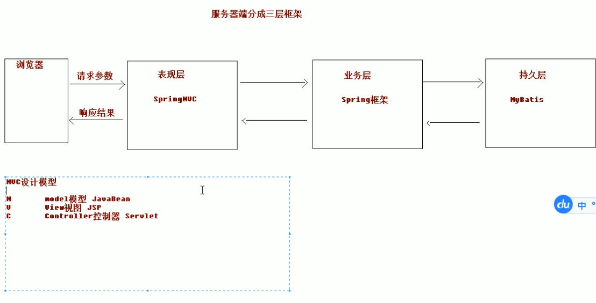
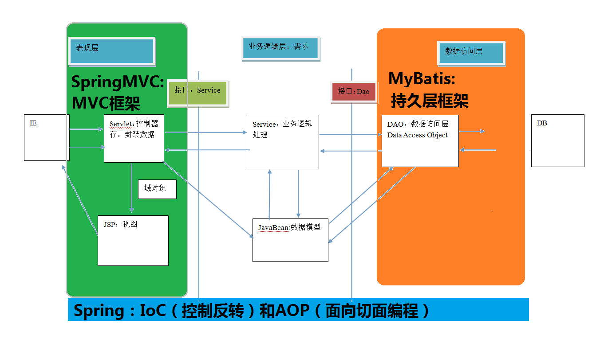
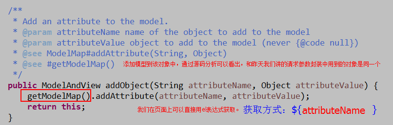
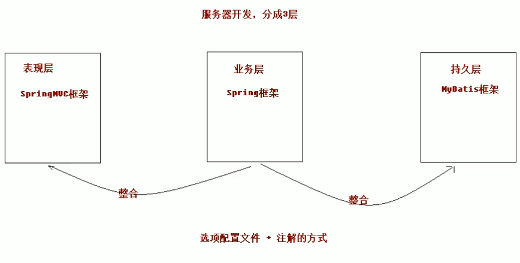

### SpringMVC 的基本概念

#### 三层架构



三层架构中,每一层各司其职,接下来我们就说说每层都负责哪些方面:
**表现层:**
也就是我们常说的 web 层。它负责接收客户端请求,向客户端响应结果,通常客户端使用 http 协议请求
web 层,web 需要接收 http 请求,完成 http 响应。
表现层包括展示层和控制层:控制层负责接收请求,展示层负责结果的展示。
表现层依赖业务层,接收到客户端请求一般会调用业务层进行业务处理,并将处理结果响应给客户端。
表现层的设计一般都使用 MVC 模型。(MVC 是表现层的设计模型,和其他层没有关系)
**业务层:**
也就是我们常说的 service 层。它负责业务逻辑处理,和我们开发项目的需求息息相关。web 层依赖业
务层,但是业务层不依赖 web 层。
业务层在业务处理时可能会依赖持久层,如果要对数据持久化需要保证事务一致性。(也就是我们说的,
事务应该放到业务层来控制)
**持久层:**
也就是我们是常说的 dao 层。负责数据持久化,包括数据层即数据库和数据访问层,数据库是对数据进
行持久化的载体,数据访问层是业务层和持久层交互的接口,业务层需要通过数据访问层将数据持久化到数据库
中。通俗的讲,持久层就是和数据库交互,对数据库表进行曾删改查的。

#### MVC 模型


MVC 全名是 Model View Controller,是模型(model)-视图(view)-控制器(controller)的缩写,
是一种用于设计创建 Web 应用程序表现层的模式。MVC 中每个部分各司其职:
**Model(模型):**
通常指的就是我们的数据模型。作用一般情况下用于封装数据。
**View(视图):**
通常指的就是我们的 jsp 或者 html。作用一般就是展示数据的。
通常视图是依据模型数据创建的。
**Controller(控制器):**
是应用程序中处理用户交互的部分。作用一般就是处理程序逻辑的。
它相对于前两个不是很好理解,这里举个例子:
例如:
我们要保存一个用户的信息,该用户信息中包含了姓名,性别,年龄等等。
这时候表单输入要求年龄必须是 1~100 之间的整数。姓名和性别不能为空。并且把数据填充
到模型之中。
此时除了 js 的校验之外,服务器端也应该有数据准确性的校验,那么校验就是控制器的该做
的。
当校验失败后,由控制器负责把错误页面展示给使用者。
如果校验成功,也是控制器负责把数据填充到模型,并且调用业务层实现完整的业务需求。




#### SpringMVC 的优势

spring mvc 是按照模块化开发。模块都是用什么什么器来表示。

**1、清晰的角色划分:**
前端控制器(DispatcherServlet)
请求到处理器映射(HandlerMapping) （请求路径，对应什么方法）
处理器适配器(HandlerAdapter)
视图解析器(ViewResolver) （请求声明方法，跳转什么jsp）
处理器或页面控制器(Controller)
验证器( Validator)
命令对象(Command
请求参数绑定到的对象就叫命令对象)
表单对象(Form Object 提供给表单展示和提交到的对象就叫表单对象)。
**2、分工明确**,而且扩展点相当灵活,可以很容易扩展,虽然几乎不需要。
3、由于命令对象就是一个 POJO,无需继承框架特定 API,可以使用命令对象直接作为业务对象。
4、和 Spring 其他框架无缝集成,是其它 Web 框架所不具备的。
5、可适配,通过 HandlerAdapter 可以支持任意的类作为处理器。
6、可定制性,HandlerMapping、ViewResolver 等能够非常简单的定制。
7、功能强大的数据验证、格式化、绑定机制。
8、利用 Spring 提供的 Mock 对象能够非常简单的进行 Web 层单元测试。
9、本地化、主题的解析的支持,使我们更容易进行国际化和主题的切换。
10、强大的 JSP 标签库,使 JSP 编写更容易。
..................还有比如 RESTful 风格的支持、简单的文件上传、约定大于配置的契约式编程支持、基于注解的零配
置支持等等。


#### SpringMVC 和 Struts2 的优略分析

共同点:
	它们都是表现层框架,都是基于 MVC 模型编写的。
	它们的底层都离不开原始 ServletAPI。
	**它们处理请求的机制都是一个核心控制器。**
区别:
	**Spring MVC 的入口是 Servlet, 而 Struts2 是 Filter**
	**Spring MVC 是基于方法设计的,**而 Struts2 是基于类,Struts2 每次执行都会创建一个动作类。所
	以 Spring MVC 会稍微比 Struts2 快些。
	Spring MVC 使用更加简洁,同时还支持 JSR303, 处理 ajax 的请求更方便
	(JSR303 是一套 JavaBean 参数校验的标准,它定义了很多常用的校验注解,我们可以直接将这些注
	解加在我们 JavaBean 的属性上面,就可以在需要校验的时候进行校验了。)
	Struts2 的 OGNL 表达式使页面的开发效率相比 Spring MVC 更高些,但执行效率并没有比 JSTL 提
	升,尤其是 struts2 的表单标签,远没有 html 执行效率高。

### 	

### SpringMVC 的入门案例

springmvc.xml

```java
<?xml version="1.0" encoding="UTF-8"?>
<beans xmlns="http://www.springframework.org/schema/beans"
       xmlns:mvc="http://www.springframework.org/schema/mvc"
       xmlns:context="http://www.springframework.org/schema/context"
       xmlns:xsi="http://www.w3.org/2001/XMLSchema-instance"
       xsi:schemaLocation="
        http://www.springframework.org/schema/beans
        http://www.springframework.org/schema/beans/spring-beans.xsd
        http://www.springframework.org/schema/mvc
        http://www.springframework.org/schema/mvc/spring-mvc.xsd
        http://www.springframework.org/schema/context
        http://www.springframework.org/schema/context/spring-context.xsd">

    <!-- 开启注解扫描 -->
    <context:component-scan base-package="cn.itcast"/>

    <!-- 视图解析器对象 -->
    <bean id="internalResourceViewResolver" class="org.springframework.web.servlet.view.InternalResourceViewResolver">
        <property name="prefix" value="/WEB-INF/pages/"/>
        <property name="suffix" value=".jsp"/>
    </bean>

    <!--配置自定义类型转换器-->
    <bean id="conversionService" class="org.springframework.context.support.ConversionServiceFactoryBean">
        <property name="converters">
            <set>
                <bean class="cn.itcast.utils.StringToDateConverter"/>
            </set>
        </property>
    </bean>


    <!-- 开启SpringMVC框架注解的支持 -->
    <mvc:annotation-driven conversion-service="conversionService"/>

</beans>
```

#### 编写控制器并使用注解配置

```java
@Controller("helloController")
public class HelloController {
@RequestMapping("/hello")
public String sayHello() {
	System.out.println("HelloController 的 sayHello 方法执行了。。。。");
	return "success";
}
}
```

#### 案例的执行过程

1、服务器启动,应用被加载。读取到 web.xml 中的配置创建 spring 容器并且初始化容器中的对象

从入门案例中可以看到的是:HelloController 和 InternalResourceViewResolver,但是远不
止这些。

2、浏览器发送请求,被 DispatherServlet 捕获,该 Servlet 并不处理请求,而是把请求转发出去。转发
的路径是根据请求 URL,匹配@RequestMapping 中的内容。
3、匹配到了后,执行对应方法。该方法有一个返回值。
4、根据方法的返回值,借助 InternalResourceViewResolver 找到对应的结果视图。
5、渲染结果视图,响应浏览器

### 入门案例中涉及的组件


**DispatcherServlet:前端控制器**

```
用户请求到达前端控制器,它就相当于 mvc 模式中的 c,dispatcherServlet 是整个流程控制的中心,由
它调用其它组件处理用户的请求,dispatcherServlet 的存在降低了组件之间的耦合性
```

**HandlerMapping:处理器映射器**

```
HandlerMapping 负责根据用户请求找到 Handler 即处理器,SpringMVC 提供了不同的映射器实现不同的
映射方式,例如:配置文件方式,实现接口方式,注解方式等。
```

**Handler:处理器**

```
它就是我们开发中要编写的具体业务控制器。由 DispatcherServlet 把用户请求转发到 Handler。由
Handler 对具体的用户请求进行处理。
```

**HandlAdapter:处理器适配器**

```
通过 HandlerAdapter 对处理器进行执行,这是适配器模式的应用,通过扩展适配器可以对更多类型的处理
器进行执行。

```

View Resolver:视图解析器

```
View Resolver 负责将处理结果生成 View 视图,View Resolver 首先根据逻辑视图名解析成物理视图名
即具体的页面地址,再生成 View 视图对象,最后对 View 进行渲染将处理结果通过页面展示给用户。
```

**View:视图**

```
SpringMVC 框架提供了很多的 View 视图类型的支持,包括:jstlView、freemarkerView、pdfView
等。我们最常用的视图就是 jsp。
一般情况下需要通过页面标签或页面模版技术将模型数据通过页面展示给用户,需要由程序员根据业务需求开
发具体的页面。
```

### <mvc:annotation-driven>说明

在 SpringMVC 的各个组件中,**处理器映射器、处理器适配器、视图解析器称**为 SpringMVC 的三大组件。
**使 用 <mvc:annotation-driven> 自 动 加 载** RequestMappingHandlerMapping ( 处 理 映 射 器 ) 和
RequestMappingHandlerAdapter ( 处 理 适 配 器 ) , 可 用 在 SpringMVC.xml 配 置 文 件 中 使 用
<mvc:annotation-driven>替代注解处理器和适配器的配置。

### RequestMapping 注解

```
源码:
@Target({ElementType.METHOD, ElementType.TYPE})
@Retention(RetentionPolicy.RUNTIME)
@Documented
@Mapping
public @interface RequestMapping {
}
作用:
用于建立请求 URL 和处理请求方法之间的对应关系。
出现位置:
类上:
请求 URL 的第一级访问目录。此处不写的话,就相当于应用的根目录。写的话需要以/开头。
它出现的目的是为了使我们的 URL 可以按照模块化管理:
例如:
账户模块:
/account/add
/account/update
/account/delete
...
订单模块:
/order/add
/order/update
/order/delete
红色的部分就是把 RequsetMappding 写在类上,使我们的 URL 更加精细。
方法上:
请求 URL 的第二级访问目录。
属性:
value:用于指定请求的 URL。它和 path 属性的作用是一样的。
method:用于指定请求的方式。
params:用于指定限制请求参数的条件。它支持简单的表达式。要求请求参数的 key 和 value 必须和
配置的一模一样。
例如:
params = {"accountName"},表示请求参数必须有 accountName
params = {"moeny!100"},表示请求参数中 money 不能是 100。
headers:用于指定限制请求消息头的条件。
注意:
以上四个属性只要出现 2 个或以上时,他们的关系是与的关系。
```

#### 使用 ServletAPI 对象作为方法参数

#### 自定义类型转换器

```java
import org.springframework.stereotype.Controller;
import org.springframework.web.bind.annotation.RequestMapping;

// 控制器类
@Controller
@RequestMapping(path="/user")
public class HelloController {

    /**
     * 入门案例
     * @return
     */
    @RequestMapping(path="/hello")
    public String sayHello(){
        System.out.println("Hello StringMVC");
        return "success";
    }

    /**
     * RequestMapping注解
     * @return
     */
    @RequestMapping(value="/testRequestMapping",params = {"username=heihei"},headers = {"Accept"})
    public String testRequestMapping(){
        System.out.println("测试RequestMapping注解...");
        return "success";
    }

}
```

```java

import org.springframework.stereotype.Controller;
import org.springframework.web.bind.annotation.RequestMapping;

import javax.servlet.ServletContext;
import javax.servlet.http.HttpServletRequest;
import javax.servlet.http.HttpServletResponse;
import javax.servlet.http.HttpSession;

/**
 * 请求参数绑定
 */
@Controller
@RequestMapping("/param")
public class ParamController {

    /**
     * 请求参数绑定入门
     * @return
     */
    @RequestMapping("/testParam")
    public String testParam(String username,String password){
        System.out.println("执行了...");
        System.out.println("用户名："+username);
        System.out.println("密码："+password);
        return "success";
    }

    /**
     * 请求参数绑定把数据封装到JavaBean的类中
     * @return
     */
    @RequestMapping("/saveAccount")
    public String saveAccount(Account account){
        System.out.println("执行了...");
        System.out.println(account);
        return "success";
    }


    /**
     * 自定义类型转换器
     * @param user
     * @return
     */
    @RequestMapping("/saveUser")
    public String saveUser(User user){
        System.out.println("执行了...");
        System.out.println(user);
        return "success";
    }

    /**
     * 原生的API
     * @return
     */
    @RequestMapping("/testServlet")
    public String testServlet(HttpServletRequest request, HttpServletResponse response){
        System.out.println("执行了...");
        System.out.println(request);

        HttpSession session = request.getSession();
        System.out.println(session);

        ServletContext servletContext = session.getServletContext();
        System.out.println(servletContext);

        System.out.println(response);
        return "success";
    }

}

```

```java
public class Account implements Serializable{

    private String username;
    private String password;
    private Double money;

   // private User user;

    private List<User> list;
    private Map<String,User> map;

    public String getUsername() {
        return username;
    }

    public void setUsername(String username) {
        this.username = username;
    }

    public String getPassword() {
        return password;
    }

    public void setPassword(String password) {
        this.password = password;
    }

    public Double getMoney() {
        return money;
    }

    public void setMoney(Double money) {
        this.money = money;
    }

    public List<User> getList() {
        return list;
    }

    public void setList(List<User> list) {
        this.list = list;
    }

    public Map<String, User> getMap() {
        return map;
    }

    public void setMap(Map<String, User> map) {
        this.map = map;
    }

    /*

    public User getUser() {
        return user;
    }

    public void setUser(User user) {
        this.user = user;
    }
*/

    @Override
    public String toString() {
        return "Account{" +
                "username='" + username + '\'' +
                ", password='" + password + '\'' +
                ", money=" + money +
                ", list=" + list +
                ", map=" + map +
                '}';
    }
}


public class User implements Serializable{

    private String uname;
    private Integer age;

    private Date date;

    public String getUname() {
        return uname;
    }

    public void setUname(String uname) {
        this.uname = uname;
    }

    public Integer getAge() {
        return age;
    }

    public void setAge(Integer age) {
        this.age = age;
    }

    public Date getDate() {
        return date;
    }

    public void setDate(Date date) {
        this.date = date;
    }

    @Override
    public String toString() {
        return "User{" +
                "uname='" + uname + '\'' +
                ", age=" + age +
                ", date=" + date +
                '}';
    }
}
```

```java
import org.springframework.core.convert.converter.Converter;

import java.text.DateFormat;
import java.text.SimpleDateFormat;
import java.util.Date;

/**
 * 把字符串转换日期
 */
public class StringToDateConverter implements Converter<String,Date>{

    /**
     * String source    传入进来字符串
     * @param source
     * @return
     */
    public Date convert(String source) {
        // 判断
        if(source == null){
            throw new RuntimeException("请您传入数据");
        }
        DateFormat df = new SimpleDateFormat("yyyy-MM-dd");

        try {
            // 把字符串转换日期
            return df.parse(source);
        } catch (Exception e) {
            throw new RuntimeException("数据类型转换出现错误");
        }
    }

}
```

```xml
pom.xml
<?xml version="1.0" encoding="UTF-8"?>

<project xmlns="http://maven.apache.org/POM/4.0.0" xmlns:xsi="http://www.w3.org/2001/XMLSchema-instance"
  xsi:schemaLocation="http://maven.apache.org/POM/4.0.0 http://maven.apache.org/xsd/maven-4.0.0.xsd">
  <modelVersion>4.0.0</modelVersion>

  <groupId>cn.itcast</groupId>
  <artifactId>springmvc_day01_01_start</artifactId>
  <version>1.0-SNAPSHOT</version>
  <packaging>war</packaging>

  <name>springmvc_day01_01_start Maven Webapp</name>
  <!-- FIXME change it to the project's website -->
  <url>http://www.example.com</url>

  <properties>
    <project.build.sourceEncoding>UTF-8</project.build.sourceEncoding>
    <maven.compiler.source>1.8</maven.compiler.source>
    <maven.compiler.target>1.8</maven.compiler.target>
    <spring.version>5.0.2.RELEASE</spring.version>
  </properties>

  <dependencies>
    <dependency>
      <groupId>org.springframework</groupId>
      <artifactId>spring-context</artifactId>
      <version>${spring.version}</version>
    </dependency>

    <dependency>
      <groupId>org.springframework</groupId>
      <artifactId>spring-web</artifactId>
      <version>${spring.version}</version>
    </dependency>

    <dependency>
      <groupId>org.springframework</groupId>
      <artifactId>spring-webmvc</artifactId>
      <version>${spring.version}</version>
    </dependency>

    <dependency>
      <groupId>javax.servlet</groupId>
      <artifactId>servlet-api</artifactId>
      <version>2.5</version>
      <scope>provided</scope>
    </dependency>

    <dependency>
      <groupId>javax.servlet.jsp</groupId>
      <artifactId>jsp-api</artifactId>
      <version>2.0</version>
      <scope>provided</scope>
    </dependency>

  </dependencies>

  <build>
    <finalName>springmvc_day01_01_start</finalName>
    <pluginManagement><!-- lock down plugins versions to avoid using Maven defaults (may be moved to parent pom) -->
      <plugins>
        <plugin>
          <artifactId>maven-clean-plugin</artifactId>
          <version>3.0.0</version>
        </plugin>
        <!-- see http://maven.apache.org/ref/current/maven-core/default-bindings.html#Plugin_bindings_for_war_packaging -->
        <plugin>
          <artifactId>maven-resources-plugin</artifactId>
          <version>3.0.2</version>
        </plugin>
        <plugin>
          <artifactId>maven-compiler-plugin</artifactId>
          <version>3.7.0</version>
        </plugin>
        <plugin>
          <artifactId>maven-surefire-plugin</artifactId>
          <version>2.20.1</version>
        </plugin>
        <plugin>
          <artifactId>maven-war-plugin</artifactId>
          <version>3.2.0</version>
        </plugin>
        <plugin>
          <artifactId>maven-install-plugin</artifactId>
          <version>2.5.2</version>
        </plugin>
        <plugin>
          <artifactId>maven-deploy-plugin</artifactId>
          <version>2.8.2</version>
        </plugin>
      </plugins>
    </pluginManagement>
  </build>
</project>
```

```xml
web.xml
<!DOCTYPE web-app PUBLIC
 "-//Sun Microsystems, Inc.//DTD Web Application 2.3//EN"
 "http://java.sun.com/dtd/web-app_2_3.dtd" >

<web-app>
  <display-name>Archetype Created Web Application</display-name>

  <!--配置前端控制器-->
  <servlet>
    <servlet-name>dispatcherServlet</servlet-name>
    <servlet-class>org.springframework.web.servlet.DispatcherServlet</servlet-class>
    <init-param>
      <param-name>contextConfigLocation</param-name>
      <param-value>classpath:springmvc.xml</param-value>
    </init-param>
    <load-on-startup>1</load-on-startup>
  </servlet>
  <servlet-mapping>
    <servlet-name>dispatcherServlet</servlet-name>
    <url-pattern>/</url-pattern>
  </servlet-mapping>

  <!--配置解决中文乱码的过滤器-->
  <filter>
    <filter-name>characterEncodingFilter</filter-name>
    <filter-class>org.springframework.web.filter.CharacterEncodingFilter</filter-class>
    <init-param>
      <param-name>encoding</param-name>
      <param-value>UTF-8</param-value>
    </init-param>
  </filter>
  <filter-mapping>
    <filter-name>characterEncodingFilter</filter-name>
    <url-pattern>/*</url-pattern>
  </filter-mapping>

</web-app>
```

```html
<%--
  Created by IntelliJ IDEA.
  User: Administrator
  Date: 2018/4/29
  Time: 22:10
  To change this template use File | Settings | File Templates.
--%>
<%@ page contentType="text/html;charset=UTF-8" language="java" %>
<html>
<head>
    <title>Title</title>
</head>
<body>

    <%--请求参数绑定--%>
    <%--
    <a href="param/testParam?username=hehe&password=123">请求参数绑定</a>

    把数据封装Account类中
    <form action="param/saveAccount" method="post">
        姓名：<input type="text" name="username" /><br/>
        密码：<input type="text" name="password" /><br/>
        金额：<input type="text" name="money" /><br/>
        用户姓名：<input type="text" name="user.uname" /><br/>
        用户年龄：<input type="text" name="user.age" /><br/>
        <input type="submit" value="提交" />
    </form>
    --%>

    <%--把数据封装Account类中，类中存在list和map的集合
    <form action="param/saveAccount" method="post">
        姓名：<input type="text" name="username" /><br/>
        密码：<input type="text" name="password" /><br/>
        金额：<input type="text" name="money" /><br/>

        用户姓名：<input type="text" name="list[0].uname" /><br/>
        用户年龄：<input type="text" name="list[0].age" /><br/>

        用户姓名：<input type="text" name="map['one'].uname" /><br/>
        用户年龄：<input type="text" name="map['one'].age" /><br/>
        <input type="submit" value="提交" />
    </form>
    --%>

    <%--自定义类型转换器
    <form action="param/saveUser" method="post">
        用户姓名：<input type="text" name="uname" /><br/>
        用户年龄：<input type="text" name="age" /><br/>
        用户生日：<input type="text" name="date" /><br/>
        <input type="submit" value="提交" />
    </form>
    --%>


    <a href="param/testServlet">Servlet原生的API</a>

</body>
</html>

success.jsp
<%@ page contentType="text/html;charset=UTF-8" language="java" isELIgnored="false" %>
<html>
<head>
    <title>Title</title>
</head>
<body>

    <h3>入门成功</h3>

    ${ msg }

    ${sessionScope}

</body>
</html>
```

### 

### REST 风格 URL

什么是 rest:
REST(英文:Representational State Transfer,简称 REST)描述了一个架构样式的网络系统,
比如 web 应用程序。它首次出现在 2000 年 Roy Fielding 的博士论文中,他是 HTTP 规范的主要编写者之
一。在目前主流的三种 Web 服务交互方案中,REST 相比于 SOAP(Simple Object Access protocol,简单
对象访问协议)以及 XML-RPC 更加简单明了,无论是对 URL 的处理还是对 Payload 的编码,REST 都倾向于用更
加简单轻量的方法设计和实现。值得注意的是 REST 并没有一个明确的标准,而更像是一种设计的风格。
它本身并没有什么实用性,其核心价值在于如何设计出符合 REST 风格的网络接口。


**restful 的优点**
		它结构清晰、符合标准、易于理解、扩展方便,所以正得到越来越多网站的采用。
**restful 的特性:**
		资源(Resources):网络上的一个实体,或者说是网络上的一个具体信息。
它可以是一段文本、一张图片、一首歌曲、一种服务,总之就是一个具体的存在。可以用一个 URI (统一
资源定位符)指向它,每种资源对应一个特定的 URI 。要
获取这个资源,访问它的 URI 就可以,因此 URI 即为每一个资源的独一无二的识别符。

**表现层(Representation)**:

 	把资源具体呈现出来的形式,叫做它的表现层 (Representation)。
比如,文本可以用 txt 格式表现,也可以用 HTML 格式、XML 格式、JSON 格式表现,甚至可以采用二
进制格式。
**状态转化(State Transfer)**:每 发出一个请求,就代表了客户端和服务器的一次交互过程。
	HTTP 协议,是一个无状态协议,即所有的状态都保存在服务器端。因此,如果客户端想要操作服务器,
必须通过某种手段,让服务器端发生“状态转化”(State Transfer)。而这种转化是建立在表现层之上的,所以
就是 “ 表现层状 态转化” 。

具 体说, 就是 HTTP 协议里面,四个表 示操作 方式的 动词:GET 、POST 、PUT 、DELETE 。它们分别对应四种基本操作:**GET 用来获取资源,POST 用来新建资源,PUT 用来更新资源,DELETE 用来**
**删除资源。**
restful 的示例:
	/account/1 HTTP GET :
	得到 id = 1 的 account
	/account/1 HTTP DELETE: 删除 id = 1 的 account
	/account/1 HTTP PUT:
	更新 id = 1 的 account
	/account HTTP POST: 新增 account


#### 常用注解

**RequestParam**

作用:
	**把请求中指定名称的参数给控制器中的形参赋值**。
属性:
	value:请求参数中的名称。
	required:请求参数中是否必须提供此参数。默认值:true。表示必须提供,如果不提供将报错。


**RequestBody**

作用:
	用于获取请求体内容。直接使用得到是 key=value&key=value...结构的数据。
	get 请求方式不适用。
属性:
	required:是否必须有请求体。默认值是:true。当取值为 true 时,get 请求方式会报错。如果取值
	为 false,get 请求得到是 null


**PathVaribale**

作用:
	用于绑定 url 中的占位符。例如:请求 url 中 /delete/{id},这个{id}就是 url 占位符。
	url 支持占位符是 spring3.0 之后加入的。是 springmvc 支持 rest 风格 URL 的一个重要标志。
属性:
	value:用于指定 url 中占位符名称。
	required:是否必须提供占位符

**RequestHeader**

作用:
	用于获取请求消息头。
属性:
	value:提供消息头名称
	required:是否必须有此消息头
注:
在实际开发中一般不怎么用。

**CookieValue**

作用:
用于把指定 cookie 名称的值传入控制器方法参数。
属性:
value:指定 cookie 的名称。
required:是否必须有此 cookie。

**ModelAttribute**


作用:
该注解是 SpringMVC4.3 版本以后新加入的。它可以用于修饰方法和参数。
出现在方法上,表示当前方法会在控制器的方法执行之前,先执行。它可以修饰没有返回值的方法,也可
以修饰有具体返回值的方法。
出现在参数上,获取指定的数据给参数赋值。
属性:
value:用于获取数据的 key。key 可以是 POJO 的属性名称,也可以是 map 结构的 key。
应用场景:
当表单提交数据不是完整的实体类数据时,保证没有提交数据的字段使用数据库对象原来的数据。
例如:
我们在编辑一个用户时,用户有一个创建信息字段,该字段的值是不允许被修改的。在提交表单数
据是肯定没有此字段的内容,一旦更新会把该字段内容置为 null,此时就可以使用此注解解决问题


**SessionAttribute**

作用:
	用于多次执行控制器方法间的参数共享。
属性:
	value:用于指定存入的属性名称
	type:用于指定存入的数据类型


```java
/**
 * 常用的注解
 */
@Controller
@RequestMapping("/anno")
@SessionAttributes(value={"msg"})   // 把msg=美美存入到session域对中
public class AnnoController {

    @RequestMapping("/testRequestParam")
    public String testRequestParam(@RequestParam(name="name") String username){
        System.out.println("执行了...");
        System.out.println(username);
        return "success";
    }

    /**
     * 获取到请求体的内容
     * @return
     */
    @RequestMapping("/testRequestBody")
    public String testRequestBody(@RequestBody String body){
        System.out.println("执行了...");
        System.out.println(body);
        return "success";
    }

    /**
     * PathVariable注解
     * @return
     */
    @RequestMapping(value="/testPathVariable/{sid}")
    public String testPathVariable(@PathVariable(name="sid") String id){
        System.out.println("执行了...");
        System.out.println(id);
        return "success";
    }

    /**
     * 获取请求头的值
     * @param header
     * @return
     */
    @RequestMapping(value="/testRequestHeader")
    public String testRequestHeader(@RequestHeader(value="Accept") String header, HttpServletRequest request,HttpServletResponse response) throws IOException {
        System.out.println("执行了...");
        System.out.println(header);
        // return "success";
        // response.sendRedirect(request.getContextPath()+"/anno/testCookieValue");
        return "redirect:/param.jsp";
    }


    /**
     * 获取Cookie的值
     * @return
     */
    @RequestMapping(value="/testCookieValue")
    public String testCookieValue(@CookieValue(value="JSESSIONID") String cookieValue){
        System.out.println("执行了...");
        System.out.println(cookieValue);
        return "success";
    }

    /**
     * ModelAttribute注解
     * @return
     */
    @RequestMapping(value="/testModelAttribute")
    public String testModelAttribute(@ModelAttribute("abc") User user){
        System.out.println("testModelAttribute执行了...");
        System.out.println(user);
        return "success";
    }

    @ModelAttribute
    public void showUser(String uname, Map<String,User> map){
        System.out.println("showUser执行了...");
        // 通过用户查询数据库（模拟）
        User user = new User();
        user.setUname(uname);
        user.setAge(20);
        user.setDate(new Date());
        map.put("abc",user);
    }

    /**
     * 该方法会先执行

    @ModelAttribute
    public User showUser(String uname){
        System.out.println("showUser执行了...");
        // 通过用户查询数据库（模拟）
        User user = new User();
        user.setUname(uname);
        user.setAge(20);
        user.setDate(new Date());
        return user;
    }
     */

    /**
     * SessionAttributes的注解
     * @return
     */
    @RequestMapping(value="/testSessionAttributes")
    public String testSessionAttributes(Model model){
        System.out.println("testSessionAttributes...");
        // 底层会存储到request域对象中
        model.addAttribute("msg","美美");
        return "success";
    }

    /**
     * 获取值
     * @param modelMap
     * @return
     */
    @RequestMapping(value="/getSessionAttributes")
    public String getSessionAttributes(ModelMap modelMap){
        System.out.println("getSessionAttributes...");
        String msg = (String) modelMap.get("msg");
        System.out.println(msg);
        return "success";
    }

    /**
     * 清除
     * @param status
     * @return
     */
    @RequestMapping(value="/delSessionAttributes")
    public String delSessionAttributes(SessionStatus status){
        System.out.println("getSessionAttributes...");
        status.setComplete();
        return "success";
    }

}

```


```html
<%--
  Created by IntelliJ IDEA.
  User: Administrator
  Date: 2018/4/29
  Time: 23:35
  To change this template use File | Settings | File Templates.
--%>
<%@ page contentType="text/html;charset=UTF-8" language="java" %>
<html>
<head>
    <title>Title</title>
</head>
<body>

    <%--常用的注解--%>

    <a href="anno/testRequestParam?name=哈哈">RequestParam</a>

    <br>

    <form action="anno/testRequestBody" method="post">
        用户姓名：<input type="text" name="username" /><br/>
        用户年龄：<input type="text" name="age" /><br/>
        <input type="submit" value="提交" />
    </form>

    <a href="anno/testPathVariable/10">testPathVariable</a>

    <br>

    <a href="anno/testRequestHeader">RequestHeader</a>

    <br>

    <a href="anno/testCookieValue">CookieValue</a>

    <br>

    <form action="anno/testModelAttribute" method="post">
        用户姓名：<input type="text" name="uname" /><br/>
        用户年龄：<input type="text" name="age" /><br/>
        <input type="submit" value="提交" />
    </form>

    <br>


    <a href="anno/testSessionAttributes">testSessionAttributes</a>
    <a href="anno/getSessionAttributes">getSessionAttributes</a>
    <a href="anno/delSessionAttributes">delSessionAttributes</a>


</body>
</html>
```


### 响应数据和结果视图


#### **ModelAndView**


ModelAndView 是 SpringMVC 为我们提供的一个对象,该对象也可以用作控制器方法的返回值。

该对象中有两个方法:



#### 转发和重定向

forward 转发

```java
controller 方法在提供了 String 类型的返回值之后,默认就是请求转发。我们也可以写成:
/**
* 转发
* @return
*/
@RequestMapping("/testForward")
public String testForward() {
System.out.println("AccountController 的 testForward 方法执行了。。。。");
return "forward:/WEB-INF/pages/success.jsp";
}
需要注意的是,如果用了 formward:则路径必须写成实际视图 url,不能写逻辑视图。
它相当于“request.getRequestDispatcher("url").forward(request,response)”。使用请求
转发,既可以转发到 jsp,也可以转发到其他的控制器方法。
```


Redirect 重定向

```java
contrller 方法提供了一个 String 类型返回值之后,它需要在返回值里使用:redirect:
/**
* 重定向
* @return
*/
@RequestMapping("/testRedirect")
public String testRedirect() {
System.out.println("AccountController 的 testRedirect 方法执行了。。。。");
return "redirect:testReturnModelAndView";
}
它相当于“response.sendRedirect(url)”。需要注意的是,如果是重定向到 jsp 页面,则 jsp 页面不
能写在 WEB-INF 目录中,否则无法找到。
```


#### ResponseBody 响应 json 数据

作用:
该注解用于将 Controller 的方法返回的对象,通过 HttpMessageConverter 接口转换为指定格式的
数据如:json,xml 等,通过 Response 响应给客户端


```java
package cn.itcast.controller;

import cn.itcast.domain.User;
import org.springframework.stereotype.Controller;
import org.springframework.ui.Model;
import org.springframework.web.bind.annotation.RequestBody;
import org.springframework.web.bind.annotation.RequestMapping;
import org.springframework.web.bind.annotation.ResponseBody;
import org.springframework.web.servlet.ModelAndView;

import javax.servlet.http.HttpServletRequest;
import javax.servlet.http.HttpServletResponse;

@Controller
@RequestMapping("/user")
public class UserController {

    /**
     * 返回String
     * @param model
     * @return
     */
    @RequestMapping("/testString")
    public String testString(Model model){
        System.out.println("testString方法执行了...");
        // 模拟从数据库中查询出User对象
        User user = new User();
        user.setUsername("美美");
        user.setPassword("123");
        user.setAge(30);
        // model对象
        model.addAttribute("user",user);
        return "success";
    }

    /**
     * 是void
     * 请求转发一次请求，不用编写项目的名称
     */
    @RequestMapping("/testVoid")
    public void testVoid(HttpServletRequest request, HttpServletResponse response) throws Exception {
        System.out.println("testVoid方法执行了...");
        // 编写请求转发的程序
        // request.getRequestDispatcher("/WEB-INF/pages/success.jsp").forward(request,response);

        // 重定向
        // response.sendRedirect(request.getContextPath()+"/index.jsp");

        // 设置中文乱码
        response.setCharacterEncoding("UTF-8");
        response.setContentType("text/html;charset=UTF-8");

        // 直接会进行响应
        response.getWriter().print("你好");

        return;
    }

    /**
     * 返回ModelAndView
     * @return
     */
    @RequestMapping("/testModelAndView")
    public ModelAndView testModelAndView(){
        // 创建ModelAndView对象
        ModelAndView mv = new ModelAndView();
        System.out.println("testModelAndView方法执行了...");
        // 模拟从数据库中查询出User对象
        User user = new User();
        user.setUsername("小凤");
        user.setPassword("456");
        user.setAge(30);

        // 把user对象存储到mv对象中，也会把user对象存入到request对象
        mv.addObject("user",user);

        // 跳转到哪个页面
        mv.setViewName("success");

        return mv;
    }

    /**
     * 使用关键字的方式进行转发或者重定向
     * @return
     */
    @RequestMapping("/testForwardOrRedirect")
    public String testForwardOrRedirect(){
        System.out.println("testForwardOrRedirect方法执行了...");

        // 请求的转发
        // return "forward:/WEB-INF/pages/success.jsp";

        // 重定向
        return "redirect:/index.jsp";
    }

    /**
     * 模拟异步请求响应
     */
    @RequestMapping("/testAjax")
    public @ResponseBody User testAjax(@RequestBody User user){
        System.out.println("testAjax方法执行了...");
        // 客户端发送ajax的请求，传的是json字符串，后端把json字符串封装到user对象中
        System.out.println(user);
        // 做响应，模拟查询数据库
        user.setUsername("haha");
        user.setAge(40);
        // 做响应
        return user;
    }

}
```


```java
public class User implements Serializable{

    private String username;
    private String password;
    private Integer age;

    public String getUsername() {
        return username;
    }

    public void setUsername(String username) {
        this.username = username;
    }

    public String getPassword() {
        return password;
    }

    public void setPassword(String password) {
        this.password = password;
    }

    public Integer getAge() {
        return age;
    }

    public void setAge(Integer age) {
        this.age = age;
    }
}
```

springmvc.xml

```java
<?xml version="1.0" encoding="UTF-8"?>
<beans xmlns="http://www.springframework.org/schema/beans"
       xmlns:mvc="http://www.springframework.org/schema/mvc"
       xmlns:context="http://www.springframework.org/schema/context"
       xmlns:xsi="http://www.w3.org/2001/XMLSchema-instance"
       xsi:schemaLocation="
        http://www.springframework.org/schema/beans
        http://www.springframework.org/schema/beans/spring-beans.xsd
        http://www.springframework.org/schema/mvc
        http://www.springframework.org/schema/mvc/spring-mvc.xsd
        http://www.springframework.org/schema/context
        http://www.springframework.org/schema/context/spring-context.xsd">

    <!-- 开启注解扫描 -->
    <context:component-scan base-package="cn.itcast"/>

    <!-- 视图解析器对象 -->
    <bean id="internalResourceViewResolver" class="org.springframework.web.servlet.view.InternalResourceViewResolver">
        <property name="prefix" value="/WEB-INF/pages/"/>
        <property name="suffix" value=".jsp"/>
    </bean>

    <!--前端控制器，哪些静态资源不拦截-->
    <mvc:resources location="/css/" mapping="/css/**"/>
    <mvc:resources location="/images/" mapping="/images/**"/>
    <mvc:resources location="/js/" mapping="/js/**"/>

    <!-- 开启SpringMVC框架注解的支持 -->
    <mvc:annotation-driven />

</beans>

```


### SpringMVC 实现文件上传

**文件上传的必要前提**

```
A form 表单的 enctype 取值必须是:multipart/form-data
(默认值是:application/x-www-form-urlencoded)
enctype:是表单请求正文的类型
B method 属性取值必须是 Post
C 提供一个文件选择域<input type=”file” />
```


#### 文件上传的原理分析

```java
当 form 表单的 enctype 取值不是默认值后,request.getParameter()将失效。
enctype=”application/x-www-form-urlencoded”时,form 表单的正文内容是:
key=value&key=value&key=value
当 form 表单的 enctype 取值为 Mutilpart/form-data 时,请求正文内容就变成:
每一部分都是 MIME 类型描述的正文
-----------------------------7de1a433602ac 分界符
Content-Disposition: form-data; name="userName" 协议头
    aaa
-----------------------------7de1a433602ac
Content-Disposition:
form-data;
name="file";
filename="C:\Users\zhy\Desktop\fileupload_demofile\b.txt"
Content-Type: text/plain
协议的类型(MIME 类型)
bbbbbbbbbbbbbbbbbbbbbbbbbbbbbbbb
-----------------------------7de1a433602ac--
```


借助第三方组件实现文件上传

```
使用 Commons-fileupload 组件实现文件上传,需要导入该组件相应的支撑 jar 包:Commons-fileupload 和
commons-io。commons-io 不属于文件上传组件的开发 jar 文件,但 Commons-fileupload 组件从 1.1 版本开始,它
工作时需要 commons-io 包的支持
```

**springmvc 传统方式的文件上传**

```java
import com.sun.jersey.api.client.Client;
import com.sun.jersey.api.client.WebResource;
import org.apache.commons.fileupload.FileItem;
import org.apache.commons.fileupload.disk.DiskFileItemFactory;
import org.apache.commons.fileupload.servlet.ServletFileUpload;
import org.springframework.stereotype.Controller;
import org.springframework.web.bind.annotation.RequestMapping;
import org.springframework.web.multipart.MultipartFile;

import javax.servlet.http.HttpServletRequest;
import java.io.File;
import java.util.List;
import java.util.UUID;

@Controller
@RequestMapping("/user")
public class UserController {

    /**
     * 跨服务器文件上传
     * @return
     */
    @RequestMapping("/fileupload3")
    public String fileuoload3(MultipartFile upload) throws Exception {
        System.out.println("跨服务器文件上传...");

        // 定义上传文件服务器路径
        String path = "http://localhost:9090/uploads/";

        // 说明上传文件项
        // 获取上传文件的名称
        String filename = upload.getOriginalFilename();
        // 把文件的名称设置唯一值，uuid
        String uuid = UUID.randomUUID().toString().replace("-", "");
        filename = uuid+"_"+filename;

        // 创建客户端的对象
        Client client = Client.create();

        // 和图片服务器进行连接
        WebResource webResource = client.resource(path + filename);

        // 上传文件
        webResource.put(upload.getBytes());

        return "success";
    }

    /**
     * SpringMVC文件上传
     * @return
     */
    @RequestMapping("/fileupload2")
    public String fileuoload2(HttpServletRequest request, MultipartFile upload) throws Exception {
        System.out.println("springmvc文件上传...");

        // 使用fileupload组件完成文件上传
        // 上传的位置
        String path = request.getSession().getServletContext().getRealPath("/uploads/");
        // 判断，该路径是否存在
        File file = new File(path);
        if(!file.exists()){
            // 创建该文件夹
            file.mkdirs();
        }

        // 说明上传文件项
        // 获取上传文件的名称
        String filename = upload.getOriginalFilename();
        // 把文件的名称设置唯一值，uuid
        String uuid = UUID.randomUUID().toString().replace("-", "");
        filename = uuid+"_"+filename;
        // 完成文件上传
        upload.transferTo(new File(path,filename));

        return "success";
    }

    /**
     * 文件上传
     * @return
     */
    @RequestMapping("/fileupload1")
    public String fileuoload1(HttpServletRequest request) throws Exception {
        System.out.println("文件上传...");

        // 使用fileupload组件完成文件上传
        // 上传的位置
        String path = request.getSession().getServletContext().getRealPath("/uploads/");
        // 判断，该路径是否存在
        File file = new File(path);
        if(!file.exists()){
            // 创建该文件夹
            file.mkdirs();
        }

        // 解析request对象，获取上传文件项
        DiskFileItemFactory factory = new DiskFileItemFactory();
        ServletFileUpload upload = new ServletFileUpload(factory);
        // 解析request
        List<FileItem> items = upload.parseRequest(request);
        // 遍历
        for(FileItem item:items){
            // 进行判断，当前item对象是否是上传文件项
            if(item.isFormField()){
                // 说明普通表单向
            }else{
                // 说明上传文件项
                // 获取上传文件的名称
                String filename = item.getName();
                // 把文件的名称设置唯一值，uuid
                String uuid = UUID.randomUUID().toString().replace("-", "");
                filename = uuid+"_"+filename;
                // 完成文件上传
                item.write(new File(path,filename));
                // 删除临时文件
                item.delete();
            }
        }

        return "success";
    }

}
```

```xml
<?xml version="1.0" encoding="UTF-8"?>

<project xmlns="http://maven.apache.org/POM/4.0.0" xmlns:xsi="http://www.w3.org/2001/XMLSchema-instance"
  xsi:schemaLocation="http://maven.apache.org/POM/4.0.0 http://maven.apache.org/xsd/maven-4.0.0.xsd">
  <modelVersion>4.0.0</modelVersion>

  <groupId>cn.itcast</groupId>
  <artifactId>springmvc_day02_02_fileupload</artifactId>
  <version>1.0-SNAPSHOT</version>
  <packaging>war</packaging>

  <name>springmvc_day02_02_fileupload Maven Webapp</name>
  <!-- FIXME change it to the project's website -->
  <url>http://www.example.com</url>

  <properties>
    <project.build.sourceEncoding>UTF-8</project.build.sourceEncoding>
    <maven.compiler.source>1.8</maven.compiler.source>
    <maven.compiler.target>1.8</maven.compiler.target>
    <spring.version>5.0.2.RELEASE</spring.version>
  </properties>

  <dependencies>
    <dependency>
      <groupId>org.springframework</groupId>
      <artifactId>spring-context</artifactId>
      <version>${spring.version}</version>
    </dependency>

    <dependency>
      <groupId>org.springframework</groupId>
      <artifactId>spring-web</artifactId>
      <version>${spring.version}</version>
    </dependency>

    <dependency>
      <groupId>org.springframework</groupId>
      <artifactId>spring-webmvc</artifactId>
      <version>${spring.version}</version>
    </dependency>

    <dependency>
      <groupId>javax.servlet</groupId>
      <artifactId>servlet-api</artifactId>
      <version>2.5</version>
      <scope>provided</scope>
    </dependency>

    <dependency>
      <groupId>javax.servlet.jsp</groupId>
      <artifactId>jsp-api</artifactId>
      <version>2.0</version>
      <scope>provided</scope>
    </dependency>

    <dependency>
      <groupId>commons-fileupload</groupId>
      <artifactId>commons-fileupload</artifactId>
      <version>1.3.1</version>
    </dependency>
    <dependency>
      <groupId>commons-io</groupId>
      <artifactId>commons-io</artifactId>
      <version>2.4</version>
    </dependency>

    <dependency>
      <groupId>com.sun.jersey</groupId>
      <artifactId>jersey-core</artifactId>
      <version>1.18.1</version>
    </dependency>
    <dependency>
      <groupId>com.sun.jersey</groupId>
      <artifactId>jersey-client</artifactId>
      <version>1.18.1</version>
    </dependency>

  </dependencies>

  <build>
    <finalName>springmvc_day02_02_fileupload</finalName>
    <pluginManagement><!-- lock down plugins versions to avoid using Maven defaults (may be moved to parent pom) -->
      <plugins>
        <plugin>
          <artifactId>maven-clean-plugin</artifactId>
          <version>3.0.0</version>
        </plugin>
        <!-- see http://maven.apache.org/ref/current/maven-core/default-bindings.html#Plugin_bindings_for_war_packaging -->
        <plugin>
          <artifactId>maven-resources-plugin</artifactId>
          <version>3.0.2</version>
        </plugin>
        <plugin>
          <artifactId>maven-compiler-plugin</artifactId>
          <version>3.7.0</version>
        </plugin>
        <plugin>
          <artifactId>maven-surefire-plugin</artifactId>
          <version>2.20.1</version>
        </plugin>
        <plugin>
          <artifactId>maven-war-plugin</artifactId>
          <version>3.2.0</version>
        </plugin>
        <plugin>
          <artifactId>maven-install-plugin</artifactId>
          <version>2.5.2</version>
        </plugin>
        <plugin>
          <artifactId>maven-deploy-plugin</artifactId>
          <version>2.8.2</version>
        </plugin>
      </plugins>
    </pluginManagement>
  </build>
</project>

```

```html
<%@ page contentType="text/html;charset=UTF-8" language="java" %>
<html>
<head>
    <title>Title</title>
</head>
<body>

    <h3>传统文件上传</h3>

    <form action="/user/fileupload1" method="post" enctype="multipart/form-data">
        选择文件：<input type="file" name="upload" /><br/>
        <input type="submit" value="上传" />
    </form>

    <h3>Springmvc文件上传</h3>

    <form action="/user/fileupload2" method="post" enctype="multipart/form-data">
        选择文件：<input type="file" name="upload" /><br/>
        <input type="submit" value="上传" />
    </form>

    <h3>跨服务器文件上传</h3>

    <form action="/user/fileupload3" method="post" enctype="multipart/form-data">
        选择文件：<input type="file" name="upload" /><br/>
        <input type="submit" value="上传" />
    </form>

</body>
</html>
```

### SpringMVC的异常处理

**异常处理思路**

1. Controller调用service,service调用dao,异常都是向上抛出的,最终有DispatcherServlet找异常处理器进
   行异常的处理


**SpringMVC的异常处理**


自定义异常类


```java
package cn.itcast.exception;
public class SysException extends Exception{
private static final long serialVersionUID = 4055945147128016300L;
// 异常提示信息
private String message;
public String getMessage() {
return message;
}
public void setMessage(String message) {
this.message = message;
}
public SysException(String message) {
this.message = message;
}
}
```

自定义异常处理器

```java
import javax.servlet.http.HttpServletRequest;
import javax.servlet.http.HttpServletResponse;
import org.springframework.web.servlet.HandlerExceptionResolver;
import org.springframework.web.servlet.ModelAndView;
/**
* 异常处理器
* @author rt
*/
public class SysExceptionResolver implements HandlerExceptionResolver{
/**
* 跳转到具体的错误页面的方法
*/
public ModelAndView resolveException(HttpServletRequest request, HttpServletResponse
response, Object handler,
Exception ex) {
ex.printStackTrace();
SysException e = null;
// 获取到异常对象
if(ex instanceof SysException) {
e = (SysException) ex;
}else {
e = new SysException("请联系管理员");
}
ModelAndView mv = new ModelAndView();
// 存入错误的提示信息
mv.addObject("message", e.getMessage());
// 跳转的Jsp页面
mv.setViewName("error");
return mv;
}
}
```

配置异常处理器

```xml
<!-- 配置异常处理器 -->
<bean id="sysExceptionResolver" class="cn.itcast.exception.SysExceptionResolver"/>
```


### SpringMVC框架中的拦截器

pring MVC 的处理器拦截器类似于 Servlet 开发中的过滤器 Filter,用于对处理器进行预处理和后处理。
用户可以自己定义一些拦截器来实现特定的功能。
谈到拦截器,还要向大家提一个词——拦截器链(Interceptor Chain)。拦截器链就是将拦截器按一定的顺
序联结成一条链。在访问被拦截的方法或字段时,拦截器链中的拦截器就会按其之前定义的顺序被调用。
说到这里,可能大家脑海中有了一个疑问,这不是我们之前学的过滤器吗?是的它和过滤器是有几分相似,但
是也有区别,接下来我们就来说说他们的区别:
**过滤器是** servlet 规范中的一部分,任何 java web 工程都可以使用。
**拦截器是** SpringMVC 框架自己的,只有使用了 SpringMVC 框架的工程才能用。
**过滤器在** url-pattern 中配置了/*之后,可以对所有要访问的资源拦截。
**拦截器**它是只会拦截访问的**控制器方法**,如果访问的是 jsp,html,css,image 或者 js **是不会进行拦**
**截的。**
它也是 AOP 思想的具体应用。
**我们要想自定义拦截器, 要求必须实现:HandlerInterceptor 接口。**

#### 自定义拦截器步骤

创建类,实现HandlerInterceptor接口,重写需要的方法


```java
package cn.itcast.demo1;
import javax.servlet.http.HttpServletRequest;
import javax.servlet.http.HttpServletResponse;
import org.springframework.web.servlet.HandlerInterceptor;
/**
* 自定义拦截器1
* @author rt
*/
public class MyInterceptor1 implements HandlerInterceptor{
/**
* controller方法执行前,进行拦截的方法
* return true放行
* return false拦截
* 可以使用转发或者重定向直接跳转到指定的页面。
*/
public boolean preHandle(HttpServletRequest request, HttpServletResponse response,
Object handler)
throws Exception {
System.out.println("拦截器执行了...");
return true;
}
}
```

#### 在springmvc.xml中配置拦截器类

```xml
<!-- 配置拦截器 -->
<mvc:interceptors>
<mvc:interceptor>
<!-- 哪些方法进行拦截 -->
<mvc:mapping path="/user/*"/>
<!-- 哪些方法不进行拦截
<mvc:exclude-mapping path=""/>
-->
<!-- 注册拦截器对象 -->
<bean class="cn.itcast.demo1.MyInterceptor1"/>
</mvc:interceptor>
</mvc:interceptors>
```

HandlerInterceptor接口中的方法

1. preHandle方法是controller方法执行前拦截的方法
1. 可以使用request或者response跳转到指定的页面
2. return true放行,执行下一个拦截器,如果没有拦截器,执行controller中的方法。
3. return false不放行,不会执行controller中的方法。
2. postHandle是controller方法执行后执行的方法,在JSP视图执行前。
1. 可以使用request或者response跳转到指定的页面
2. 如果指定了跳转的页面,那么controller方法跳转的页面将不会显示。
3. postHandle方法是在JSP执行后执行
1. request或者response不能再跳转页面了

配置多个拦截器

1. 再编写一个拦截器的类
2. 配置2个拦截器

```xml
<!-- 配置拦截器 -->
<mvc:interceptors>
<mvc:interceptor>
<!-- 哪些方法进行拦截 -->
<mvc:mapping path="/user/*"/>
<!-- 哪些方法不进行拦截
<mvc:exclude-mapping path=""/>
--><!-- 注册拦截器对象 -->
<bean class="cn.itcast.demo1.MyInterceptor1"/>
</mvc:interceptor>
<mvc:interceptor>
<!-- 哪些方法进行拦截 -->
<mvc:mapping path="/**"/>
<!-- 注册拦截器对象 -->
<bean class="cn.itcast.demo1.MyInterceptor2"/>
</mvc:interceptor>
```


### SSM框架整合

#### 搭建整合环境




1. 整合说明:SSM整合可以使用多种方式,咱们会选择XML + 注解的方式

2. 整合的思路

   1. 先搭建整合的环境
   2. 先把Spring的配置搭建完成
   3. 再使用Spring整合SpringMVC框架
   4. 最后使用Spring整合MyBatis框架

3. 创建数据库和表结构

   1. ```sql
      create database ssm;
      use ssm;
      create table account(
      id int primary key auto_increment,
      name varchar(20),
      money double
      );
      ```

4. 创建maven的工程(今天会使用到工程的聚合和拆分的概念,这个技术maven高级会讲)

   1. 创建ssm_parent父工程(打包方式选择pom,必须的)
   2. 创建ssm_web子模块(打包方式是war包)
   3. 创建ssm_service子模块(打包方式是jar包)
   4. 创建ssm_dao子模块(打包方式是jar包)
   5. 创建ssm_domain子模块(打包方式是jar包)
   6. web依赖于service,service依赖于dao,dao依赖于domain
   7. 在ssm_parent的pom.xml文件中引入坐标依赖


#### 

在ssm_web项目中创建applicationContext.xml的配置文件,编写具体的配置信息。

#### 

#### Spring整合SpringMVC的框架

. 目的:在controller中能成功的调用service对象中的方法。

在项目启动的时候,就去加载applicationContext.xml的配置文件,在web.xml中配置
ContextLoaderListener监听器(该监听器只能加载WEB-INF目录下的applicationContext.xml的配置文
件)。


#### Spring整合MyBatis框架

目的:把SqlMapConfig.xml配置文件中的内容配置到applicationContext.xml配置文件中


```xml
<!-- 配置C3P0的连接池对象 -->
<bean id="dataSource"
class="org.springframework.jdbc.datasource.DriverManagerDataSource">
<property name="driverClassName" value="com.mysql.jdbc.Driver" />
<property name="url" value="jdbc:mysql:///ssm" />
<property name="username" value="root" />
<property name="password" value="root" />
</bean>
<!-- 配置SqlSession的工厂 -->
<bean id="sqlSessionFactory" class="org.mybatis.spring.SqlSessionFactoryBean">
<property name="dataSource" ref="dataSource" />
</bean>
<!-- 配置扫描dao的包 -->
<bean id="mapperScanner" class="org.mybatis.spring.mapper.MapperScannerConfigurer">
<property name="basePackage" value="cn.itcast.dao"/>
</bean>
```

applicationContext.xml

```xml
<?xml version="1.0" encoding="UTF-8"?>
<beans xmlns="http://www.springframework.org/schema/beans"
       xmlns:xsi="http://www.w3.org/2001/XMLSchema-instance"
       xmlns:context="http://www.springframework.org/schema/context"
       xmlns:aop="http://www.springframework.org/schema/aop"
       xmlns:tx="http://www.springframework.org/schema/tx"
       xsi:schemaLocation="http://www.springframework.org/schema/beans
	http://www.springframework.org/schema/beans/spring-beans.xsd
	http://www.springframework.org/schema/context
	http://www.springframework.org/schema/context/spring-context.xsd
	http://www.springframework.org/schema/aop
	http://www.springframework.org/schema/aop/spring-aop.xsd
	http://www.springframework.org/schema/tx
	http://www.springframework.org/schema/tx/spring-tx.xsd">

    <!--开启注解的扫描，希望处理service和dao，controller不需要Spring框架去处理-->
    <context:component-scan base-package="cn.itcast" >
        <!--配置哪些注解不扫描-->
        <context:exclude-filter type="annotation" expression="org.springframework.stereotype.Controller" />
    </context:component-scan>

    <!--Spring整合MyBatis框架-->
    <!--配置连接池-->
    <bean id="dataSource" class="com.mchange.v2.c3p0.ComboPooledDataSource">
        <property name="driverClass" value="com.mysql.jdbc.Driver"/>
        <property name="jdbcUrl" value="jdbc:mysql:///ssm"/>
        <property name="user" value="root"/>
        <property name="password" value="root"/>
    </bean>

    <!--配置SqlSessionFactory工厂-->
    <bean id="sqlSessionFactory" class="org.mybatis.spring.SqlSessionFactoryBean">
        <property name="dataSource" ref="dataSource" />
    </bean>

    <!--配置AccountDao接口所在包-->
    <bean id="mapperScanner" class="org.mybatis.spring.mapper.MapperScannerConfigurer">
        <property name="basePackage" value="cn.itcast.dao"/>
    </bean>

    <!--配置Spring框架声明式事务管理-->
    <!--配置事务管理器-->
    <bean id="transactionManager" class="org.springframework.jdbc.datasource.DataSourceTransactionManager">
        <property name="dataSource" ref="dataSource" />
    </bean>

    <!--配置事务通知-->
    <tx:advice id="txAdvice" transaction-manager="transactionManager">
        <tx:attributes>
            <tx:method name="find*" read-only="true"/>
            <tx:method name="*" isolation="DEFAULT"/>
        </tx:attributes>
    </tx:advice>

    <!--配置AOP增强-->
    <aop:config>
        <aop:advisor advice-ref="txAdvice" pointcut="execution(* cn.itcast.service.impl.*ServiceImpl.*(..))"/>
    </aop:config>

</beans>

```

log4j.properties

```properties
# Set root category priority to INFO and its only appender to CONSOLE.
#log4j.rootCategory=INFO, CONSOLE            debug   info   warn error fatal
log4j.rootCategory=info, CONSOLE, LOGFILE

# Set the enterprise logger category to FATAL and its only appender to CONSOLE.
log4j.logger.org.apache.axis.enterprise=FATAL, CONSOLE

# CONSOLE is set to be a ConsoleAppender using a PatternLayout.
log4j.appender.CONSOLE=org.apache.log4j.ConsoleAppender
log4j.appender.CONSOLE.layout=org.apache.log4j.PatternLayout
log4j.appender.CONSOLE.layout.ConversionPattern=%d{ISO8601} %-6r [%15.15t] %-5p %30.30c %x - %m\n

# LOGFILE is set to be a File appender using a PatternLayout.
log4j.appender.LOGFILE=org.apache.log4j.FileAppender
log4j.appender.LOGFILE.File=d:\axis.log
log4j.appender.LOGFILE.Append=true
log4j.appender.LOGFILE.layout=org.apache.log4j.PatternLayout
log4j.appender.LOGFILE.layout.ConversionPattern=%d{ISO8601} %-6r [%15.15t] %-5p %30.30c %x - %m\n

```


springmvc.xml

```xml
<?xml version="1.0" encoding="UTF-8"?>
<beans xmlns="http://www.springframework.org/schema/beans"
       xmlns:mvc="http://www.springframework.org/schema/mvc" xmlns:context="http://www.springframework.org/schema/context"
       xmlns:xsi="http://www.w3.org/2001/XMLSchema-instance"
       xsi:schemaLocation="
        http://www.springframework.org/schema/beans
        http://www.springframework.org/schema/beans/spring-beans.xsd
        http://www.springframework.org/schema/mvc
        http://www.springframework.org/schema/mvc/spring-mvc.xsd
        http://www.springframework.org/schema/context
        http://www.springframework.org/schema/context/spring-context.xsd">

    <!--开启注解扫描，只扫描Controller注解-->
    <context:component-scan base-package="cn.itcast">
        <context:include-filter type="annotation" expression="org.springframework.stereotype.Controller" />
    </context:component-scan>

    <!--配置的视图解析器对象-->
    <bean id="internalResourceViewResolver" class="org.springframework.web.servlet.view.InternalResourceViewResolver">
        <property name="prefix" value="/WEB-INF/pages/"/>
        <property name="suffix" value=".jsp"/>
    </bean>

    <!--过滤静态资源-->
    <mvc:resources location="/css/" mapping="/css/**" />
    <mvc:resources location="/images/" mapping="/images/**" />
    <mvc:resources location="/js/" mapping="/js/**" />

    <!--开启SpringMVC注解的支持-->
    <mvc:annotation-driven/>

</beans>
```

AccountController.

```java

/**
 * 帐户web
 */
@Controller
@RequestMapping("/account")
public class AccountController {

    @Autowired
    private AccountService accountService;

    @RequestMapping("/findAll")
    public String findAll(Model model){
        System.out.println("表现层：查询所有账户...");
        // 调用service的方法
        List<Account> list = accountService.findAll();
        model.addAttribute("list",list);
        return "list";
    }

    /**
     * 保存
     * @return
     */
    @RequestMapping("/save")
    public void save(Account account, HttpServletRequest request, HttpServletResponse response) throws IOException {
        accountService.saveAccount(account);
        response.sendRedirect(request.getContextPath()+"/account/findAll");
        return;
    }

}
```

accountDao

```java

/**
 * 帐户dao接口
 */
@Repository
public interface AccountDao {

    // 查询所有账户
    @Select("select * from account")
    public List<Account> findAll();

    // 保存帐户信息
    @Insert("insert into account (name,money) values (#{name},#{money})")
    public void saveAccount(Account account);

}
```

accountService

```java
public interface AccountService {

    // 查询所有账户
    public List<Account> findAll();

    // 保存帐户信息
    public void saveAccount(Account account);

}


@Service("accountService")
public class AccountServiceImpl implements AccountService{

    @Autowired
    private AccountDao accountDao;

    public List<Account> findAll() {
        System.out.println("业务层：查询所有账户...");
        return accountDao.findAll();
    }

    public void saveAccount(Account account) {
        System.out.println("业务层：保存帐户...");
        accountDao.saveAccount(account);
    }
}


```

web.xml

```xml
<!DOCTYPE web-app PUBLIC
 "-//Sun Microsystems, Inc.//DTD Web Application 2.3//EN"
 "http://java.sun.com/dtd/web-app_2_3.dtd" >

<web-app>
  <display-name>Archetype Created Web Application</display-name>

  <!--配置Spring的监听器，默认只加载WEB-INF目录下的applicationContext.xml配置文件-->
  <listener>
    <listener-class>org.springframework.web.context.ContextLoaderListener</listener-class>
  </listener>
  <!--设置配置文件的路径-->
  <context-param>
    <param-name>contextConfigLocation</param-name>
    <param-value>classpath:applicationContext.xml</param-value>
  </context-param>
  <context-param>
    <param-name/>
    <param-value/>
  </context-param>

  <!--配置前端控制器-->
  <servlet>
    <servlet-name>dispatcherServlet</servlet-name>
    <servlet-class>org.springframework.web.servlet.DispatcherServlet</servlet-class>
    <!--加载springmvc.xml配置文件-->
    <init-param>
      <param-name>contextConfigLocation</param-name>
      <param-value>classpath:springmvc.xml</param-value>
    </init-param>
    <!--启动服务器，创建该servlet-->
    <load-on-startup>1</load-on-startup>
  </servlet>
  <servlet-mapping>
    <servlet-name>dispatcherServlet</servlet-name>
    <url-pattern>/</url-pattern>
  </servlet-mapping>

  <!--解决中文乱码的过滤器-->
  <filter>
    <filter-name>characterEncodingFilter</filter-name>
    <filter-class>org.springframework.web.filter.CharacterEncodingFilter</filter-class>
    <init-param>
      <param-name>encoding</param-name>
      <param-value>UTF-8</param-value>
    </init-param>
  </filter>
  <filter-mapping>
    <filter-name>characterEncodingFilter</filter-name>
    <url-pattern>/*</url-pattern>
  </filter-mapping>
  
</web-app>

```

pom.xml

```xml
<?xml version="1.0" encoding="UTF-8"?>

<project xmlns="http://maven.apache.org/POM/4.0.0" xmlns:xsi="http://www.w3.org/2001/XMLSchema-instance"
  xsi:schemaLocation="http://maven.apache.org/POM/4.0.0 http://maven.apache.org/xsd/maven-4.0.0.xsd">
  <modelVersion>4.0.0</modelVersion>

  <groupId>cn.itcast</groupId>
  <artifactId>ssm</artifactId>
  <version>1.0-SNAPSHOT</version>
  <packaging>war</packaging>

  <name>ssm Maven Webapp</name>
  <!-- FIXME change it to the project's website -->
  <url>http://www.example.com</url>

  <properties>
    <project.build.sourceEncoding>UTF-8</project.build.sourceEncoding>
    <maven.compiler.source>1.8</maven.compiler.source>
    <maven.compiler.target>1.8</maven.compiler.target>
    <spring.version>5.0.2.RELEASE</spring.version>
    <slf4j.version>1.6.6</slf4j.version>
    <log4j.version>1.2.12</log4j.version>
    <mysql.version>5.1.6</mysql.version>
    <mybatis.version>3.4.5</mybatis.version>
  </properties>

  <dependencies>
    <!-- spring -->
    <dependency>
      <groupId>org.aspectj</groupId>
      <artifactId>aspectjweaver</artifactId>
      <version>1.6.8</version>
    </dependency>

    <dependency>
      <groupId>org.springframework</groupId>
      <artifactId>spring-aop</artifactId>
      <version>${spring.version}</version>
    </dependency>

    <dependency>
      <groupId>org.springframework</groupId>
      <artifactId>spring-context</artifactId>
      <version>${spring.version}</version>
    </dependency>

    <dependency>
      <groupId>org.springframework</groupId>
      <artifactId>spring-web</artifactId>
      <version>${spring.version}</version>
    </dependency>

    <dependency>
      <groupId>org.springframework</groupId>
      <artifactId>spring-webmvc</artifactId>
      <version>${spring.version}</version>
    </dependency>

    <dependency>
      <groupId>org.springframework</groupId>
      <artifactId>spring-test</artifactId>
      <version>${spring.version}</version>
    </dependency>

    <dependency>
      <groupId>org.springframework</groupId>
      <artifactId>spring-tx</artifactId>
      <version>${spring.version}</version>
    </dependency>

    <dependency>
      <groupId>org.springframework</groupId>
      <artifactId>spring-jdbc</artifactId>
      <version>${spring.version}</version>
    </dependency>

    <dependency>
      <groupId>junit</groupId>
      <artifactId>junit</artifactId>
      <version>4.12</version>
      <scope>compile</scope>
    </dependency>

    <dependency>
      <groupId>mysql</groupId>
      <artifactId>mysql-connector-java</artifactId>
      <version>${mysql.version}</version>
    </dependency>

    <dependency>
      <groupId>javax.servlet</groupId>
      <artifactId>servlet-api</artifactId>
      <version>2.5</version>
      <scope>provided</scope>
    </dependency>

    <dependency>
      <groupId>javax.servlet.jsp</groupId>
      <artifactId>jsp-api</artifactId>
      <version>2.0</version>
      <scope>provided</scope>
    </dependency>

    <dependency>
      <groupId>jstl</groupId>
      <artifactId>jstl</artifactId>
      <version>1.2</version>
    </dependency>

    <!-- log start -->
    <dependency>
      <groupId>log4j</groupId>
      <artifactId>log4j</artifactId>
      <version>${log4j.version}</version>
    </dependency>

    <dependency>
      <groupId>org.slf4j</groupId>
      <artifactId>slf4j-api</artifactId>
      <version>${slf4j.version}</version>
    </dependency>

    <dependency>
      <groupId>org.slf4j</groupId>
      <artifactId>slf4j-log4j12</artifactId>
      <version>${slf4j.version}</version>
    </dependency>

    <!-- log end -->
    <dependency>
      <groupId>org.mybatis</groupId>
      <artifactId>mybatis</artifactId>
      <version>${mybatis.version}</version>
    </dependency>

    <dependency>
      <groupId>org.mybatis</groupId>
      <artifactId>mybatis-spring</artifactId>
      <version>1.3.0</version>
    </dependency>

    <dependency>
      <groupId>c3p0</groupId>
      <artifactId>c3p0</artifactId>
      <version>0.9.1.2</version>
      <type>jar</type>
      <scope>compile</scope>
    </dependency>
  </dependencies>

  <build>
    <finalName>ssm</finalName>
    <pluginManagement><!-- lock down plugins versions to avoid using Maven defaults (may be moved to parent pom) -->
      <plugins>
        <plugin>
          <artifactId>maven-clean-plugin</artifactId>
          <version>3.0.0</version>
        </plugin>
        <!-- see http://maven.apache.org/ref/current/maven-core/default-bindings.html#Plugin_bindings_for_war_packaging -->
        <plugin>
          <artifactId>maven-resources-plugin</artifactId>
          <version>3.0.2</version>
        </plugin>
        <plugin>
          <artifactId>maven-compiler-plugin</artifactId>
          <version>3.7.0</version>
        </plugin>
        <plugin>
          <artifactId>maven-surefire-plugin</artifactId>
          <version>2.20.1</version>
        </plugin>
        <plugin>
          <artifactId>maven-war-plugin</artifactId>
          <version>3.2.0</version>
        </plugin>
        <plugin>
          <artifactId>maven-install-plugin</artifactId>
          <version>2.5.2</version>
        </plugin>
        <plugin>
          <artifactId>maven-deploy-plugin</artifactId>
          <version>2.8.2</version>
        </plugin>
      </plugins>
    </pluginManagement>
  </build>
</project>

```

list.jsp

```html
<%@ page contentType="text/html;charset=UTF-8" language="java" isELIgnored="false" %>
<%@ taglib prefix="c" uri="http://java.sun.com/jsp/jstl/core" %>
<html>
<head>
    <title>Title</title>
</head>
<body>

    <h3>查询所有的帐户</h3>

    <c:forEach items="${list}" var="account">
        ${account.name}
    </c:forEach>


</body>
</html>
```

